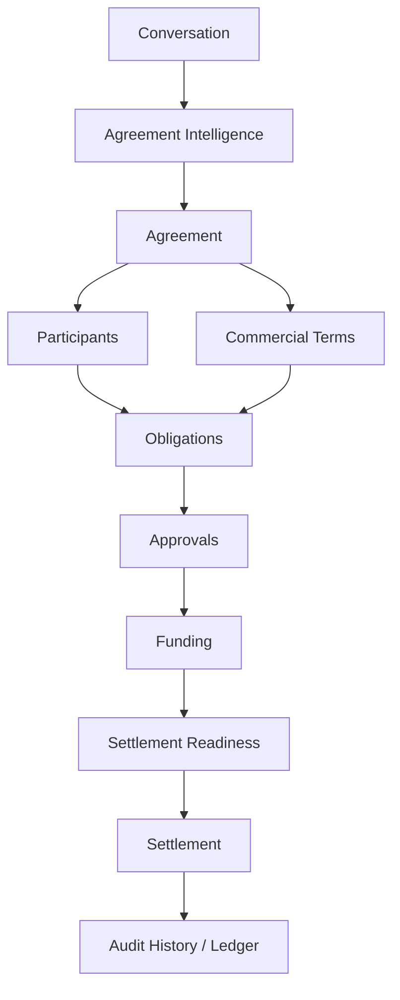

# Agreement Intelligence Platform Consistency Audit

**Phase 4 — Analysis & Recommendations Only**  
**Date:** June 2026  
**Scope:** User-facing terminology, information architecture, navigation labels, empty states, success states, dashboard summaries, and contextual descriptions.  
**Out of scope:** Onboarding logic, routing, validation, APIs, analytics, database schemas, business rules, and visual redesign.

---

## Executive Summary

Provvypay has successfully repositioned in **onboarding and authentication** toward Agreement Intelligence. The post-onboarding operator experience still largely speaks as a **payment and payout platform**: sidebar brand subtitle reads "Payment Platform," primary nav centers **Projects**, **Payments**, and **Payouts**, and legacy components still reference **payment links** and **transactions**.

The core narrative is present in pockets — participant agreements, obligations, coordination, release readiness — but it is not yet the **dominant mental model** across dashboard, navigation, and empty states.

**Priority decision for Phase 5:** Choose whether the primary workspace noun is **Agreement** (AI positioning) or **Project** (current implementation). Everything else cascades from that choice.

---

## Core Narrative (Target)

Every screen should reinforce:

1. Commercial agreements start in conversations.
2. Provvypay structures agreements into participants, obligations, and settlement workflows.
3. Settlement is the outcome of coordinated obligations.
4. Financial clarity comes from agreement visibility.

---

## 1. Terminology Inconsistencies

### 1.1 Primary noun: Project vs Agreement vs Deal

| Existing Language | Location | Recommended Language | Reason |
|---|---|---|---|
| `Projects` (nav, H1, breadcrumbs) | `operator-nav.ts`, `projects-workspace-index.tsx` | `Agreements` | Aligns nav with Agreement Intelligence; "project" reads as generic PM tooling |
| `Create your first project` | `projects-workspace-index.tsx` | `Create your first commercial agreement` | Matches onboarding activation event and category story |
| `Each project coordinates one operational engagement…` | `projects-workspace-index.tsx` | `Each agreement coordinates one commercial relationship from participants through settlement readiness` | Reframes workspace unit as a commercial arrangement |
| `Project coordination` | `project-context-header.tsx` | `Agreement coordination` | Consistent with AI briefing model |
| `Active deal`, `Deal pipeline` | `partners/deal-network/*` (pilot) | `Active agreement`, `Agreement pipeline` | "Deal" is sales CRM language; "Agreement" is platform-native |
| `Define your agreement` (onboarding) vs `Projects` (dashboard) | Onboarding vs dashboard | Single term everywhere | Onboarding already uses Agreement; dashboard contradicts it |

### 1.2 Settlement vs Payout vs Release

| Existing Language | Location | Recommended Language | Reason |
|---|---|---|---|
| `Payouts` (top-level nav) | `operator-nav.ts` | `Settlement` | Settlement is the AI outcome; "Payout" is processor language |
| `Payout releases` | Nav, settlements workspace | `Settlement releases` or `Settlements` | Unifies with onboarding "Settlement Infrastructure" |
| `Release batch` / `Create release batch` | Obligations page, settlements workspace | `Settlement batch` / `Coordinate settlement` | Keeps "release" as verb, "settlement" as noun |
| `Safe to release` | `design-language.ts`, hero widgets | `Settlement ready` or `Ready for settlement` | Ties readiness widget to settlement outcome |
| `Payout coordination for this project` | `project-payouts-view.tsx` | `Settlement readiness for this agreement` | Tab should describe outcome, not mechanism |
| `Disbursement` (one-off) | `project-payouts-view.tsx` | `Settlement` | Avoid introducing a fourth synonym |
| `Settlement Rate` (FX on invoice) | `payment-link-detail-dialog.tsx` | `Exchange rate at settlement` or `FX rate` | "Settlement" overloaded — reserve for obligation outcome |
| `Collection & settlement setup` | Settings nav | Keep, or split: `Revenue collection` + `Settlement infrastructure` | Accurate for rails; clarify collection ≠ settlement |

### 1.3 Obligation vs Commission vs Payout lines

| Existing Language | Location | Recommended Language | Reason |
|---|---|---|---|
| `Payout obligations` | Obligations pages, empty states | `Obligations` (context: settlement section) | Shorter; obligation is already platform-native |
| `Payout lines` | Obligations table section | `Obligation lines` or `Outstanding obligations` | "Payout lines" sounds like bank transfer rows |
| `Commissions` | `partners/commissions`, breadcrumbs, exports | `Participant earnings` or `Attribution obligations` | Nav already says "Participant earnings"; collapse duplicate paths |
| `Posted commission obligations` | `partners/commissions/page.tsx` | `Attribution obligations from coordinated revenue` | Links commission to agreement context |
| `Allocation status` | `project-obligations-view.tsx` table | `Obligation status` | "Allocation" is internal; operators think in obligations |
| `Configure how each participant gets paid` | `project-participants-view.tsx` | `Configure participant earnings and obligations` | Earnings + obligations precede settlement |

### 1.4 Participant vs Partner vs Payee

| Existing Language | Location | Recommended Language | Reason |
|---|---|---|---|
| `Consultants`, `Client Advocates` | `programs/participants/page.tsx` | `Participants` with role labels | Legacy referral program language conflicts with agreement model |
| `Partners & compliance` | `partners/payouts/page.tsx` | `Participant compliance` or `Settlement compliance` | "Partner" implies external B2B portal, not agreement party |
| `payee@example.com` (placeholder) | `partners/payout-methods/page.tsx` | `participant@example.com` | Payee is payment-rail terminology |
| `Programmable payments engine` | `partners/referral-links/page.tsx` | `Referral attribution for commercial agreements` | "Payments engine" is category-wrong for AI platform |
| `Recipient` (invoice resend toast) | `payment-links/page.tsx` | `Client` or `Payer contact` | Recipient is transfer terminology; invoice context prefers payer/client |

### 1.5 Payments / Invoices / Payment links / Transactions

| Existing Language | Location | Recommended Language | Reason |
|---|---|---|---|
| `Payment Platform` (sidebar subtitle) | `app-sidebar.tsx` | `Agreement Intelligence` or remove subtitle | Directly contradicts repositioning |
| `Payments` (nav section) | `operator-nav.ts` | `Revenue collection` or `Funding` | Describes agreement funding, not payment processing |
| `Invoices` (nav) + `payment link` (dialogs, tables, legacy EmptyState) | Nav vs `payment-links/*`, `EmptyState.tsx` | Pick one customer-facing term: **`Invoices`**; retire "payment link" in operator UI | Mixed terms erode trust and increase support confusion |
| `Cancel Payment Link?` | `payment-links/page.tsx` | `Cancel invoice?` | Must match nav label |
| `Payment link URL copied` | `payment-links-table.tsx` | `Invoice link copied` | Same |
| `No payment links yet` / `Create Payment Link` | `EmptyState.tsx` | `No invoices yet` / `Create invoice` | Legacy component still payment-link branded |
| `Transactions` | Nav, page H1, table columns | `Funding activity` or `Collection activity` | Ties inbound money to agreement funding; reserve "Transaction" for ledger/export contexts |
| `Payment Confirmed` (notifications) | `preferences-client.tsx`, `notifications/service.ts` | `Revenue received` or `Funding confirmed` | Positions inbound payment as agreement funding event |
| `Adjust your payment configuration` | `payment-links-guardrail-modal.tsx` | `Complete collection & settlement setup` | Matches settings page title |

### 1.6 Agreement Intelligence vocabulary (underused)

| Existing Language | Location | Recommended Language | Reason |
|---|---|---|---|
| *(absent)* | Dashboard nav, home H1 | Introduce sparingly: section badges, report headers, empty-state intros | Onboarding establishes the category; dashboard should echo it |
| `Workspace coordination` | `operational-command-center-hero.tsx` | `Agreement coordination` or `Commercial coordination` | Stronger agreement-first framing |
| `Operational command center` | `operational-home-dashboard.tsx` (legacy, unused) | Retire or rename to `Agreement coordination overview` | "Command center" is ops jargon; file appears unused |
| `Agreement Intelligence Report` | Onboarding only | Extend to agreement detail "Intelligence briefing" header | Reinforces category on every agreement view |

### 1.7 Canonical copy sources (for Phase 5)

| Source | Role |
|---|---|
| `src/lib/operations/design-language.ts` | Operator labels, phases, empty states, confidence headlines |
| `src/lib/payouts/payout-glossary.ts` | Obligation/settlement definitions |
| `src/lib/onboarding/operator-onboarding-types.ts` | Agreement Intelligence voice (onboarding) |
| `src/lib/navigation/operator-nav.ts` | Sidebar hierarchy |
| `src/components/ui/empty/EmptyState.tsx` | Legacy payment-link empty variants — **highest drift risk** |

---

## 2. Navigation Recommendations

**Do not change routes in Phase 4.** Recommendations are IA and label changes only.

### 2.1 Current hierarchy (operator standard)

```
Workspace
├── Home
├── Projects
├── Payments
│   ├── Overview
│   ├── Invoices
│   ├── Recurring
│   └── Transactions
├── Payouts
│   ├── Overview
│   ├── Obligations
│   ├── Participant earnings
│   └── Payout releases
├── Reports
│   ├── Overview
│   ├── Ledger
│   └── Export Center
└── Settings
    ├── Organization
    ├── Collection & settlement
    ├── Team
    ├── Integrations
    ├── Service catalog
    └── (admin items)
```

**Assessment:** Payment-centric top level. Agreement Intelligence concepts are buried under Projects and Payouts.

### 2.2 Recommended hierarchy (Agreement-first)

```
Dashboard                          → /dashboard

Agreements                         → /dashboard/projects  (route unchanged)
├── All agreements
└── Templates                      → future or onboarding templates

Participants                       → /dashboard/projects/:id/participants
                                   (workspace-wide index TBD)

Obligations                        → /dashboard/payouts/obligations

Settlement                         → /dashboard/payouts
├── Readiness                      → /dashboard/payouts/commissions
└── Releases                       → /dashboard/payouts/settlements

Revenue collection                 → /dashboard/payments  (optional grouping)
├── Invoices
├── Recurring schedules
└── Funding activity               → /dashboard/transactions

Reporting                          → /dashboard/reports
├── Overview
├── Ledger
└── Export center

Infrastructure                     → /dashboard/settings/integrations
                                   + Collection & settlement setup

Settings                           → org, team, catalog, admin
```

### 2.3 Navigation label mapping (recommended)

| Current | Recommended | Route (unchanged) |
|---|---|---|
| Home | Dashboard | `/dashboard` |
| Projects | Agreements | `/dashboard/projects` |
| Payments | Revenue collection | `/dashboard/payments` |
| Invoices | Invoices | `/dashboard/payment-links` |
| Recurring | Recurring schedules | `/dashboard/recurring-templates` |
| Transactions | Funding activity | `/dashboard/transactions` |
| Payouts | Settlement | `/dashboard/payouts` |
| Participant earnings | Earnings & readiness | `/dashboard/payouts/commissions` |
| Payout releases | Settlement releases | `/dashboard/payouts/settlements` |
| Collection & settlement | Collection & settlement infrastructure | `/dashboard/settings/merchant` |
| Referral sharing | Referral attribution | `/dashboard/referrals` |
| Commission links | Attribution links | `/dashboard/partners/referral-links` |

### 2.4 Breadcrumb alignment

Update `breadcrumb-nav.tsx` segment labels to match nav:

- `projects` → `Agreements`
- `payments` → `Revenue collection`
- `payouts` → `Settlement`
- `transactions` → `Funding activity`
- `payment-links` → `Invoices` *(already correct)*
- `commissions` → `Earnings` *(currently "Commissions" — conflicts with nav "Participant earnings")*

### 2.5 Project sub-navigation (agreement detail tabs)

| Current Tab | Recommended Tab |
|---|---|
| Overview | Summary |
| Commercial roles | Commercial terms |
| Participants | Participants |
| Funding sources | Funding |
| Obligations | Obligations |
| Payouts | Settlement readiness |
| Activity | Activity |

### 2.6 Sidebar brand

| Current | Recommended |
|---|---|
| Provvypay / **Payment Platform** | Provvypay / **Agreement Intelligence** |

---

## 3. Dashboard Recommendations

### 3.1 Home command center (`/dashboard`)

**Current focus:** Workspace coordination, safe-to-release metric, payout-centric confidence headlines, attention board, recent activity.

**Gap:** Widgets answer "Can we release payouts?" but not "What agreements need attention?" or "What obligations are overdue?"

#### Recommended widget set

| Widget | Question answered | Recommended copy direction |
|---|---|---|
| **Agreements needing attention** | What agreements need attention? | Count agreements with blocked readiness, pending approvals, or missing participants |
| **Obligation summary** | What obligations are overdue? | Outstanding / funded / ready — link to Obligations |
| **Pending approvals** | What approvals are pending? | Participant agreements awaiting signature or operator confirmation |
| **Settlement readiness** | What settlements are blocked? | Replace "Safe to release" headline family with settlement-readiness framing |
| **Ready for settlement** | What is ready for release? | Keep metric; rename labels to settlement language |
| **Active commercial relationships** | What relationships are active? | Participant count across live agreements |
| **Recent coordination activity** | What happened recently? | Keep timeline; prefer "agreement, obligation, settlement" event labels |

#### Transaction-centric widgets to reframe

| Current Widget | Location | Issue | Recommended Alternative |
|---|---|---|---|
| `Payment distribution` | `payment-distribution-card.tsx` | Revenue mix chart — processor framing | `Revenue by agreement` or `Funding by collection method` |
| `Connected payment methods` | `connected-payment-methods-strip.tsx` | Rail-focused | `Collection & settlement infrastructure` |
| `Revenue summary` — "No payments have been received yet" | `revenue-summary-card.tsx` | Payment-centric empty | "No coordinated funding yet" |
| Release confidence — "Payouts can be coordinated safely…" | `design-language.ts` | Payout-first | "Settlement can proceed safely from current obligations and funding" |
| Workspace phase — `Coordinating payouts` | `design-language.ts` | Mechanism-first | `Coordinating obligations` |

### 3.2 Projects index (`/dashboard/projects`)

| Current | Recommended |
|---|---|
| H1: `Projects` | `Agreements` |
| Summary mentions "payouts per project" | "participants, obligations, and settlement per agreement" |
| Card rows: `Payouts:` | `Settlement:` |
| Badge: `Needs attention` | Keep — already coordination-native |

### 3.3 Payments hub

Reframe as **funding layer** of agreements, not standalone payment product:

| Current summary | Recommended summary |
|---|---|
| "Collect customer funds through invoices, recurring billing, and payment activity." | "Coordinate revenue collection that funds agreement obligations — invoices, recurring schedules, and funding activity." |

### 3.4 Payouts hub

| Current summary | Recommended summary |
|---|---|
| "Coordinate what is owed, what is ready, and what has been released." | "Settlement coordination — track obligations, readiness, and completed releases across agreements." |

Lifecycle explainer (`payout-lifecycle-explainer.tsx`) currently: Payment → Funding → Release. Recommended: **Agreement → Obligation → Funding → Settlement**.

### 3.5 Reports

Reports language is largely finance-appropriate. Recommendations:

- Tie `Operational Insights` descriptions to **agreement operational states**, not generic "system-detected states."
- Export labels: align `Payout obligations` export with `Obligations` nav term.
- Ledger summary already strong: "payments, obligations, settlements, and allocations" — keep.

---

## 4. Agreement Page Recommendations

**Do not implement in Phase 4.** Target: transform agreement detail into an **Agreement Intelligence Briefing**.

### 4.1 Current structure (project workspace)

Tabs: Overview · Commercial roles · Participants · Funding sources · Obligations · Payouts · Activity

Content is spread across operational views with mixed project/payout language. No single "intelligence briefing" surface exists post-onboarding.

### 4.2 Recommended structure (Agreement Intelligence Briefing)

```
┌─────────────────────────────────────────────────────────────┐
│  [Agreement Intelligence badge]                             │
│  {Agreement name}                                           │
│  Readiness score · Confidence · Phase pill                  │
├─────────────────────────────────────────────────────────────┤
│  1. Agreement Summary                                       │
│     Type · Source · Commercial relationship · Status         │
├─────────────────────────────────────────────────────────────┤
│  2. Participants                                            │
│     Roles · Agreement status · Attribution · Earnings        │
├─────────────────────────────────────────────────────────────┤
│  3. Commercial Terms                                        │
│     (replaces "Commercial roles" planning + extracted terms) │
├─────────────────────────────────────────────────────────────┤
│  4. Obligations                                             │
│     Outstanding · Funded · Ready · Blocking issues           │
├─────────────────────────────────────────────────────────────┤
│  5. Approvals                                               │
│     Pending participant agreements · Operator confirmations  │
├─────────────────────────────────────────────────────────────┤
│  6. Settlement Readiness                                    │
│     (replaces "Payouts" tab — readiness, not disbursement UI)│
├─────────────────────────────────────────────────────────────┤
│  7. Activity Timeline                                       │
│     Coordination events (reuse operational-audit-timeline) │
├─────────────────────────────────────────────────────────────┤
│  8. Audit History                                           │
│     Immutable record · Export · Ledger cross-links           │
└─────────────────────────────────────────────────────────────┘
```

### 4.3 Section-by-section copy recommendations

| Section | Current analog | Recommended header | Recommended helper copy |
|---|---|---|---|
| Summary | Overview hub | `Agreement summary` | "Commercial relationship status, coordination phase, and readiness at a glance." |
| Participants | Participants tab | `Participants` | "Parties to this agreement — roles, approvals, earnings, and attribution." |
| Commercial terms | Commercial roles | `Commercial terms` | "Roles, budgets, and extracted terms that define this arrangement." |
| Obligations | Obligations tab | `Obligations` | "What is owed, funded, and ready before settlement." |
| Approvals | Scattered in participant KPIs | `Approvals` | "Signatures and confirmations required before settlement proceeds." |
| Settlement readiness | Payouts tab | `Settlement readiness` | "Funding, confirmations, and release eligibility for this agreement." |
| Activity | Activity tab | `Activity timeline` | "Coordination events as this agreement progresses." |
| Audit history | Ledger cross-links | `Audit history` | "Immutable record of agreement, approval, and settlement events." |

### 4.4 Reuse from onboarding

The onboarding `AgreementIntelligenceReport` component establishes the briefing pattern (confidence, readiness score, gaps, obligations identified). Phase 5 should **adapt this visual pattern** for live agreement detail — not duplicate onboarding logic, but mirror the mental model.

### 4.5 KPI cards on participant view (reframe)

| Current KPI | Recommended KPI |
|---|---|
| Pending agreements | Approvals pending |
| Missing confirmation | Confirmations needed |
| Ready for payout | Settlement ready |
| Active attribution | Active attribution *(keep)* |

---

## 5. Empty State Recommendations

### 5.1 Legacy components (highest priority)

| Existing Language | Location | Recommended Language | Reason |
|---|---|---|---|
| `No payment links yet` | `EmptyState.tsx` | `No invoices yet` | Nav uses Invoices |
| `Create your first payment link to start accepting crypto payments.` | `EmptyState.tsx` | `Create your first invoice to fund agreement obligations.` | Agreement-first CTA |
| `Create Payment Link` | `EmptyState.tsx` | `Create invoice` | Consistency |
| `No transactions yet` / `customers start making payments` | `EmptyState.tsx` | `No funding activity yet` / `Funding appears when invoices are paid or obligations are funded` | Funding ≠ generic transactions |
| `No data available` | `EmptyState.tsx` | Context-specific empties per surface | Generic empties feel like unfinished SaaS |

### 5.2 Payment-links guidance (partially updated)

| Existing | Recommended |
|---|---|
| `No payments have been received yet. Your first payment will automatically appear here…` | `No coordinated funding yet. Revenue from invoices and obligations will appear here once collection begins.` |
| `Transactions appear once payments are attempted or received.` | `Funding activity appears once collection is attempted or confirmed.` |

### 5.3 Operational empty states (`design-language.ts` — mostly good)

| Existing | Recommended | Reason |
|---|---|---|
| `No payout obligations in this project yet` | `No obligations in this agreement yet` | Agreement noun + shorter |
| `No payout releases yet` | `No settlement releases yet` | Settlement language |
| `No participants yet` | Keep | Already correct |
| `No funding activity yet` | Keep | Already correct |
| CTA: `Configure participant earnings` | Keep | Already correct |
| CTA: `Review payout readiness` | `Review settlement readiness` | Settlement language |

### 5.4 Page-specific empties

| Existing | Location | Recommended |
|---|---|---|
| `No invoices found. Create your first invoice to get started.` | `payment-links-table.tsx` | `No invoices yet. Create one to begin funding this agreement.` |
| `No Stripe/Hedera transactions yet` | `transactions/page.tsx` | `No {rail} funding activity yet` |
| `No payments to reconcile yet` | `reconciliation-display.ts` | `No funding events to reconcile yet` |
| `No settlement activity yet` | `ledger-balance-report.tsx` | Keep — already good |
| `No obligations recorded for this project yet…` | `project-obligations-view.tsx` | Replace "project" with "agreement" |
| `No active payout coordination yet. Create a project…` | `operational-home-dashboard.tsx` | `No agreements in coordination yet. Create your first commercial agreement…` |
| `No referral links yet. Create one to get started.` | `referral-links/page.tsx` | `No attribution links yet. Create one to track referral obligations.` |
| `No attributed invoices yet. Share your link to get started.` | `referrals/mine/page.tsx` | `No attributed revenue yet. Share your link to begin coordination.` |

### 5.5 Empty state pattern (recommended template)

```
[Icon — coordination, not credit card]

{Specific absence statement}

{Why it matters in agreement terms}

{Primary CTA aligned to next coordination step}
```

Example:

> **No obligations yet**  
> Obligations define what must be coordinated before settlement. Add participants and configure earnings to generate them.  
> [Configure participant earnings]

---

## 6. Success State Recommendations

Success messages should reinforce: **Agreement created · Obligations identified · Settlement readiness improved · Coordination completed.**

### 6.1 Onboarding (strong — minor tweaks)

| Existing | Recommended | Reason |
|---|---|---|
| `Workspace created` | Keep | Correct |
| `Agreement Intelligence ready` | Keep | Category reinforcement |
| `Agreement created` | Keep | Core activation event |
| `Settlement infrastructure saved` | Keep | Rails-specific — appropriate |
| `Captured N participant(s)` | `N participants identified` | Matches intelligence report language |
| `Demo agreement ready` | Keep | Clear |

### 6.2 Project / agreement creation

| Existing | Location | Recommended |
|---|---|---|
| `Project created` | `projects-workspace-index.tsx` | `Agreement created` |
| `Project created from conversation` | `extraction-review-modal.tsx` | `Agreement created from conversation` |
| `Deal created` / `Deal updated` | Deal network modals | `Agreement created` / `Agreement updated` |

### 6.3 Participant coordination

| Existing | Recommended |
|---|---|
| `{name} added. Share the agreement link.` | Keep — strong |
| `Participation approved` | `Agreement approved` |
| `Agreement approved` | Keep |
| `Participant updated` | Keep |
| `Compensation structure saved` / `Agreement terms updated successfully` | `Commercial terms saved` |
| `Payout details confirmed externally` | `Settlement details confirmed` |
| `Participant released` / `Batch created · amount released` | `Settlement initiated` / `Settlement batch created for {name}` |

### 6.4 Settlement / payout actions

| Existing | Recommended |
|---|---|
| `Release batch created` | `Settlement batch created` |
| `Payout marked as paid` | `Settlement completed` |
| `Batch paid on Hedera` | `Settlement confirmed on Hedera` |
| `Obligation projections refreshed` | Keep |
| `No eligible payouts available…` | `No obligations ready for settlement…` |

### 6.5 Invoice / collection (keep rail-specific clarity)

Invoice toasts (`Invoice created`, `Invoice marked as paid`) are appropriate — inbound collection is a distinct layer. Recommended addition to success descriptions:

| Existing | Recommended addition |
|---|---|
| `Invoice created` — "Invoice is ready…" | Append: "This funds obligations when paid." |
| `Invoice marked as paid` | "Funding recorded — obligation settlement can proceed." |

### 6.6 Public payer success (intentionally payment-centric)

Public pay flows (`Payment Successful!`, Hedera/Stripe toasts) should **remain payment-centric** — payers are not agreement operators. No change recommended for `/pay/*` surfaces.

### 6.7 Notifications (expand beyond payments)

Current notification preferences are payment/sync only. Recommended additions (future):

| New preference | Description |
|---|---|
| Agreement approval pending | When a participant agreement requires action |
| Obligation blocked | When an obligation cannot proceed to settlement |
| Settlement ready | When obligations become eligible for release |
| Weekly coordination summary | Replace "weekly payment activity" |

---

## 7. Quick Wins

Low-effort, high-clarity copy changes that do not require routing or logic changes.

| # | Change | File(s) | Effort |
|---|---|---|---|
| 1 | Sidebar subtitle: `Payment Platform` → `Agreement Intelligence` | `app-sidebar.tsx` | Trivial |
| 2 | Retire "payment link" in operator dialogs/toasts; use `invoice` | `payment-links/*`, `EmptyState.tsx` | Low |
| 3 | Align cancel dialog: `Cancel Payment Link?` → `Cancel invoice?` | `payment-links/page.tsx` | Trivial |
| 4 | Breadcrumb: `projects` → `Agreements` | `breadcrumb-nav.tsx` | Trivial |
| 5 | Projects index H1 + empty state → Agreement language | `projects-workspace-index.tsx` | Low |
| 6 | Replace `payment configuration` with `collection & settlement setup` | `payment-links-guardrail-modal.tsx` | Trivial |
| 7 | `design-language.ts`: "payout" → "settlement" in user-visible phase labels | `design-language.ts` | Low |
| 8 | Notification preference labels: `Payment Confirmed` → `Funding confirmed` | `preferences-client.tsx` | Low |
| 9 | Remove or update legacy `EmptyState.tsx` payment-link variants | `EmptyState.tsx` | Low |
| 10 | Table toast: `Payment link URL copied` → `Invoice link copied` | `payment-links-table.tsx` | Trivial |
| 11 | Payee placeholder → `participant@example.com` | `partners/payout-methods/page.tsx` | Trivial |
| 12 | Home hero H1: `Workspace coordination` → `Agreement coordination` | `operational-command-center-hero.tsx` | Trivial |

**Estimated impact:** Removes the most visible contradictions between onboarding (Agreement Intelligence) and dashboard (Payment Platform) within 1–2 copy passes.

---

## 8. High-Impact Future Improvements

| # | Initiative | Description | Dependency |
|---|---|---|---|
| 1 | **Primary noun decision** | Adopt `Agreement` vs keep `Project` across nav, URLs (display only first), headers, empty states | Leadership/product decision |
| 2 | **Nav restructure (labels only)** | Implement recommended hierarchy labels in `operator-nav.ts` without route changes | Noun decision |
| 3 | **Agreement Intelligence Briefing page** | Compose agreement detail from briefing sections; reuse onboarding report visual patterns | Design + eng |
| 4 | **Unified copy SSOT expansion** | Extend `design-language.ts` to cover nav labels, page titles, toasts, notifications — not just operations widgets | Eng |
| 5 | **Dashboard widget redesign** | Replace transaction-centric report cards with agreement-centric coordination widgets | Product + eng |
| 6 | **Collapse commission/partner legacy** | Migrate `programs/participants`, `partners/commissions` language to participant/attribution model | Product decision on legacy routes |
| 7 | **Notification taxonomy** | Add agreement/obligation/settlement notification types alongside payment events | Backend + product |
| 8 | **Glossary alignment** | Publish in-app glossary entries for Agreement, Obligation, Settlement, Funding — sourced from `payout-glossary.ts` | Content |
| 9 | **Pilot shell alignment** | Rabbit Hole / Strait Experiences sidebars still use "Invoices", "Payout coordination" — align with standard operator language | Pilot review |
| 10 | **Public vs operator voice guide** | Document where payment language is intentional (payer flows, ledger exports) vs where agreement language applies | Content |

---

## Appendix A: Screen Coverage Checklist

| Area | Reviewed | Primary drift |
|---|---|---|
| Dashboard home | ✅ | Payout/release framing vs agreement attention |
| Agreement / project pages | ✅ | Project ≠ Agreement |
| Participant pages | ✅ | Strong agreement columns; weak legacy programs page |
| Obligations | ✅ | Good term; "payout" prefix unnecessary |
| Settlement / payouts | ✅ | Payout/release vs settlement |
| Reporting | ✅ | Mostly finance-appropriate |
| Payment links / invoices | ✅ | Invoice vs payment link split |
| Referrals / attribution | ✅ | "Payments engine", partner language |
| Workspace settings | ✅ | Collection & settlement good; integrations rail-focused |
| Navigation | ✅ | Payment-centric top level |
| Empty states | ✅ | Legacy EmptyState + mixed guidance |
| Success states / toasts | ✅ | Onboarding strong; project/payout verbs |
| Notifications | ✅ | Payment-only preferences |
| Table headers | ✅ | Payment Link column in transactions |
| Onboarding / auth | ✅ | **Reference voice** — already aligned |

---

## Appendix B: Terminology Migration Guide (Quick Reference)

**Prefer**

Agreement · Participant · Commercial terms · Obligation · Settlement · Coordination · Approval · Readiness · Agreement Intelligence · Commercial relationship · Financial outcome · Funding · Revenue collection

**Avoid in operator UI (unless describing payment rails)**

Payee · Recipient · Payout setup · Payment configuration · Revenue recipient · Transaction setup · Money movement · Payment routing · Transfer configuration · Payment platform · Payment link (use Invoice)

**Keep in payer / rail contexts**

Payment · Transaction · Invoice payment · Stripe · Hedera · Wise · Ledger · Reconciliation

---

## Appendix C: Semantic Model



Current dashboard navigation maps roughly to **Funding** (Payments), **Obligations + Settlement** (Payouts), and **Agreement** (Projects) — but labels do not reflect this model.

---

*End of Phase 4 audit. No code changes were made. Phase 5 should begin with Quick Wins (#7) and the primary noun decision before navigation or page restructuring.*
