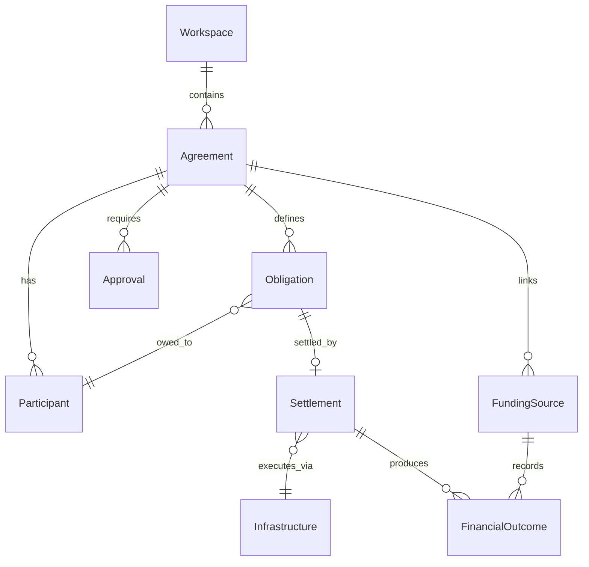

# Canonical Domain Model

**Phase 5 — Agreement Intelligence Platform**  
**Status:** Canonical reference for product, design, and engineering  
**Routes and schemas:** Unchanged in Phase 5; this document defines language and mental models only.

---

## Hierarchy

```
Workspace
 └── Agreement (primary object)
      ├── Participants
      ├── Commercial Terms
      ├── Obligations
      ├── Approvals
      ├── Funding (linked revenue)
      └── Settlement (outcome)
           └── Financial Outcome / Audit record
Infrastructure (workspace-level rails and integrations)
```

**Primary answer for new users:** *"What do I create in Provvypay?"* → **An Agreement.**

---

## Workspace

| | |
|---|---|
| **Purpose** | Top-level container for an operator organization. Holds agreements, team access, collection infrastructure, and reporting context. |
| **Relationships** | Parent of all Agreements. References Infrastructure configuration. Aggregates settlement readiness across agreements. |
| **User-facing definition** | *Your commercial coordination environment — where agreements, participants, and settlement live.* |
| **Internal definition** | `organizations` record and associated operator session context. Onboarding creates the workspace; activation is first agreement created. |

**Not the same as:** A single agreement, a payment account, or a Stripe Connect entity.

---

## Agreement

| | |
|---|---|
| **Purpose** | The primary object in Provvypay. Represents one commercial arrangement derived from a conversation, contract, or template — coordinating participants, terms, obligations, and settlement. |
| **Relationships** | Belongs to Workspace. Has many Participants, Obligations, Approvals, Funding sources. Produces Settlement releases. Has an Agreement Type (metadata). |
| **User-facing definition** | *A commercial arrangement you coordinate — from the people involved through obligations to settlement.* |
| **Internal definition** | Currently stored as `project` / `deal` records in the codebase. Phase 5 renames user-facing copy only; internal IDs remain until a future schema phase. |

**Agreement Type (metadata, not a separate object):**

| Legacy / informal label | Canonical type |
|---|---|
| Revenue share | Agreement type: Revenue share |
| Affiliate program | Agreement type: Affiliate |
| Referral program | Agreement type: Referral |
| Event settlement | Agreement type: Event |
| Sponsorship | Agreement type: Sponsorship |
| Contractor engagement | Agreement type: Contractor |

**Supersedes user-facing use of:** Project, Deal, Commercial arrangement, Settlement workflow (as a noun), Revenue share program (as object name).

---

## Participant

| | |
|---|---|
| **Purpose** | A party to an Agreement — person or entity with a role, commercial terms, approvals, and settlement eligibility. |
| **Relationships** | Belongs to Agreement. May have Obligations, Approvals, earnings configuration, attribution scope. Receives Settlement. |
| **User-facing definition** | *Someone involved in a commercial agreement — with defined role, terms, and settlement path.* |
| **Internal definition** | `participants`, project-scoped participant records, referral attribution entities. |

**Not the same as:** Payee, recipient, partner (unless role label), customer/payer.

**Customer / payer:** External party who funds obligations via invoices — not a Participant unless explicitly modeled as one.

---

## Obligation

| | |
|---|---|
| **Purpose** | A defined amount or commitment owed to a Participant (or category) under an Agreement, subject to funding and approval before settlement. |
| **Relationships** | Belongs to Agreement and Participant. Funded by Funding events. Gated by Approvals. Settled via Settlement release. |
| **User-facing definition** | *What must be coordinated and paid under an agreement before money moves.* |
| **Internal definition** | Obligation rows, commission postings, allocation projections, payout obligation graph nodes. |

**Not the same as:** Invoice (funding instrument), transaction (ledger event), payout line (settlement artifact).

---

## Approval

| | |
|---|---|
| **Purpose** | Explicit consent or confirmation required before coordination proceeds — participant agreement signature, operator confirmation, funding verification. |
| **Relationships** | Attached to Agreement and/or Participant. Blocks or unlocks Obligation settlement. |
| **User-facing definition** | *A required sign-off before obligations can settle.* |
| **Internal definition** | Agreement approval state, participation approval, operator payout confirmation flags, manual review queues. |

---

## Settlement

| | |
|---|---|
| **Purpose** | The outcome of coordinated obligations — releasing funds to participants after funding and approvals converge. |
| **Relationships** | Belongs to Agreement. Consumes funded Obligations. Produces Financial Outcomes and audit/ledger entries. Uses Infrastructure rails. |
| **User-facing definition** | *The result of successful coordination — when obligations are funded, approved, and released.* |
| **Internal definition** | Release batches, settlement completion events, payout batch records, Hedera/Stripe/Wise disbursement artifacts. |

**Terminology:**

| User-facing | Internal (unchanged Phase 5) |
|---|---|
| Settlement | `settlement`, release batch |
| Settlement release | `payout release`, release batch |
| Settlement readiness | Release confidence, payout readiness |
| Settlement queue | Eligible payout lines workspace |

**Not the same as:** Payment (inbound funding), invoice, transaction (ledger), payout (use Settlement in operator UI).

---

## Financial Outcome

| | |
|---|---|
| **Purpose** | Recorded result of funding and settlement — ledger entries, reconciliation state, exportable audit trail. |
| **Relationships** | Produced by Funding and Settlement. Referenced in Reporting. Immutable for audit. |
| **User-facing definition** | *The financial record of what was collected, owed, and settled under your agreements.* |
| **Internal definition** | Ledger entries, payment events, FX snapshots, reconciliation reports, export artifacts. |

---

## Infrastructure

| | |
|---|---|
| **Purpose** | Workspace-level collection and settlement rails — Stripe, Wise, Hedera, Xero, merchant settings. Enables Funding and Settlement; not itself an Agreement. |
| **Relationships** | Configured at Workspace level. Used by Agreement Funding and Settlement flows. |
| **User-facing definition** | *How your workspace collects revenue and executes settlement — payment rails and accounting connections.* |
| **Internal definition** | Merchant settings, integration tokens, provider configuration, webhook handlers. |

**User-facing label:** Collection & settlement infrastructure (settings).  
**Avoid:** Payment setup, payment configuration, payout setup (in operator UI).

---

## Object Relationship Diagram



---

## Voice Rules

1. **Agreement** is always the noun for what operators create and manage.
2. **Settlement** is the noun for outbound coordination outcomes; **Funding** for inbound revenue.
3. **Participant** replaces payee, recipient, revenue recipient in operator UI.
4. **Obligation** replaces payout obligation, commission (when meaning amount owed), payout line.
5. **Infrastructure** replaces payment configuration, payment setup (operator settings context).
6. Payment / transaction language remains valid for **payer-facing flows**, **ledger exports**, and **rail-specific errors**.

---

## Phase 5 Scope Boundary

| Changed in Phase 5 | Unchanged until later phase |
|---|---|
| User-facing labels, copy, nav titles, empty states, toasts | URL paths (`/projects`, etc.) |
| Design-language SSOT strings | Database table/column names |
| Breadcrumb segment labels | API field names (`projectId`) |
| Documentation | Analytics event names |
| | Permission keys |

Internal code may continue to use `project`, `deal`, `payout` identifiers. Operator UI must speak Agreement.
