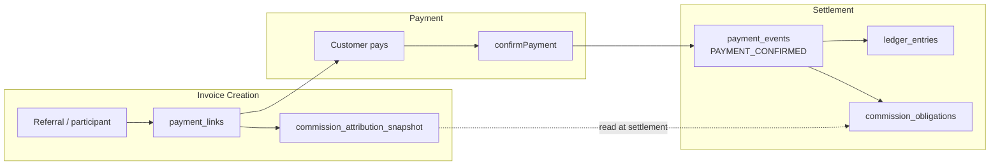

# YC Coding Agent Session Export

## Sprint 1 — Minimal Attribution + Settlement Integration

**Provvypay** · Cursor session · May 2026  
**Stack:** Next.js · Prisma · PostgreSQL · Stripe  
**Repo artifacts:** `commission-attribution-snapshot.ts` · `payment-confirmation.ts` · `referral-attribution-replay.test.ts`

---

## 1. Short Intro

Provvypay is operational financial infrastructure for multi-party commercial workflows: participants, obligations, revenue allocation, and payout coordination—not a generic payment-links app.

This Cursor session implemented **Sprint 1: a minimal, financially correct referral attribution layer** on top of an existing hardened settlement core serving live pilot usage. The engineering problem: enable participant → referral link → invoice → payment → commission, without breaking canonical settlement truth or creating duplicate commissions on webhook replay.

The founder specified hard invariants upfront—immutable attribution at invoice creation, commissions only from `PAYMENT_CONFIRMED`, no inferred attribution at payout time—and used AI to implement schema, services, checkout flows, and tests across ~20 files **without rewriting `confirmPayment`**. Follow-up prompts during founder-led testing corrected operability gaps (referral issuance, identity scoping) through **layer-by-layer debugging**, repeatedly blocking AI from broad architectural rewrites.

---

## 2. Best Transcript Excerpts Only

### Excerpt 1 — Architectural contract (founder spec)

> We are implementing the **smallest financially-correct attribution layer** that integrates cleanly with the existing hardened settlement architecture.
>
> **DO NOT:** redesign settlement flows · refactor `confirmPayment` · introduce multi-touch attribution · massively expand UX scope.
>
> **Flow:** participant → referral link / QR → service selection → invoice → **`PAYMENT_CONFIRMED`** → commission + payout
>
> **Rules:**
> 1. `PAYMENT_CONFIRMED` remains **canonical settlement truth**
> 2. Attribution MUST be written onto the invoice/`payment_link` **at creation time**
> 3. Commission generation MUST occur from **settled payment state only**
> 4. Attribution MUST survive retries, replay, reconciliation, delayed payment, recurring invoices
>
> **NO:** cookies as source of truth · inferred attribution at payout time · dynamic lookup during settlement
>
> The `payment_link` must contain **immutable attribution context**: `referral_code_id`, `referral_code`, `attributed_participant_user_id`, `attribution_source`, `commission_attribution_snapshot`.

*Context: Opening prompt. Defines scope, negative constraints, and financial invariants before any code is written.*

---

### Excerpt 2 — What shipped (agent delivery, condensed)

> **Added:** `commission_attribution_snapshot` on `payment_links`; `referral_codes` + `organization_services`; snapshot builder with completeness check.
>
> **Settlement path unchanged:**
> ```
> confirmPayment → PAYMENT_CONFIRMED → applyRevenueShareSplits
> ```
>
> **Key change:** `resolveReferralCommissionMetadata` now **prefers invoice snapshot** before DB rule hydration—critical for Wise/Hedera rails with sparse webhook metadata.
>
> **Tests:** replay invariants documented in `referral-attribution-replay.test.ts`.

*Context: Sprint 1 core delivery. AI explored existing settlement code first, then extended rather than replaced.*

---

### Excerpt 3 — Historical integrity constraint (founder)

> Complete service catalog EDIT + soft ARCHIVE for operators.
>
> **Editing must NOT:** mutate historical invoices · alter existing commission snapshots · change prior payment links.
>
> Service edits affect **future invoice generation only**. Do NOT alter `PAYMENT_CONFIRMED` flows.

*Context: Operability work scoped to avoid corrupting financial history.*

---

### Excerpt 4 — UX bug ≠ architecture bug (founder correction)

> Verification: `referral_links`, `referral_codes`, backend attribution infrastructure **is functioning**.
>
> Problem: operators and participants cannot SEE or USE referral links.
>
> This is a **UX/discoverability gap, not an attribution architecture problem.**
>
> **DO NOT redesign:** attribution persistence · settlement logic · `PAYMENT_CONFIRMED` flow.

*Context: Founder prevents AI from "fixing" working financial architecture when the real gap is surfacing existing data.*

---

### Excerpt 5 — Missing operational bridge (founder)

> Participant approves agreement but has **no generated referral link**.
>
> The missing step is NOT referral visibility. The missing step is:
> **referral issuance after participant approval.**
>
> `participant approval → automatic referral link issuance → participant can immediately share`
>
> Use **idempotent** behavior: never duplicate links/codes; reuse existing active link. **DO NOT redesign attribution architecture.**

*Context: Identifies a lifecycle gap distinct from settlement or attribution storage.*

---

### Excerpt 6 — Layered debugging directive (founder)

> Referral link still does not appear after approval. Determine exactly **WHICH layer is failing:**
>
> - issuance trigger · DB creation · participant binding · dashboard lookup · rendering · auth/user matching
>
> **DO NOT implement broad rewrites.** Identify the exact failing layer.

*Context: Systems debugging methodology—force isolation before any fix.*

---

### Excerpt 7 — Diagnosis (agent)

> | Layer | Finding |
> |-------|---------|
> | Dashboard lookup | **Primary gap** — queries participant's org; codes stored under operator org → 0 rows |
> | Dashboard auth | External participants lack org membership → 403 |
> | Participant binding | Approver session sometimes bound instead of participant |
> | UI rendering | Unlikely — empty API → empty state |
>
> **Conclusion:** Not a rendering bug. **Identity/access-model mismatch**, not an attribution architecture issue.

*Context: Trace pass produces a layer table instead of a speculative rewrite.*

---

### Excerpt 8 — Narrow fix with invariants preserved (founder)

> Fix participant dashboard to resolve ownership via **`participant_user_id` or email binding**—not org membership.
>
> Participant should see "links attributed to me" even without formal org membership.
>
> **DO NOT redesign:** settlement · attribution persistence · referral issuance. **Implement ONLY the narrow ownership visibility correction.**

*Context: Surgical fix scoped to access model; settlement core untouched.*

---

### Excerpt 9 — Extension without settlement rewrite (founder)

> Extend to operator-controlled referral commerce (commission model + service scope at invite time).
>
> **DO NOT redesign:** `confirmPayment` · `PAYMENT_CONFIRMED` · commission posting · attribution persistence · settlement idempotency.
>
> Verify after changes: `PAYMENT_CONFIRMED` → commission created → **replay safe** → no duplicate posting → ledger balanced.

*Context: Feature extension explicitly bounded; settlement validation required at end.*

---

## 3. Technical Appendix (Condensed)

### Attribution Flow



**Sequence:** Referral landing → create invoice with frozen snapshot → customer pays → single `PAYMENT_CONFIRMED` event → ledger + commission obligations.

---

### Immutable Commission Snapshot

| Why freeze at invoice creation? | Commission rules and participant identity must be auditable at sale time—not recomputed when money arrives or on webhook retry #7. |
| Why never infer at payout? | Rule changes, archived services, and sparse multi-rail metadata (Wise/Hedera) break late inference. |
| What is stored? | `referral_link_id`, `referral_code_id`, `attribution_referral_code`, `attributed_participant_user_id`, `attribution_source`, `commission_attribution_snapshot` (JSON) |
| Replay protection | Snapshot parsed deterministically; commission keys derive from `payment_events.id`; `confirmPayment` skips if `PAYMENT_CONFIRMED` already exists |

**Code path:** `buildCommissionAttributionMetadataFromReferralLink()` → persisted on `payment_links` → consumed by `resolveReferralCommissionMetadata()` in `payment-confirmation.ts`.

---

### Settlement Invariant

> **Commissions only exist from canonical settled payment events.**

| Mechanism | Behavior |
|-----------|----------|
| Trigger | `applyRevenueShareSplits` runs only when `confirmPayment` creates a **new** `PAYMENT_CONFIRMED` (`alreadyProcessed === false`) |
| Idempotency | Existing `PAYMENT_CONFIRMED` for `payment_link_id` → skip re-posting |
| Commission keys | `commission-${paymentEventId}-split-${split_id}` |
| Entity roles | `payment_links` = invoice + immutable snapshot · `payment_events` = settlement truth · `ledger_entries` = accounting · `commission_obligations` = revenue-share debts post-settlement |

**Test anchor:** `referral-attribution-replay.test.ts` — *"Commission posting runs only after a new PAYMENT_CONFIRMED payment_event."*

---

## 4. Founder vs AI Contribution Summary

**Founder**
- Defined financial invariants and explicit "DO NOT" boundaries before implementation
- Specified immutable snapshot semantics and canonical `PAYMENT_CONFIRMED` settlement truth
- Classified failures: UX vs architecture vs identity/access-model—not one undifferentiated "bug"
- Directed layer-by-layer debugging; blocked broad rewrites of working settlement core
- Required replay/idempotency verification as part of the original spec

**AI (Cursor)**
- Mapped existing settlement, referral, and commission code paths before changing schema
- Implemented Prisma migration, snapshot service, checkout flows, APIs, and Jest tests (~20 files)
- Produced structured layer diagnosis (issuance / binding / lookup / auth / render)
- Executed narrow fixes (participant ownership query, service PATCH/archive, trace logging) within constraints

---

## 5. Closing

This session is **AI-assisted systems engineering under financial correctness constraints**: a technical founder directing Cursor to extend production payment infrastructure with immutable attribution, replay-safe commissions, and invariant-preserving debugging—not generic code generation.
