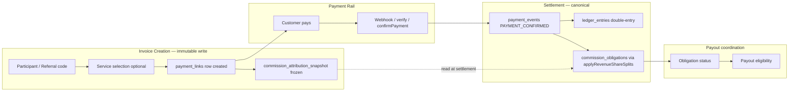

# YC Coding Agent Session Export
## Sprint 1 — Minimal Attribution + Settlement Integration

**Product:** Provvypay  
**Session ID:** `ac661f04-534b-4e6d-b83b-2e5eaa5dc629`  
**Period:** May 2026 (founder-led, multi-phase)  
**Stack:** Next.js 15 · Prisma · PostgreSQL · Stripe · Supabase Auth  
**Outcome:** Production attribution layer integrated with existing settlement without rewriting `confirmPayment`

---

# Part 0 — Intro for YC Reviewers (read this first)

Provvypay is operational financial infrastructure for multi-party payouts. This session shows how the founder used Cursor to add a **financially correct referral attribution layer** on top of an existing hardened payment/settlement core—without breaking canonical settlement truth.

The work is not UI prototyping. It is **systems engineering under constraints**: immutable invoice attribution, commission posting tied to `PAYMENT_CONFIRMED`, replay-safe idempotency, and layered debugging when operability gaps surfaced (issuance, identity scoping, service catalog integrity).

The session spans one architectural implementation pass plus several **narrow, invariant-preserving** follow-ups discovered during founder-led testing. Throughout, the founder repeatedly blocked AI from redesigning settlement, inferring attribution at payout time, or conflating UX bugs with financial architecture bugs.

**Artifacts to inspect in repo:**  
`src/lib/referrals/commission-attribution-snapshot.ts` · `src/lib/services/payment-confirmation.ts` · `src/__tests__/referrals/referral-attribution-replay.test.ts` · migration `20260513120000_sprint1_referral_attribution`

---

# Part 1A — YC-Ready Curated Transcript

> Format: **Founder** / **Agent** · Tool noise and repetitive diffs omitted · Engineering narrative preserved

---

## Act I — Architectural specification (immutable attribution)

### Founder
We are implementing Sprint 1: **MINIMAL ATTRIBUTION + REFERRAL LAYER** for launch readiness.

This is NOT a marketplace, creator platform, or booking engine. We are implementing the **smallest financially-correct attribution layer** that integrates cleanly with the existing hardened settlement architecture.

**DO NOT:**
- redesign settlement flows
- refactor `confirmPayment` architecture
- introduce multi-touch attribution or affiliate hierarchies
- massively expand UX scope

**Objective flow:**
```
participant → referral link / QR → service selection → invoice/payment link
→ PAYMENT_CONFIRMED → commission attribution + payout
```

**Architectural rules:**
1. `PAYMENT_CONFIRMED` remains **canonical settlement truth**
2. Attribution MUST be written onto the invoice/`payment_link` **at creation time**
3. Commission generation MUST occur from **settled payment state only**
4. Attribution MUST survive retries, replay, reconciliation, delayed payment, recurring invoices
5. Deterministic and auditable

**NO:** cookies as source of truth · inferred attribution at payout time · dynamic lookup during settlement

The `payment_link`/invoice must contain **immutable attribution context**.

When invoice is generated, persist on `payment_links`:
- `referral_code_id`, `referral_code`, `attributed_participant_id`, `attribution_source`, `commission_snapshot`

Commission MUST remain tied to `PAYMENT_CONFIRMED` only. Do NOT bypass existing settlement convergence architecture.

Add minimal verification:
- attribution written correctly
- replay does not duplicate commissions
- `PAYMENT_CONFIRMED` still canonical
- attribution survives retries/reconciliation

### Agent
Implementing Sprint 1. Exploring payment-link model, settlement flow, and existing referral/commission code before touching schema.

*[Explores `schema.prisma`, `commission-posting.ts`, `payment-confirmation.ts`, referral checkout routes]*

### Agent — Delivery summary (Sprint 1 core)

**Key additions:**
- `commission-attribution-snapshot.ts` — frozen Stripe-shaped commission metadata + completeness check
- Schema: `referral_codes`, `organization_services`, attribution columns on `payment_links`
- `resolveReferralCommissionMetadata` updated to **prefer `commission_attribution_snapshot`** before DB rule hydration
- Referral checkout writes attribution + snapshot at invoice creation
- Tests: `commission-attribution-snapshot.test.ts`, `referral-attribution-replay.test.ts`

**Settlement integration (unchanged path):**
```
confirmPayment → PAYMENT_CONFIRMED → applyRevenueShareSplits
```

**Attribution persistence:** Invoice row becomes immutable financial truth; settlement reads snapshot first, then falls back to DB rules only if incomplete.

---

## Act II — Infrastructure correction (scope-bound)

### Founder
We identified a Supabase + Prisma connection topology issue. `DIRECT_DATABASE_URL` and `DATABASE_URL` appear **inverted** for Prisma best practices.

Refactor datasource to support:
- **pooled** runtime (`DATABASE_URL` → pooler :6543)
- **direct** CLI (`DIRECT_DATABASE_URL` → db host :5432)

**Do NOT** redesign database layer or alter business logic. Focus ONLY on connection topology.

### Agent
Fixed `schema.prisma` `directUrl`, corrected `.env` mapping, validated Prisma generate. Runtime uses pooler; migrate/db pull uses direct URL.

---

## Act III — Operability without mutating financial history

### Founder
Backend attribution + settlement infrastructure is functioning. Operator service catalog lifecycle is incomplete (CREATE/READ only).

Complete EDIT + soft ARCHIVE/RESTORE for `organization_services`.

**Critical constraints:**
- Editing must NOT mutate historical invoices or commission snapshots
- Service edits affect **future invoice generation only**
- Do NOT alter `PAYMENT_CONFIRMED` flows
- Maintain immutable historical attribution

### Agent
Added `PATCH /api/organization-services/[id]`, archive via `active=false`, org-scoped auth. Public referral pages show `active=true` only; historical `payment_links` retain references.

---

## Act IV — Distinguishing rendering bugs from architecture

### Founder
Runtime error: `Cannot read properties of undefined (reading 'toISOString')` on services page.

Make rendering resilient to undefined/null dates and partially hydrated API responses.

**Do NOT** redesign service architecture or weaken settlement logic. Focus ONLY on launch-stability UX.

### Agent
Root cause: rendering-only; API now consistently returns `createdAt`/`updatedAt`; safe date formatters added for legacy rows.

---

## Act V — UX gap vs architecture gap (founder correction)

### Founder
Verification: `referral_links`, `referral_codes`, participant mappings exist; backend attribution infrastructure is functioning.

**Problem:** operators and participants cannot SEE or USE referral links.

This is a **UX/discoverability gap, not an attribution architecture problem.**

Expose existing infrastructure. **DO NOT redesign:**
- attribution persistence
- settlement logic
- `PAYMENT_CONFIRMED` flow

Use existing: `/r/[code]`, `/api/referral/[code]/qr`, `/api/me/referral-dashboard`

### Founder (deeper gap identified)
After testing: participant approves agreement but has **no generated referral link**.

The missing step is NOT referral visibility. The missing step is:
**referral issuance after participant approval.**

Implement: `participant approval → automatic referral link issuance → participant can immediately share`

Use idempotent behavior: never duplicate links/codes; reuse existing active link.

**DO NOT redesign attribution architecture.**

---

## Act VI — Systems debugging (layer-by-layer)

### Founder
Referral link still does not appear after approval. Focused trace/debug pass.

Determine exactly **WHICH layer is failing:**
- issuance trigger
- DB creation
- participant binding
- dashboard lookup
- rendering
- auth/user matching

**DO NOT implement broad rewrites.** Identify the exact failing layer.

### Agent — Precise diagnosis

| Layer | Finding |
|-------|---------|
| Issuance trigger | Sometimes skipped (local UI toggle vs API approve path) |
| DB creation | Skipped if operator org not resolved |
| Participant binding | **Often wrong user** — approver session bound instead of participant |
| Dashboard lookup | **Primary gap** — queries scoped to participant's org, but codes stored under operator org |
| Dashboard auth | External participants lack org membership → 403 |
| UI rendering | Unlikely — empty API returns empty state |

**Conclusion:** Not a rendering bug. **Identity/access-model mismatch** between issuance (operator org) and dashboard lookup (participant org).

### Founder
Precise diagnosis confirmed. Issuance executes; rows created; QR works. Dashboard returns `[]` or 403 because lookup uses **organization membership** instead of **participant ownership**.

Fix participant dashboard to resolve via `participant_user_id` or email binding — **NOT org membership.**

**DO NOT redesign settlement, attribution persistence, or referral issuance.** Implement ONLY the narrow ownership visibility correction.

Participant should see "links attributed to me" even without formal org membership.

---

## Act VII — Extending commerce config without touching settlement

### Founder
Extend referral system into operator-controlled **referral commerce** (commission model + service scope at invite time).

**DO NOT redesign:**
- `confirmPayment`
- `PAYMENT_CONFIRMED` flow
- commission posting architecture
- attribution persistence
- settlement idempotency

Ensure service-scoped purchases still populate `commission_attribution_snapshot` and remain replay-safe.

Historical payment links remain **immutable**. Edits affect future invoices only.

### Founder (runtime validation)
Invite page crashes: `setReferralIssuance is not defined`.

Fix runtime only. Then validate end-to-end:
- scoped service rendering
- attribution fields on `payment_link`
- `PAYMENT_CONFIRMED` → commission → replay safe → ledger balanced

**Do NOT modify settlement architecture.**

---

# Part 1B — Best Excerpts Only (~8 min read)

### Excerpt 1 — The architectural contract (founder)
> "We are implementing the SMALLEST financially-correct attribution layer that integrates cleanly with the existing hardened settlement architecture."
>
> "PAYMENT_CONFIRMED remains canonical settlement truth."
>
> "Attribution MUST be written onto the invoice/payment_link at creation time."
>
> "NO: cookies as source of truth · inferred attribution at payout time · dynamic lookup during settlement"
>
> "The payment_link/invoice must contain immutable attribution context."

### Excerpt 2 — What the agent built (summary)
> Added `commission_attribution_snapshot` on `payment_links`. Updated `resolveReferralCommissionMetadata` to prefer invoice snapshot before DB hydration. Settlement path unchanged: `confirmPayment → PAYMENT_CONFIRMED → applyRevenueShareSplits`. Tests document replay invariants.

### Excerpt 3 — Founder distinguishes UX from architecture
> "Backend attribution infrastructure is functioning… This is now a UX/discoverability gap, **not an attribution architecture problem.**"
>
> "DO NOT redesign attribution persistence, settlement logic, or PAYMENT_CONFIRMED flow."

### Excerpt 4 — Founder identifies missing systems bridge
> "The missing step is NOT referral visibility. The missing step is: **referral issuance after participant approval.**"
>
> "Use idempotent behavior: never duplicate links/codes."

### Excerpt 5 — Layered debugging directive
> "Determine exactly WHICH layer is failing: issuance trigger · DB creation · participant binding · dashboard lookup · rendering · auth/user matching."
>
> "DO NOT implement broad rewrites."

### Excerpt 6 — Agent diagnosis (systems reasoning)
> "Dashboard queries participant's org; issuance writes to operator org → 0 rows. Not a rendering bug."
>
> "External participants lack org membership → 403. Identity/access-model mismatch."

### Excerpt 7 — Narrow fix with invariants preserved
> "This is an identity/access-model mismatch, **not an attribution architecture issue.**"
>
> "Implement ONLY the narrow ownership visibility correction."

### Excerpt 8 — Settlement validation after commerce extension
> "Verify: PAYMENT_CONFIRMED → commission created → replay safe → no duplicate posting → ledger balanced."
>
> "Do NOT modify settlement architecture."

---

# Part 1C — Strongest Architectural Quotes (Founder)

1. **Scope discipline:** "DO NOT redesign settlement flows · refactor confirmPayment architecture · introduce multi-touch attribution."

2. **Canonical truth:** "PAYMENT_CONFIRMED remains canonical settlement truth."

3. **Immutability:** "The payment_link/invoice must contain immutable attribution context."

4. **Anti-pattern rejection:** "NO: cookies as source of truth · inferred attribution at payout time · dynamic lookup during settlement."

5. **Historical integrity:** "Editing must NOT mutate historical invoices or alter existing commission snapshots."

6. **Problem classification:** "This is a UX/discoverability gap, not an attribution architecture problem."

7. **Operational bridge:** "The missing step is: referral issuance after participant approval."

8. **Debug discipline:** "Determine exactly WHICH layer is failing… DO NOT implement broad rewrites."

9. **Root-cause framing:** "Identity/access-model mismatch, not an attribution architecture issue."

10. **Extension constraint:** "DO NOT redesign confirmPayment, PAYMENT_CONFIRMED flow, commission posting architecture, or settlement idempotency."

11. **Financial durability:** "Attribution MUST survive: retries · replay · reconciliation · delayed payment · recurring invoice generation."

12. **Minimalism:** "We are implementing the SMALLEST financially-correct attribution layer."

---

# Part 2 — Technical Summary Appendix (1 page)

## A. Attribution Flow Diagram



**Operational sequence:**
1. Referral landing (`/r/{code}`) → optional service pick → create `payment_link`
2. Attribution fields + JSON snapshot written **before** payment
3. Customer pays (Stripe / other rails)
4. `confirmPayment()` creates **one** `PAYMENT_CONFIRMED` event (idempotent)
5. Ledger posts; commission engine reads **invoice snapshot first**
6. Obligations become payout-eligible through existing revenue-share rules

---

## B. Immutable Commission Snapshot Summary

| Question | Answer |
|----------|--------|
| **Why freeze at creation?** | Commission rules, splits, and participant identity must be auditable at the time of sale—not recomputed when money arrives days later or on webhook retry #7. |
| **Why never infer later?** | Late inference breaks under rule changes, archived services, participant edits, and multi-rail settlement (Stripe metadata may be sparse for Wise/Hedera). |
| **What is stored?** | `referral_link_id`, `referral_code_id`, `attribution_referral_code`, `attributed_participant_user_id`, `attribution_source`, `commission_attribution_snapshot` (Stripe-metadata-shaped JSON) |
| **Protection against retries/replay** | Snapshot is read deterministically; commission idempotency keys derive from `payment_events.id` / split IDs; `confirmPayment` skips if `PAYMENT_CONFIRMED` already exists |
| **Protection against reconciliation drift** | Accounting and commission both anchor to the same settled event + frozen invoice context—not live DB rule lookups |

**Code anchor:** `buildCommissionAttributionMetadataFromReferralLink()` → persisted on `payment_links.commission_attribution_snapshot` → consumed by `resolveReferralCommissionMetadata()` in `payment-confirmation.ts`.

---

## C. Settlement Invariant Summary

### Core invariant
> **Commissions only exist from canonical settled payment events.**

Concretely:
- `applyRevenueShareSplits` runs only when `confirmPayment` creates a **new** `PAYMENT_CONFIRMED` row (`alreadyProcessed === false`)
- Webhook retries hit idempotent guard: existing `PAYMENT_CONFIRMED` for `payment_link_id` → no re-posting

### Entity relationships

| Entity | Role |
|--------|------|
| `payment_links` | Invoice + **immutable attribution snapshot** |
| `payment_events` | Append-only lifecycle; `PAYMENT_CONFIRMED` is settlement truth |
| `ledger_entries` | Double-entry accounting per payment (idempotency keys) |
| `commission_obligations` | Revenue-share debts created post-settlement from snapshot/metadata |
| `webhook_events` | Provider dedup (Stripe); orthogonal but supports safe replay |

### Idempotency protections
- Payment: skip if `PAYMENT_CONFIRMED` already exists for link
- Commission: keys like `commission-${paymentEventId}-split-${split_id}`
- Attribution parse: frozen snapshot yields deterministic splits on every read (tested)

### Test anchor
`src/__tests__/referrals/referral-attribution-replay.test.ts` documents:
> "Commission posting runs only after a new PAYMENT_CONFIRMED payment_event (alreadyProcessed === false)."

---

# Part 3 — YC Framing

## 1. Session introduction (for submission cover letter)

This Cursor session documents Provvypay's Sprint 1 implementation: a **minimal, financially correct referral attribution layer** integrated into production payment infrastructure serving live pilot customers. The founder specified hard architectural invariants—immutable invoice attribution, canonical `PAYMENT_CONFIRMED` settlement, replay-safe commissions—and used AI to implement schema, services, checkout flows, and tests across ~20 files without rewriting the settlement core. Subsequent prompts show **operational maturity**: distinguishing UX gaps from architecture bugs, layer-by-layer debugging of issuance/identity mismatches, and extending referral commerce while explicitly forbidding settlement changes. The result is fintech infrastructure built at startup velocity with production-grade financial reasoning.

## 2. Why this demonstrates strong AI-assisted engineering

- **Architecture-first prompting:** The founder supplied explicit negative constraints ("DO NOT refactor confirmPayment") that prevented the common failure mode of AI rewriting working financial cores.
- **Correct problem decomposition:** When links didn't appear, the founder rejected blanket rewrites and demanded layer isolation (issuance vs lookup vs auth)—leading to a precise identity-model fix, not a new attribution system.
- **Immutable financial design:** AI implemented the pattern; the founder defined *when* attribution becomes truth (invoice creation) and *when* money becomes truth (`PAYMENT_CONFIRMED`).
- **Verification discipline:** Replay/idempotency tests were requested in the original spec and delivered—not bolted on later.
- **Iterative refinement under invariants:** Multiple follow-up prompts extended operability (services, issuance, commerce scoping) while repeatedly blocking settlement changes.

## 3. Technical sophistication highlights

- Immutable commission snapshot pattern compatible with Stripe metadata consumers
- Snapshot-first settlement resolution for multi-rail payments (Wise/Hedera lack rich session metadata)
- Additive Prisma migration with backfill of existing `referral_links` → `referral_codes`
- Idempotent referral issuance (reuse active codes/links)
- Separation of **financial truth** (settlement) vs **operational visibility** (dashboards)
- Participant ownership model decoupled from org membership for external earners
- Service catalog soft-archive without mutating historical invoices/snapshots
- Structured debug methodology across 6 layers with env-gated trace logging

## 4. Founder vs AI contribution breakdown

| Founder | AI (Cursor agent) |
|---------|-------------------|
| Defined financial invariants and scope boundaries | Explored codebase to map existing settlement/referral paths |
| Specified data model semantics (immutable snapshot, attribution sources) | Implemented Prisma schema, migration, backfill SQL |
| Rejected marketplace/booking scope creep | Built referral checkout, service checkout, QR, APIs |
| Classified bugs: UX vs architecture vs identity | Implemented UI surfaces, PATCH routes, date guards |
| Directed layer-by-layer debugging; blocked broad rewrites | Added trace instrumentation; produced layer diagnosis table |
| Required replay/idempotency test coverage | Wrote Jest tests + wired snapshot into `payment-confirmation.ts` |
| Validated end-to-end settlement behavior after commerce extension | Fixed runtime state bugs (`setReferralIssuance`) |

**Net:** Founder = systems architect + QA commander. AI = high-velocity implementer operating inside financial guardrails.

---

## Submission checklist

- [ ] Attach this document or Part 1B excerpts as coding-agent transcript
- [ ] Link commit range: Sprint 1 migration `20260513120000_sprint1_referral_attribution` + attribution hardening commits (May 2026)
- [ ] Optional code pointers: `commission-attribution-snapshot.ts`, `payment-confirmation.ts` (lines ~664–715), `referral-attribution-replay.test.ts`
- [ ] Frame as **financial infrastructure**, not payment-link UI work

---

*Export generated from Cursor session `ac661f04-534b-4e6d-b83b-2e5eaa5dc629` and repository artifacts. Tool output and repetitive diffs omitted for reviewer readability.*
