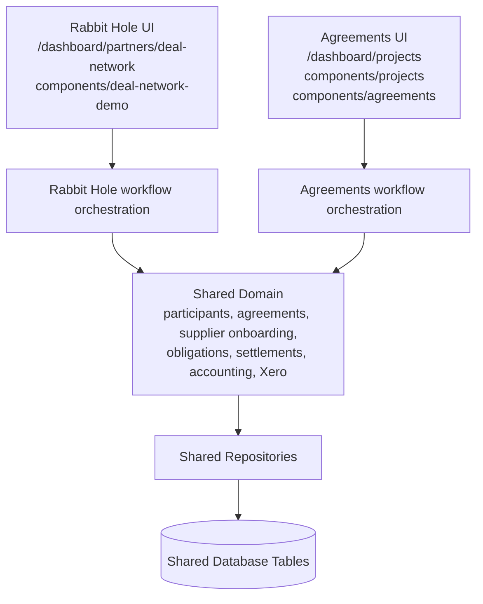

# ADR 0001: Rabbit Hole Pilot and Agreements Module Boundaries

## Status

Accepted.

## Context

The Rabbit Hole Deal Network pilot is a live production pilot for Alex and is now frozen.
Provvypay Agreements will continue to evolve under `/dashboard/projects/*`, but future
Agreements work must not accidentally change Rabbit Hole behaviour.

This decision establishes ownership boundaries only. It does not create new APIs,
database tables, repositories, or persistence models.

## Decision

The application is divided into three ownership areas:

| Area | Owns | Change Rule |
| --- | --- | --- |
| Rabbit Hole Pilot | `/dashboard/partners/deal-network/*`, `components/deal-network-demo/*`, pilot compatibility UI and snapshot client contracts | Frozen. Changes require explicit Rabbit Hole pilot approval. |
| Agreements | `/dashboard/projects/*`, `components/projects/*`, `components/agreements/*` | May evolve independently, but must not import Rabbit Hole UI components. |
| Shared Domain | participant rules, agreement rules, supplier onboarding, obligations, settlements, accounting, Xero, repositories, database models | Shared by both products. Must stay UI-agnostic. |

## Allowed Dependencies

Rabbit Hole UI and Agreements UI must not depend on each other directly.
Both may depend on shared domain services and repositories.

## Prohibited Dependencies

- Rabbit Hole UI must not import `components/projects/*` or `components/agreements/*`.
- Agreements UI must not add new imports from `components/deal-network-demo/*`.
- Business rules must not be implemented in React components when they can live in
  a shared domain service.
- Shared domain code must not import route-specific UI components.

## Current Compatibility Bridges

The boundary test documents existing Agreements-to-Rabbit-Hole UI bridges that are
allowed only to preserve current runtime behaviour:

- `/dashboard/projects/layout.tsx` uses the existing Deal Network experience provider.
- `components/projects/projects-workspace-index.tsx` uses the existing Rabbit Hole
  create-deal modal and experience provider.

These bridges are migration debt. New cross-UI imports are blocked by
`module-ownership-boundaries.test.ts`.

## Future Migration Strategy

1. Keep Rabbit Hole routes and UI frozen.
2. Move shared business behaviour into neutral domain modules when touching it for
   non-UI reasons.
3. Keep repositories and database tables shared unless a future product requirement
   proves that persistence must diverge.
4. Introduce separate workflow orchestration for Rabbit Hole and Agreements while
   reusing shared domain services underneath.
5. Remove the documented compatibility bridges only when the Agreements UI has a
   neutral replacement and the change can be verified as runtime-equivalent.

## Consequences

- Agreements can evolve without modifying Rabbit Hole UI.
- Rabbit Hole remains compatible for Alex.
- Shared backend code can continue to serve both products.
- Existing UI coupling is explicitly documented and guarded against expansion.
