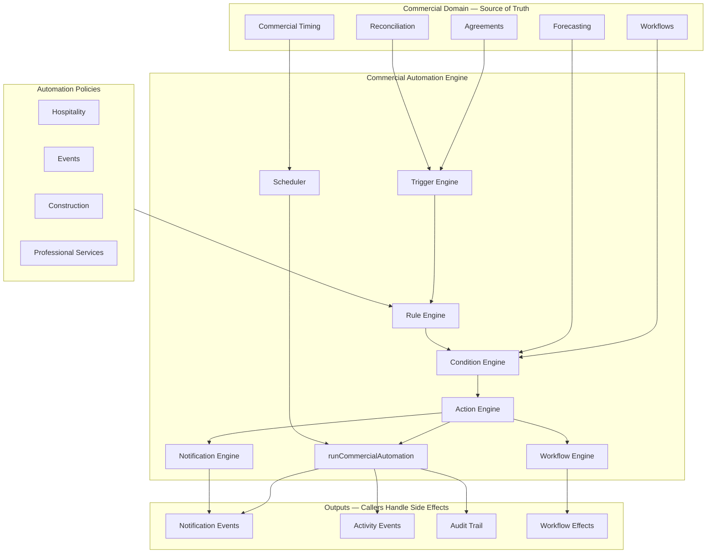

# Commercial Automation

**Status:** Production architecture  
**Module:** `src/lib/commercial-automation/`  
**Related:** [commercial-forecasting.md](./commercial-forecasting.md), [commercial-reconciliation.md](./commercial-reconciliation.md), [commercial-timing.md](./commercial-timing.md)

---

## Purpose

Provvypay is no longer a passive system of record. It is a **Commercial Operations Platform**.

The Commercial Automation Engine is the **deterministic execution layer** that sits on top of the Commercial Domain. It orchestrates commercial operations automatically — without AI.

| Layer | Role |
|-------|------|
| Commercial Agreements | Define intent |
| Commercial Workflows | Coordinate execution |
| Commercial Forecasting | Predict future state |
| **Commercial Automation** | **Execute operational work** |
| Settlement | Move value |
| Accounting | Record outcomes |
| AI (future) | Explain and optimise |

Automation consumes the commercial model. **It never owns it.**

---

## Architecture



---

## Execution Lifecycle

```
Commercial Event Occurs
        ↓
Trigger Engine resolves trigger
        ↓
Rule Engine finds matching rules (via Policy)
        ↓
Condition Engine evaluates conditions
        ↓
Action Engine plans actions
        ↓
Automation Engine executes
        ↓
Notification Events + Activity Events + Audit Entries
        ↓
Callers persist and dispatch
```

Every automation execution is **auditable** and **deterministic**. Same inputs → same outputs.

---

## Core Concepts

### Triggers

Commercial events that initiate automation evaluation:

| Trigger | Example |
|---------|---------|
| `agreement_approved` | Participant approves commercial terms |
| `invoice_overdue` | Invoice outstanding 7+ days |
| `settlement_ready` | All prerequisites met |
| `payment_received` | Customer payment confirmed |
| `forecast_risk_raised` | Forecast risk detected |
| `commercial_timing_approaching` | Service period within 7 days |
| `manual` | Operator-initiated |

Future integrations register new triggers without modifying the engine.

### Conditions

Determine whether a rule executes:

| Condition | Evaluates |
|-----------|-----------|
| `payout_details_missing` | Approved participants without bank details |
| `invoice_outstanding` | Unpaid invoices |
| `payment_late` | Overdue by N days |
| `settlement_eligible` | Settlement workflow READY |
| `all_participants_approved` | Every participant approved |
| `commercial_timing_within_days` | Events within N days |
| `forecast_confidence_above_threshold` | Forecast confidence level |

Rules combine multiple conditions (`all` or `any` mode).

### Actions

Reusable, composable operations:

| Action | Effect |
|--------|--------|
| `generate_invoice` | Create invoice from agreement |
| `export_invoice` | Queue accounting export |
| `send_reminder` | Payment or payout reminder |
| `release_settlement` | Release participant settlement |
| `refresh_forecast` | Re-derive commercial forecast |
| `create_activity_event` | Add to project history |
| `create_audit_entry` | Record in audit trail |
| `update_workflow_state` | Advance workflow (descriptor only) |

Actions return **plans** — callers handle persistence and dispatch.

### Rules

```
Trigger → Condition(s) → Action(s)
```

Example rules (built-in catalog):

1. **Agreement Approved + Payout Missing → Request Payout Details**
2. **Invoice Created → Export to Accounting**
3. **Invoice Overdue 7 Days → Send Payment Reminder**
4. **Settlement Eligible + All Approved → Release Settlement**
5. **Payment Received → Refresh Forecast**

---

## Automation Policies

One engine, configurable policies per business type:

| Policy | Focus |
|--------|-------|
| **Default** | All standard rules |
| **Hospitality** | Fast settlement, payout reminders |
| **Events** | Timing-driven, service period tracking |
| **Construction** | Milestone payments, approval tracking |
| **Professional Services** | Invoice export, payment reminders |

Policies are collections of enabled rule IDs — not separate engines.

```typescript
resolveRulesForPolicy('events')  // → timing + export + settlement rules
resolveRulesForPolicy('hospitality')  // → payout + settlement rules
```

---

## Scheduler

Time-based automation:

| Schedule | Rule |
|----------|------|
| 7 days before service period | Commercial timing reminder |
| 3 days before settlement | Settlement eligibility check |
| 14 days after invoice due | Overdue payment reminder |

`deriveScheduledAutomationJobs()` → `filterDueScheduledJobs()` → `prepareScheduledExecutions()`

---

## Notifications

Automation creates **notification events** — it never sends directly.

| Kind | Recipient |
|------|-----------|
| `payment_reminder` | Merchant |
| `payout_reminder` | Participant |
| `settlement_released` | Participant |
| `forecast_alert` | Operator |
| `workspace_invitation` | Participant |

Future adapters: Email (Resend), SMS (Twilio), Slack, Webhook (Zapier).

---

## Activity Timeline

Every automation creates activity events for project history:

- ✓ Workspace Invitation Sent
- ✓ Invoice Exported
- ✓ Payment Reminder Sent
- ✓ Settlement Released
- ✓ Forecast Updated

Reuses existing Activity Timeline — no new dashboard.

---

## Audit Trail

Every execution records:

- Rule ID and name
- Trigger kind
- Condition evaluation results
- Action results
- Timestamp and duration
- Status (success / partial / failed / skipped)
- Future retry count

---

## Workflow Integration

Automation **consumes** existing workflows — never duplicates state:

- `deriveParticipantWorkflows()` — commercial / settlement / accounting projections
- `deriveWorkflowEffectFromAction()` — returns effect descriptors
- `commercialEventKindFromAction()` — bridges to commercial event bus

Workflow state remains owned by the workflow engines.

---

## Forecast Integration

Automation consumes Commercial Forecasting:

- `forecast_risk_raised` trigger from risk analysis
- `refresh_forecast` action re-derives forecast
- `commercial_timing_within_days` condition uses forecast events
- Cashflow risk, late payment, settlement risk → automation triggers

Future AI recommendations use the same forecast events.

---

## Future AI Integration

Extension points only — no AI logic implemented:

| Extension | Purpose |
|-----------|---------|
| `deriveAiRuleRecommendationsExtension()` | Recommend rules |
| `deriveAiExecutionExplanationExtension()` | Explain why automation ran |
| `deriveAiWorkflowImprovementExtension()` | Suggest improvements |
| `deriveAiSettlementTimingExtension()` | Recommend settlement timing |

AI explains and recommends. **Automation executes.**

---

## Provider Adapters

Future integrations without engine modification:

| Provider | Role |
|----------|------|
| Stripe, Wise, HashPack, MetaMask | Payment triggers |
| Xero, QuickBooks, NetSuite | Accounting actions |
| Twilio, Resend | Notification delivery |
| Slack, Zapier, Webhook | External orchestration |

---

## Module Index

```
src/lib/commercial-automation/
├── types.ts
├── automation-engine.ts          ← runCommercialAutomation()
├── trigger-engine.ts
├── condition-engine.ts
├── action-engine.ts
├── rule-engine.ts                ← rules + policies
├── workflow-engine.ts
├── notification-engine.ts
├── scheduler.ts
├── adapters/
│   └── provider-adapters.ts
├── extensions/
│   └── ai-recommendations.ts
├── reporting/
│   └── automation-reporting.ts
└── index.ts
```

---

## Example Workflow

```
Agreement Approved
        ↓  [automation: request payout details]
Generate Invoice
        ↓  [automation: export to Xero]
Export to Xero
        ↓  [automation: invite workspace]
Invite Participants
        ↓  [automation: track approvals]
Track Approvals
        ↓  [automation: refresh forecast]
Monitor Forecast
        ↓  [automation: detect settlement eligibility]
Detect Settlement Eligibility
        ↓  [automation: release settlement]
Release Settlement
        ↓  [automation: queue accounting export]
Update Accounting
        ↓  [automation: notify participants]
Notify Participants
```

No individual workflow is hardcoded. All automation executes through the engine.

---

## Design Principle

> Commercial Agreements define intent.  
> Commercial Workflows coordinate execution.  
> Commercial Forecasting predicts future state.  
> Commercial Automation executes operational work.  
> Settlement moves value. Accounting records outcomes. AI explains and optimises.

Automation always executes from the **commercial model** rather than from payment or accounting events alone.

---

## Backwards Compatibility

- Existing workflows unchanged — automation returns descriptors only
- Commercial event bus remains the canonical consequence pipeline
- No schema migration required
- Policies opt-in per project
- All execution is pure/deterministic — side effects in callers
