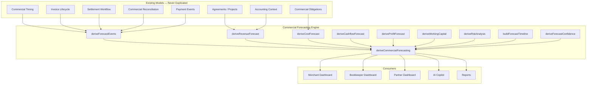

# Commercial Forecasting

**Status:** Production architecture  
**Module:** `src/lib/commercial-forecasting/`  
**Related:** [commercial-timing.md](./commercial-timing.md), [commercial-reconciliation.md](./commercial-reconciliation.md), [invoice-lifecycle.md](./invoice-lifecycle.md)

---

## Why Commercial Forecasting Exists

Accounting software records what **has happened**. Provvypay understands what **will happen** — because it owns the commercial relationship before money moves.

Provvypay's competitive advantage is understanding commercial commitments before money moves. The forecasting engine consumes those commitments to answer:

> What is going to happen next?

Not just "what is the forecast balance?" but:

- 15 July — Customer payment expected — $18,000
- 20 July — Service period begins
- 31 July — Revenue recognised
- 15 August — Participant settlements
- 18 August — Stripe payout clears

---

## The Evolved Workflow

```
Agreement
    ↓
Commercial Timing
    ↓
Commercial Obligations
    ↓
Invoice Lifecycle
    ↓
Settlement Workflow
    ↓
Commercial Reconciliation
    ↓
Commercial Forecasting        ← THIS MODULE
    ↓
Merchant Dashboard
Bookkeeper Dashboard
Partner Dashboard
AI
Reports
```

---

## Key Distinctions

| Concept | What it is |
|---------|------------|
| **Forecast Revenue** | Expected revenue from commercial commitments (agreements, funding sources) |
| **Recognised Revenue** | Revenue attributed to a recognition period (commercial timing) |
| **Collected Cash** | Confirmed payments received |
| **Outstanding Receivables** | Customer payments expected but not yet received |
| **Settlement** | Participant payouts after commercial obligations are met |
| **Profit** | Forecast revenue minus forecast costs (obligations) |
| **Working Capital** | Receivables, payables, expected cash, outstanding settlement |

**Design principle:** Provvypay does not forecast from historical accounting data. Provvypay forecasts from commercial commitments. Commercial agreements define the future. Accounting records the past. Forecasting is the bridge between those two.

---

## Architecture



---

## Forecast Events

The primary human-facing forecast primitive. Instead of only numbers, forecast **events**:

```typescript
type ForecastEvent = {
  id: string;
  date: string;                    // YYYY-MM-DD
  category: ForecastEventCategory;
  label: string;
  description: string;
  amount: number | null;
  currency: string;
  confidence: CommercialForecastConfidence;
  confidenceReasons: string[];
  source: 'agreement' | 'timing' | 'obligation' | 'invoice' | 'settlement' | 'payment' | 'reconciliation';
  relatedId: string | null;
  occurred: boolean;
};
```

### Event Categories

| Category | Example |
|----------|---------|
| `customer_payment_expected` | 15 July — Customer payment expected — $18,000 |
| `service_period_start` | 20 July — Event service period begins |
| `revenue_recognised` | 31 July — Revenue recognised |
| `participant_settlement` | 15 August — Participant settlements |
| `bank_payout_clearing` | 18 August — Stripe payout clears |
| `tax_liability_due` | 20 August — GST liability due |
| `settlement_eligible` | Settlement ready after reconciliation |

---

## Forecast Confidence

Confidence derives from workflow state — **never fabricated**:

| Level | Derived from |
|-------|-------------|
| **Committed** | Confirmed funding, paid invoices, settlement ready |
| **Likely** | Pending with high confidence, partial payment, agreement approved |
| **Expected** | Exported invoice awaiting payment, medium confidence |
| **Tentative** | Forecast-only revenue, unapproved agreements, blocked settlement |

---

## Revenue Forecast

| Bucket | Source |
|--------|--------|
| Committed Revenue | Confirmed funding sources |
| Pending Revenue | Pending payment sources |
| Expected Revenue | Forecast-only sources |
| Recognised Revenue | Recognition period from commercial timing |
| Collected Revenue | Confirmed payments received |

Dollar totals delegate to existing `deriveCommercialForecast()` — not duplicated.

---

## Cost Forecast

| Bucket | Source |
|--------|--------|
| Participant Payouts | Obligation rows (non-supplier) |
| Supplier Invoices | Supplier-type obligations |
| Operational Costs | Expense-type obligations |
| Future Obligations | Unsettled obligation rows |

---

## Cashflow Forecast

Time-bucketed inflows and outflows from forecast events:

- Expected customer payments
- Expected participant settlements
- Expected bank deposits
- Expected cash balance
- Outstanding receivables
- Outstanding payables

Does **not** rely on historical accounting entries.

---

## Forecast Timeline

Reusable monthly bars for every dashboard:

```
July
██████████████  Revenue
██████████      Costs
██████          Settlement
████████        Cash
```

`buildForecastTimeline()` produces normalized bar values (0–1) plus event lists per month.

---

## Risk Analysis

Reusable risk derivation for future AI:

- Late customer payment
- Outstanding obligations
- Settlement delays
- Approval bottlenecks
- Revenue concentration

---

## Settlement Integration

Settlement forecast derives from settlement workflow inputs — not bank feeds:

```
Payment Received
    ↓
Commercial Reconciliation
    ↓
Settlement Eligible (forecast event)
    ↓
Participant Settlement (forecast event)
```

---

## Partner Workspace Support

Extension points support all workspace types without redesign:

| Scope | Function |
|-------|----------|
| Single merchant | `deriveMerchantForecast()` |
| Portfolio | `derivePortfolioForecast()` |
| Advisor | `deriveAdvisorForecast()` |
| Bookkeeper | `deriveBookkeeperForecast()` |

---

## AI Extension Points

Future AI consumes forecasting — does not recreate it:

| Extension | Purpose |
|-----------|---------|
| `deriveAiCashflowWarningsExtension()` | Cashflow deficit warnings |
| `deriveAiRevenueProjectionExtension()` | Revenue projections |
| `deriveAiSettlementPredictionExtension()` | Settlement predictions |

---

## Reporting Extension Points

| Report | Function |
|--------|----------|
| Revenue Forecast | `deriveRevenueForecastReport()` |
| Cashflow Forecast | `deriveCashflowForecastReport()` |
| Settlement Forecast | `deriveSettlementForecastReport()` |
| Profit Forecast | `deriveProfitForecastReport()` |
| Working Capital | `deriveWorkingCapitalForecastReport()` |
| Forecast Events | `deriveForecastEventsReport()` |

No dashboards — only reusable report derivation services.

---

## Module Index

```
src/lib/commercial-forecasting/
├── types.ts
├── derive-commercial-forecast.ts       ← canonical orchestrator
├── derive-forecast-events.ts             ← forecast events
├── derive-forecast-confidence.ts
├── derive-revenue-forecast.ts
├── derive-cost-forecast.ts
├── derive-cashflow-forecast.ts
├── derive-profit-forecast.ts
├── derive-working-capital.ts
├── derive-risk-analysis.ts
├── forecast-timeline.ts
├── reporting/
│   └── forecasting-reporting.ts
├── extensions/
│   ├── ai-recommendations.ts
│   └── partner-workspace.ts
└── index.ts
```

---

## Backwards Compatibility

- Dollar forecast math unchanged — delegates to `deriveCommercialForecast()`
- All new fields derived — no schema migration required
- Existing financial snapshot and planning flows preserved
- Commercial timing extension now delegates to this module (replaces placeholders)
- Historical accounting entries not required for forecasting

---

## Design Principle

> Provvypay does not forecast from historical accounting data.  
> Provvypay forecasts from commercial commitments.  
> Commercial agreements define the future. Accounting records the past.  
> Forecasting becomes the bridge between those two.
