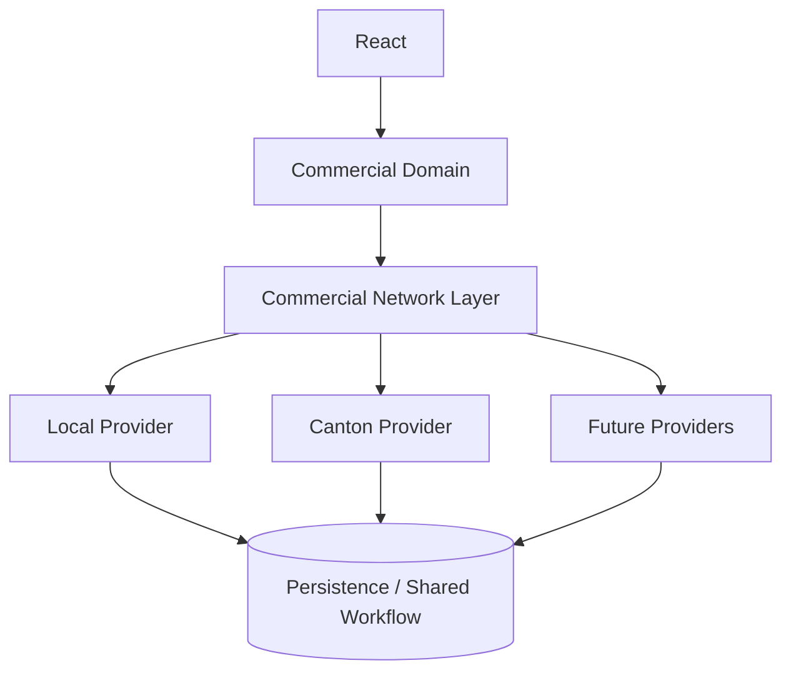
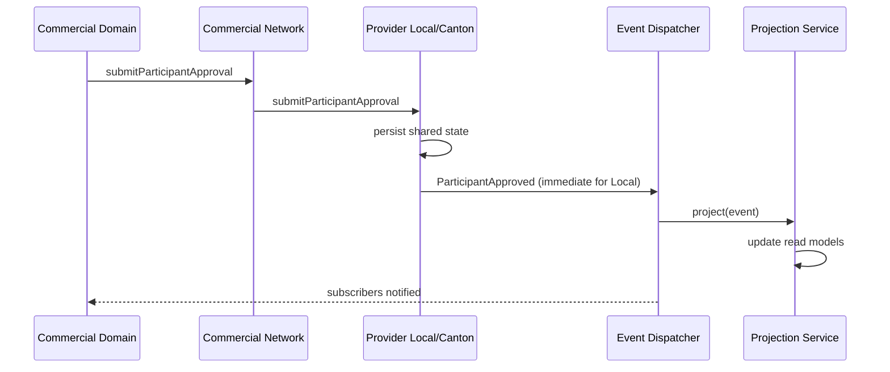

# Commercial Network Layer

**Status:** Architecture introduced  
**Module:** `src/lib/commercial-network/`  
**Related:** [CANONICAL_DOMAIN_MODEL.md](./CANONICAL_DOMAIN_MODEL.md), [commercial-automation.md](./commercial-automation.md), [participant-workspace.md](./participant-workspace.md)

---

## Purpose

Provvypay is the **Commercial Operating System**.

Shared workflow networks (Local today, Canton tomorrow, others later) synchronize **shared commercial state**. They do not own business logic.

This milestone introduces a **Commercial Network Layer** that decouples the Commercial Domain from any specific shared workflow network. Canton is **one** implementation — never hardcoded into the domain.

---

## Target architecture



Previously:

```text
React → Commercial Domain → Postgres
```

Now:

```text
React
  ↓
Commercial Domain
  ↓
Commercial Network Layer
  ↓
Local Provider | Canton Provider | Future Providers
  ↓
Persistence / Shared Workflow
```

---

## Commercial Operating System

Provvypay remains the source of **business logic**:

| Owned by Provvypay | Not owned by network providers |
|--------------------|--------------------------------|
| Forecasting | Shared agreement sync |
| Automation | Workflow commands |
| Accounting connectors | Participant approvals |
| AI (future) | Settlement approvals |
| Reporting | Event subscription |
| UI | Projection updates |

**Rule:** Providers never own forecasting, automation, accounting, AI, reporting, or UI. Only shared workflow synchronization.

---

## Commercial Network

The Commercial Network is the **boundary** between Provvypay and external workflow networks.

Domain code opens a network handle:

```ts
import { openCommercialNetwork } from '@/lib/commercial-network';

const network = openCommercialNetwork({
  organizationId: 'org-…',
  projectId: 'agreement-…', // optional
});

await network.createSharedCommercialAgreement({ … });
await network.submitParticipantApproval({ … });
```

The domain must not import Canton SDKs, ledger clients, or provider-specific modules.

---

## Provider Pattern

Every network implements `CommercialNetworkProvider`:

| Responsibility | Method |
|----------------|--------|
| Create Shared Commercial Agreement | `createSharedCommercialAgreement` |
| Update Commercial Agreement | `updateCommercialAgreement` |
| Transition Workflow | `transitionWorkflow` |
| Submit Participant Approval | `submitParticipantApproval` |
| Submit Settlement Approval | `submitSettlementApproval` |
| Subscribe to Workflow Events | `subscribeToWorkflowEvents` |
| Publish Commercial Events | `publishCommercialEvent` |
| Synchronize Shared State | `synchronizeSharedState` |

### Provider Registry

Providers are selected by organisation (or project override) — never hardcoded:

```ts
import {
  setCommercialNetworkConfig,
  getDefaultCommercialNetworkProviderRegistry,
} from '@/lib/commercial-network';

setCommercialNetworkConfig('org-1', { provider: 'local' });
// later:
setCommercialNetworkConfig('org-1', { provider: 'canton' });

const provider = getDefaultCommercialNetworkProviderRegistry().resolveFor({
  organizationId: 'org-1',
});
```

Registered today:

- `LocalProvider`
- `CantonProvider` (skeleton)

Future slots: Azure, Hyperledger, others (`extensions/future-providers.ts`).

---

## Local Provider

**Default.** Wraps existing Provvypay behaviour.

- Persists via `LocalPersistencePort` (in-memory for tests; production binds to current Postgres / pilot paths)
- Dispatches Commercial Network events **immediately**
- Preserves current functionality — **no behavioural changes** for the running app

Existing API routes and pilot-snapshot persistence continue to operate as before. New domain orchestration should prefer `openCommercialNetwork` so Local / Canton stay interchangeable.

---

## Canton Provider

**Implemented** for the HackCanton Shared Commercial Agreement workflow.

- Daml model extends official cn-quickstart (`canton/cn-quickstart/.../shared-commercial-agreement`)
- Mediated **adapter** behind `CantonCommercialNetworkProvider`:
  - `simulated` → `CantonLedgerRuntime` (tests / default)
  - `localnet` → Quickstart JSON Ledger API (real Canton LocalNet)
- Ledger events → Commercial Network events → Projection Service → Commercial Domain → UI
- UI narration: **Provvypay Platform**; Daml field: `platform`
- Accountant is **not** a ledger party

See [hackcanton-shared-commercial-agreement.md](./hackcanton-shared-commercial-agreement.md) and [hackcanton-localnet.md](./hackcanton-localnet.md).

---

## Projection Architecture


This mirrors how future Canton ledger events will update Provvypay read models.

Read models include agreement, workflow, participant, and settlement projections. They are **thin** — full forecast / automation / accounting remain domain engines.

---

## Event Flow



Canonical network event kinds:

- `AgreementCreated`
- `AgreementUpdated`
- `WorkflowTransitioned`
- `ParticipantApproved`
- `SettlementReady`
- `SettlementReleased`
- `CommercialForecastUpdated`
- `AutomationExecuted`

**Local** dispatches immediately. **Future providers** may dispatch asynchronously from ledger streams.

> Note: These are **network-boundary** events. The Commercial Domain event bus (`processCommercialEvent`) remains the pure in-OS pipeline for forecast / timeline / notification consequences.

---

## Network Configuration

Organisation-level (configuration only — no UI in this milestone):

```text
Commercial Network
  ○ Local    ← default
  ○ Canton
```

API:

```ts
setCommercialNetworkConfig(organizationId, {
  provider: 'local',
  projectOverrides: {
    'project-premium': 'canton',
  },
});
```

---

## Future Providers

| Provider | Status |
|----------|--------|
| Local | Implemented (default) |
| Canton | Skeleton + extension points |
| Azure | Hint only |
| Hyperledger | Hint only |

Adding a provider:

1. Implement `CommercialNetworkProvider`
2. Register a factory on the provider registry
3. Add the id to `AVAILABLE_COMMERCIAL_NETWORK_PROVIDERS` when selectable
4. Do **not** change Commercial Domain engines

---

## Module map

```text
src/lib/commercial-network/
  types.ts
  events.ts
  commercial-network-provider.ts
  commercial-network.ts          ← domain facade
  provider-registry.ts
  network-config.ts
  projection-service.ts
  event-dispatcher.ts
  adapters/
    local-persistence-port.ts
  providers/
    local/
      local-provider.ts
    canton/
      canton-provider.ts
      extension-points.ts
  extensions/
    canton-extension-points.ts
    future-providers.ts
  index.ts
```

---

## Design principles (summary)

1. Provvypay remains the Commercial Operating System.
2. Commercial Networks synchronize shared commercial state only.
3. The Commercial Domain never knows which network implementation is used.
4. Local preserves today’s behaviour.
5. Canton (and others) plug in without domain rewrites.
