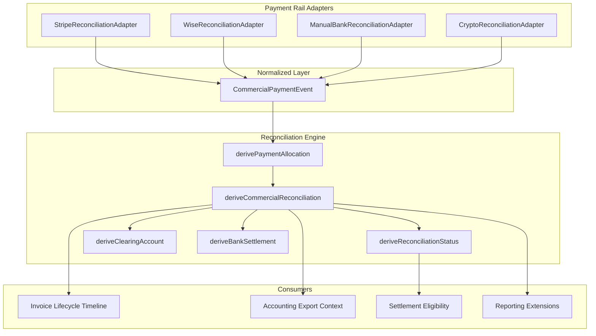

# Commercial Reconciliation

**Status:** Production architecture  
**Module:** `src/lib/commercial-reconciliation/`  
**Related:** [commercial-timing.md](./commercial-timing.md), [invoice-lifecycle.md](./invoice-lifecycle.md), [commercial-forecasting.md](./commercial-forecasting.md)

---

## Why Commercial Reconciliation Exists

Accounting software records transactions. Provvypay understands **commercial relationships**.

Because Provvypay owns the agreement, invoice, payment link, and participant context, reconciliation should be **automatic wherever possible** — driven by commercial identity, not bank-feed guessing.

Bank reconciliation confirms that money arrived in a bank account. **Commercial reconciliation** confirms that a payment belongs to a specific invoice under a specific agreement — before accounting systems need to discover that relationship independently.

---

## The Evolved Workflow

```
Agreement
    ↓
Commercial Timing
    ↓
Invoice Created
    ↓
Invoice Exported (accounting receivable)
    ↓
Customer Pays → Payment Event
    ↓
Commercial Reconciliation        ← THIS MODULE
    ↓
Clearing Account
    ↓
Bank Settlement
    ↓
Accounting Reconciliation (Xero payment sync)
    ↓
Settlement Eligible
    ↓
Participant Paid
```

---

## Key Distinctions

| Concept | What it is |
|---------|------------|
| **Commercial Reconciliation** | Matching payment to invoice using Provvypay's commercial identity |
| **Bank Reconciliation** | Confirming funds cleared in a bank account (downstream) |
| **Settlement** | Releasing participant payouts after commercial obligations are met |
| **Accounting Export** | Pushing invoice/payment records to Xero — consumes reconciliation context |
| **Clearing Account** | Temporary holding account per payment rail (Stripe Clearing, Wise Clearing, etc.) |

Commercial reconciliation happens **before** accounting reconciliation. Accounting systems consume reconciliation results rather than discovering relationships independently.

---

## Architecture



### Adapter Pattern

Provider-specific logic lives in **adapters only**. The reconciliation engine operates exclusively on `CommercialPaymentEvent`:

| Adapter | Rail | Normalizes |
|---------|------|------------|
| `StripeReconciliationAdapter` | `stripe` | Stripe PAYMENT_CONFIRMED events |
| `WiseReconciliationAdapter` | `wise` | Wise transfer events |
| `ManualBankReconciliationAdapter` | `manual_bank` | Manual bank confirmations |
| `CryptoReconciliationAdapter` | `crypto` / `hedera` / `evm_wallet` | HashPack, MetaMask, crypto rails |

Adding a new rail = add an adapter. The engine never changes.

---

## Reconciliation Model

```typescript
type CommercialReconciliation = {
  reconciliationId: string;
  invoiceId: string;           // payment_links.id
  paymentLinkId: string;
  agreementId: string | null;
  paymentEventId: string | null;
  paymentRail: PaymentRailId | null;
  clearingAccount: ClearingAccountMapping | null;
  settlementReference: string | null;
  reconciliationStatus: CommercialReconciliationStatus;
  matchedAmount: number;
  remainingAmount: number;
  allocations: PaymentAllocation[];
  commercialIdentity: CommercialIdentity;
  bankSettlement: BankSettlementView | null;
  settlementEligible: boolean;
};
```

### Reconciliation Status

| Status | Meaning |
|--------|---------|
| `Pending` | No payment received yet |
| `Matched` | Payment fully allocated to invoice |
| `PartiallyMatched` | Partial payment allocated |
| `Cleared` | Bank settlement complete |
| `RequiresReview` | Assisted review required (e.g. PAID_UNVERIFIED) |
| `Failed` | Reconciliation failed |

All statuses are **derived** — backwards compatible with existing data.

---

## Clearing Accounts

Clearing accounts map payment rails to configurable holding accounts:

| Payment Rail | Config Key | Default Account Name |
|--------------|------------|---------------------|
| Stripe | `stripe_clearing` | Stripe Clearing |
| Wise | `wise_clearing` | Wise Clearing |
| Manual Bank | `bank_clearing` | Bank Clearing |
| Hedera / HashPack | `crypto_clearing` | HBAR Clearing / Crypto Clearing |
| EVM Wallet / MetaMask | `crypto_clearing` | USDC Clearing / Crypto Clearing |
| Crypto | `crypto_clearing` | Crypto Clearing |

Account names come from `recommended-accounting-config.ts` — not hardcoded in the engine. Merchant settings provide configured Xero account codes via mapping fields.

**Resolver:** `deriveClearingAccount(paymentRail, overrides?)`

---

## Payment Allocation

`derivePaymentAllocation()` supports:

- **Full payment** — single event covers invoice amount
- **Partial payment** — remaining amount tracked
- **Multiple payments** — events processed in chronological order
- **Overpayment** — detected and flagged
- **Refunds / chargebacks** — extension points only (`extensions/refunds.ts`, `extensions/chargebacks.ts`)

---

## Commercial Identity

Every payment already knows:

- Agreement (`pilot_deal_id`)
- Invoice (`payment_link_id`)
- Organization / merchant
- Payment event

Reconciliation derives from these relationships. **No heuristic matching** when Provvypay owns the data.

---

## Settlement Integration

Settlement consumes reconciliation — it does not depend on bank feeds:

```
Payment Received
    ↓
Commercial Reconciliation (Matched)
    ↓
Settlement Eligible
    ↓
Settlement Released
```

`settlementEligible` is true when status is `Matched` or `Cleared`.

---

## Accounting Export Integration

Accounting export context is enriched with reconciliation data — **no Xero behaviour changes**:

- Payment rail + label
- Clearing account mapping
- Reconciliation status
- Settlement reference
- Matched / remaining amounts
- Settlement eligibility

Stored in Xero sync payload metadata for future mapping.

---

## UI — Invoice Lifecycle Timeline

The existing payment lifecycle panel shows:

1. Invoice Created
2. Invoice Exported
3. Awaiting Payment
4. Payment Received
5. **Commercially Reconciled** ← new
6. **Bank Cleared** ← new
7. Invoice Paid
8. Settlement Ready

No separate accounting dashboard.

---

## Reporting Extension Points

| Function | Future report |
|----------|---------------|
| `deriveOutstandingClearingAccountsReport()` | Outstanding Clearing Accounts |
| `deriveStripeClearingBalanceReport()` | Stripe Clearing Balance |
| `deriveWiseClearingBalanceReport()` | Wise Clearing Balance |
| `deriveCryptoClearingBalanceReport()` | Crypto Clearing Balance |
| `deriveUnreconciledPaymentsReport()` | Unreconciled Payments |
| `derivePartialAllocationsReport()` | Partial Allocations |

---

## Module Index

```
src/lib/commercial-reconciliation/
├── types.ts
├── derive-commercial-reconciliation.ts    ← canonical engine
├── derive-clearing-account.ts
├── derive-payment-allocation.ts
├── derive-reconciliation-status.ts
├── derive-bank-settlement.ts
├── adapters/
│   └── reconciliation-rail-adapters.ts
├── extensions/
│   ├── refunds.ts
│   ├── chargebacks.ts
│   └── future-providers.ts
├── reporting/
│   └── reconciliation-reporting.ts
└── index.ts
```

---

## Design Principle

> Provvypay already understands the commercial relationship.  
> Commercial reconciliation should happen **before** accounting reconciliation.  
> Accounting systems should consume reconciliation results rather than discovering relationships independently.  
> Commercial identity is the source of truth. Accounting is a downstream representation.

---

## Backwards Compatibility

- All reconciliation fields are derived — no schema migration required
- Existing invoices without payments remain `Pending`
- Existing paid invoices reconcile automatically via commercial identity
- Invoice lifecycle timeline preserved with additional milestones
- Bank-feed self-heal paths unchanged
