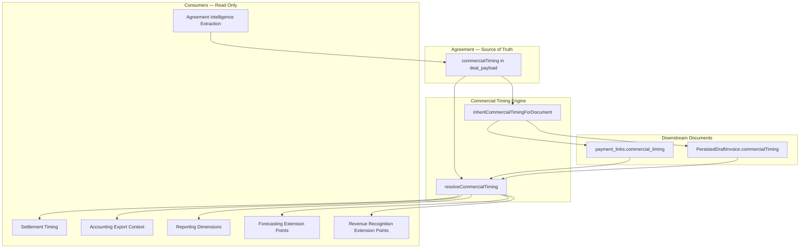
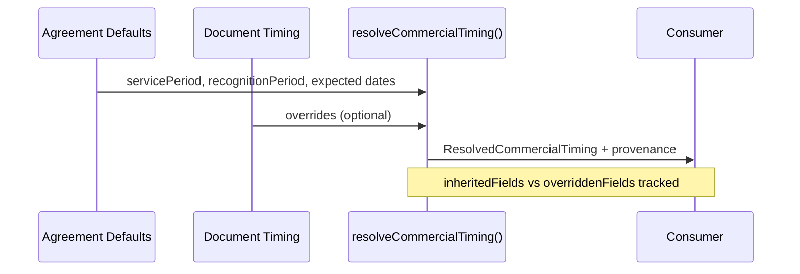

# Commercial Timing

**Status:** Canonical architecture — Phase 1 foundation  
**Module:** `src/lib/commercial-timing/`

---

## Why Commercial Timing Exists

Provvypay models **commercial intent before accounting**.

Today the platform understands agreements, participants, obligations, payment events, settlement, and accounting exports. Each of these has its own dates — invoice issue dates, due dates, payment receipt dates, settlement completion dates, and accounting period postings.

Commercial Timing introduces a first-class concept: **when commercial activity actually occurs**, independent of when documents are issued or cash moves.

This is not an accounting-only feature. It belongs beside Agreement, Participants, Obligations, and Settlement in the commercial model. Accounting systems consume Commercial Timing later — they do not own it.

---

## Core Principle

```
Commercial Agreement (source of truth)
        ↓
Commercial Timing defaults
        ↓
Invoices · Bills · Payment Events (inherit + optional override)
        ↓
Settlement · Accounting · Reporting · Forecasting (consume)
```

**Design rules:**

1. Commercial Timing belongs to the **commercial agreement** (`deal_payload.commercialTiming`).
2. Downstream documents **inherit by default** and may **override** specific fields.
3. **Never fabricate** timing values — if extraction or input cannot determine a field, leave it empty.
4. All timing fields are **optional** — existing projects and invoices continue working unchanged.

---

## Timing Concepts — What Each Date Means

| Concept | Meaning | Typical source |
|---------|---------|----------------|
| **Invoice Date** | When the invoice document was issued | `payment_links.invoice_date` |
| **Due Date** | When payment is contractually due on the invoice | `payment_links.due_date` |
| **Service Period** | When the commercial deliverable or service occurred | `CommercialTiming.servicePeriodStart/End` |
| **Recognition Period** | Month for revenue or cost recognition | `CommercialTiming.recognitionPeriod` |
| **Expected Payment Date** | Commercial expectation of customer payment | `CommercialTiming.expectedPaymentDate` |
| **Expected Settlement Date** | Commercial expectation of participant settlement | `CommercialTiming.expectedSettlementDate` |
| **Actual Settlement Date** | When settlement actually completed | `payment_settlements.settled_at`, funding `actual_settlement_date` |
| **Payment Date** | When payment was received | `payment_events` / payment lifecycle |
| **Accounting Period** | Period in which an accounting system posts entries | Xero/QB/NetSuite posting period (downstream) |

### Key Distinctions

- **Invoice Date ≠ Service Period** — An invoice issued in March may cover services delivered in January.
- **Due Date ≠ Expected Payment Date** — Contractual terms vs commercial forecast.
- **Settlement Date ≠ Recognition Period** — Cash movement vs when revenue is commercially earned.
- **Accounting Period ≠ Recognition Period** — Accounting systems may post in a different period unless explicitly aligned.

---

## Architecture Diagram



---

## Data Model

### Canonical Type

```typescript
type CommercialTimingFields = {
  servicePeriodStart?: string | null;      // ISO datetime
  servicePeriodEnd?: string | null;
  recognitionPeriod?: { year: number; month: number } | null;
  expectedPaymentDate?: string | null;
  expectedSettlementDate?: string | null;
};
```

### Storage Locations

| Layer | Storage | Notes |
|-------|---------|-------|
| Agreement defaults | `deal_payload.commercialTiming` | Source of truth |
| Customer invoices | `payment_links.commercial_timing` (JSON) | Inherits from linked project |
| Supplier bills | `participant_payload.paymentSetup` → `PersistedDraftInvoice.commercialTiming` | Same model |
| Settlement actuals | Existing settlement tables | Not duplicated |

---

## Resolution Flow



When a project-linked invoice is created without explicit timing:

1. Load agreement timing from `deal_network_pilot_deals.deal_payload`.
2. Call `inheritCommercialTimingForInvoice()`.
3. Store result on `payment_links.commercial_timing`.

---

## Extension Points (Not Yet Implemented)

Phase 1 defines architecture only. These functions exist as placeholders:

| Function | Module | Purpose |
|----------|--------|---------|
| `deriveRevenueRecognition()` | `extensions/revenue-recognition.ts` | Revenue recognition schedules |
| `deriveDeferredRevenue()` | `extensions/revenue-recognition.ts` | Deferred revenue balances |
| `deriveAccrualEntries()` | `extensions/revenue-recognition.ts` | Accrual journal entries |
| `deriveExpectedRevenueTiming()` | `extensions/forecasting.ts` | Expected revenue forecast |
| `deriveCashFlowForecast()` | `extensions/forecasting.ts` | Cash flow forecast |
| `deriveReportingDimensions()` | `extensions/reporting.ts` | Report grouping keys |
| `deriveSettlementTiming()` | `extensions/settlement-timing.ts` | Expected vs actual settlement |
| `getAccountingTimingMappingHints()` | `extensions/accounting-export-mapping.ts` | Xero/QB/NetSuite field mapping docs |
| `extractCommercialTimingFromAgreementIntelligence()` | `extensions/agreement-intelligence.ts` | AI extraction — never fabricates |

---

## Future Accounting Integrations

Accounting exports **do not yet consume** Commercial Timing. The export engine passes through `commercialTiming.resolved` and `commercialTiming.exportContext` on `AccountingExportModel` for future mapping.

Documented provider mappings (inactive):

| Provvy Field | Xero (future) | QuickBooks (future) | NetSuite (future) |
|--------------|---------------|---------------------|-------------------|
| servicePeriodStart | Line tracking / custom field | ServiceDate | custbody_service_period_start |
| servicePeriodEnd | Line tracking / custom field | Custom field | custbody_service_period_end |
| recognitionPeriod | TrackingCategory | Class / Location | PostingPeriod segment |
| expectedPaymentDate | Custom field (≠ DueDate) | SalesTerm override | custbody_expected_payment |
| expectedSettlementDate | Bill payment schedule | Bill expected date | custbody_expected_settlement |

See `getAccountingTimingMappingHints()` for full mapping documentation.

---

## How This Supports Future Capabilities

### Revenue Recognition
Service period and recognition period drive when revenue is earned — not when invoices are issued.

### Deferred Revenue
Service period end dates define deferral boundaries without redesigning the invoice model.

### Accrual Accounting
Recognition period enables accrual entries before cash receipt.

### Forecasting
Commercial Timing becomes the **primary forecast input** — derived from agreements, participants, obligations, and settlement rules, not historical accounting entries.

### Cash Flow
Expected payment and settlement dates feed cash flow forecasts independently of invoice due dates.

### Multi-Accounting-System Support
Provider-agnostic timing model maps to Xero, QuickBooks, and NetSuite via documented field hints.

### Agreement Intelligence / AI
Single extraction surface at `extractCommercialTimingFromAgreementIntelligence()` — populates timing where possible, leaves empty otherwise.

---

## UI — Project Planning

The Planning workspace includes a **Commercial Timing** section:

- Service Period (start / end)
- Recognition Period (month picker)
- Expected Customer Payment
- Expected Participant Settlement

Values save to `deal_payload.commercialTiming` via `PATCH /api/deal-network-pilot/deals/[dealId]/commercial-timing`.

---

## Backwards Compatibility

- All timing fields are optional.
- Existing projects without `commercialTiming` continue working.
- Existing invoices without `commercial_timing` continue working.
- Prisma migration adds nullable `commercial_timing JSONB` column — no data backfill required.
- Operational graph, obligations, funding, and settlement workflows are unchanged.

---

## Module Index

```
src/lib/commercial-timing/
├── types.ts                          # Canonical types
├── serialization.ts                  # Parse / serialize JSON
├── resolve-commercial-timing.ts      # Merge agreement + document
├── inherit-commercial-timing.ts      # Document inheritance
├── commercial-timing-payload.ts      # deal_payload helpers
├── payment-link-timing.ts            # payment_links helpers
├── validation.ts                     # Zod schemas
├── index.ts                          # Barrel export
└── extensions/
    ├── revenue-recognition.ts
    ├── forecasting.ts
    ├── reporting.ts
    ├── settlement-timing.ts
    ├── accounting-export-mapping.ts
    └── agreement-intelligence.ts
```

---

## Related Documentation

- [CANONICAL_DOMAIN_MODEL.md](./CANONICAL_DOMAIN_MODEL.md) — Agreement hierarchy
- [invoice-lifecycle.md](./invoice-lifecycle.md) — Immediate invoice export workflow
- [commercial-reconciliation.md](./commercial-reconciliation.md) — Commercial reconciliation engine
- [commercial-forecasting.md](./commercial-forecasting.md) — Commercial forecasting engine
- [commercial-automation.md](./commercial-automation.md) — Commercial automation engine
- [AGREEMENT_INTELLIGENCE_ENGINE_PROPOSAL.md](./AGREEMENT_INTELLIGENCE_ENGINE_PROPOSAL.md) — Intelligence platform
