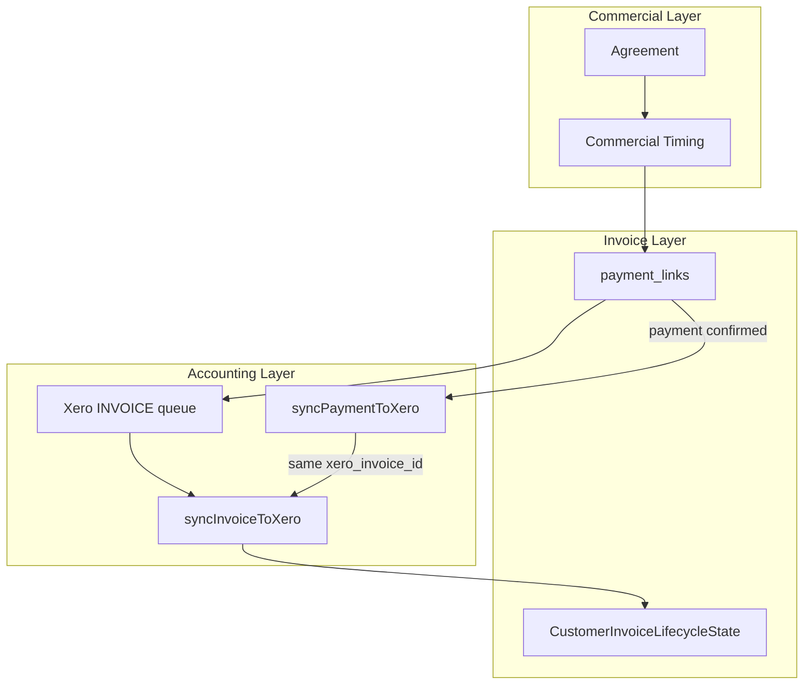

# Invoice Lifecycle — Immediate Export

**Status:** Production architecture  
**Related:** [commercial-timing.md](./commercial-timing.md)

---

## Why Invoices Are Exported Immediately

Provvypay models **commercial commitments before cash moves**.

Accounting software should always reflect:
- Outstanding receivables
- Outstanding payables
- Current commercial obligations

Waiting until payment before exporting invoices means accounting systems only learn about obligations after cash arrives. That hides receivables, breaks cash-vs-accrual separation, and prevents operators from seeing what is owed.

**Immediate Invoice Export** is the default workflow:

```
Agreement
    ↓
Invoice Created (payment_links — OPEN)
    ↓
Immediately exported to accounting (Xero ACCREC — AUTHORISED)
    ↓
Outstanding (awaiting customer payment)
    ↓
Payment Received
    ↓
Existing invoice marked Paid (Xero payment against same invoice ID)
    ↓
Settlement
    ↓
Accounting Updated (payment sync)
```

The invoice exists in accounting **before** payment occurs. Payment does not create a new invoice — it updates the exported invoice.

---

## Lifecycle States

Customer invoices (`payment_links`) use an explicit derived lifecycle:

| State | Meaning |
|-------|---------|
| `DRAFT` | Editable, not yet issued |
| `ISSUED` | Invoice created internally |
| `EXPORTED` | Pushed to accounting (Xero INVOICE sync success) |
| `OUTSTANDING` | Exported and awaiting payment |
| `PARTIALLY_PAID` | Partial payment received against same invoice |
| `PAID` | Fully paid — invoice identity preserved |
| `CANCELLED` | Expired or cancelled |

**Module:** `src/lib/payment-links/customer-invoice-lifecycle.ts`

States are **derived** from `payment_links.status`, `xero_syncs`, and `payment_events` — backwards compatible with existing rows.

---

## Timing Concepts

| Concept | Role in lifecycle |
|---------|-------------------|
| **Invoice Date** | Document issue date (`payment_links.invoice_date`) — when the invoice was issued |
| **Due Date** | Contractual payment terms (`payment_links.due_date`) |
| **Service Period** | When commercial activity occurred (Commercial Timing) |
| **Recognition Period** | Month for revenue recognition grouping (Commercial Timing) |
| **Expected Payment Date** | Commercial forecast of customer payment (Commercial Timing) |
| **Payment Date** | When payment was actually received (`payment_events`) |
| **Settlement Date** | When funds cleared to merchant (`payment_settlements`) |
| **Accounting Export** | When invoice appeared in Xero (INVOICE sync) vs when payment recorded (PAYMENT sync) |

Commercial Timing is resolved via `resolvePaymentLinkCommercialTimingForExport()` — never duplicated in export code.

---

## Architecture



**Dependency direction:** Commercial Timing → Invoice → Accounting. Never reversed.

---

## Xero Integration

### Invoice Export (before payment)

Triggered at invoice creation via `runPaymentLinkPostCreateEffects()` → `queueXeroSync({ syncType: 'INVOICE' })`.

`createXeroInvoice()` receives:
- Resolved Commercial Timing (service period, recognition period, expected payment)
- Invoice date / due date from link + timing resolver
- Commercial timing preserved in sync payload metadata when Xero lacks native fields

### Payment Sync (after payment)

`confirmPayment()` queues `syncType: 'PAYMENT'` only — never creates a new invoice.

`syncPaymentToXero()` records payment against the **existing** Xero invoice ID from INVOICE sync.

Self-heal fallback (`ensureXeroInvoiceForPayment`) remains for recovery when export failed before payment — not the primary path.

---

## Merchant Timeline

The payment lifecycle panel displays:

1. Invoice Created
2. Invoice Exported
3. Awaiting Payment
4. Payment Received
5. Invoice Paid
6. Settlement Ready

**Component:** `src/components/payment-links/payment-lifecycle-panel.tsx`  
**API:** `GET /api/payment-links/[id]/lifecycle`

---

## Partial Payments

Lifecycle supports `PARTIALLY_PAID` when confirmed payment amount is less than invoice total. Full partial payment allocation is extended when payment rails support it — lifecycle state derives from `payment_events` sum vs `payment_links.amount`.

---

## Reporting Extension Points

Not yet implemented — placeholders in `customer-invoice-lifecycle.ts`:

| Function | Future report |
|----------|---------------|
| `deriveOutstandingReceivablesReportSlice()` | Outstanding Receivables |
| `deriveInvoicesByRecognitionPeriodSlice()` | Invoices by Recognition Period |

---

## Key Files

| File | Purpose |
|------|---------|
| `src/lib/payment-links/customer-invoice-lifecycle.ts` | Lifecycle states + timeline |
| `src/lib/payment-links/invoice-commercial-timing-export.ts` | Timing resolver for export |
| `src/lib/payment-links/payment-link-post-create.ts` | Queue INVOICE sync at create |
| `src/lib/xero/invoice-service.ts` | Xero ACCREC with timing + dates |
| `src/lib/xero/sync-orchestration.ts` | INVOICE vs PAYMENT orchestration |
| `src/lib/services/payment-confirmation.ts` | Payment → PAYMENT sync only |
| `src/lib/payments/payment-lifecycle.ts` | Lifecycle snapshot with invoiceLifecycle |

---

## Backwards Compatibility

- Existing `payment_links` without `commercial_timing` continue working
- Links without Xero connection skip export queue (unchanged)
- Links paid before export history still show `PAID` state
- `PaymentLinkStatus` enum unchanged — lifecycle is a derived view
- Auto-heal export on payment sync preserved as recovery path

---

## Design Principle

> Provvypay models commercial commitments before cash moves.  
> Accounting software should always know what is owed, even if payment has not yet occurred.  
> Commercial Timing determines when commercial activity occurred.  
> Invoices communicate that commitment.  
> Payments settle that commitment.  
> Accounting records the outcome.
