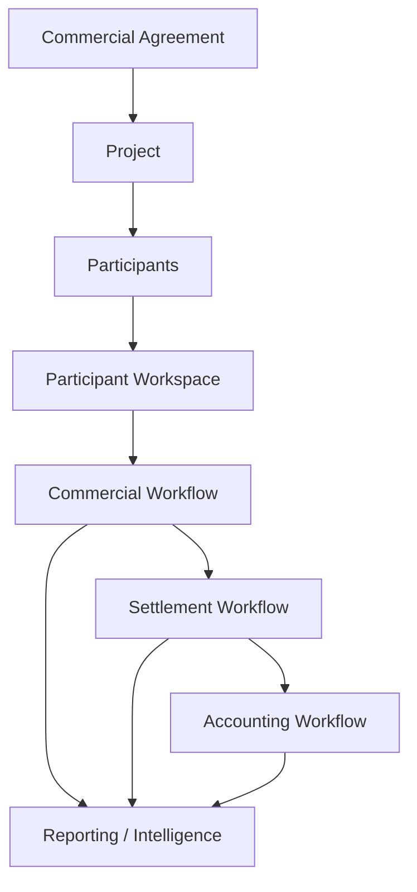
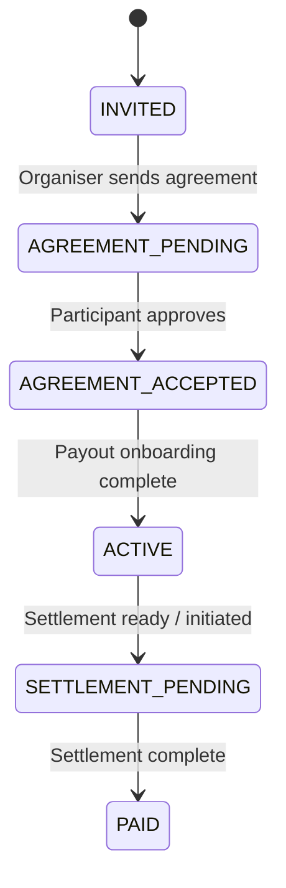
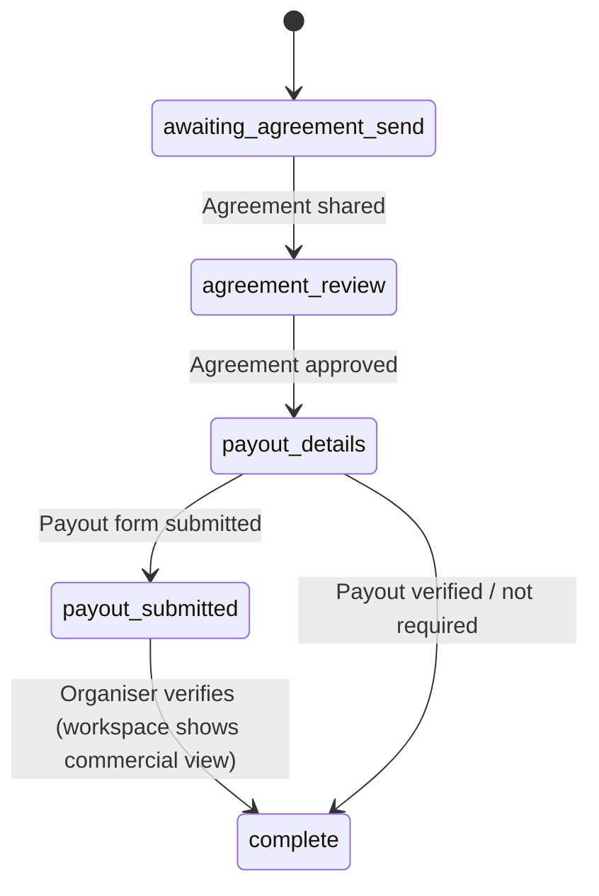
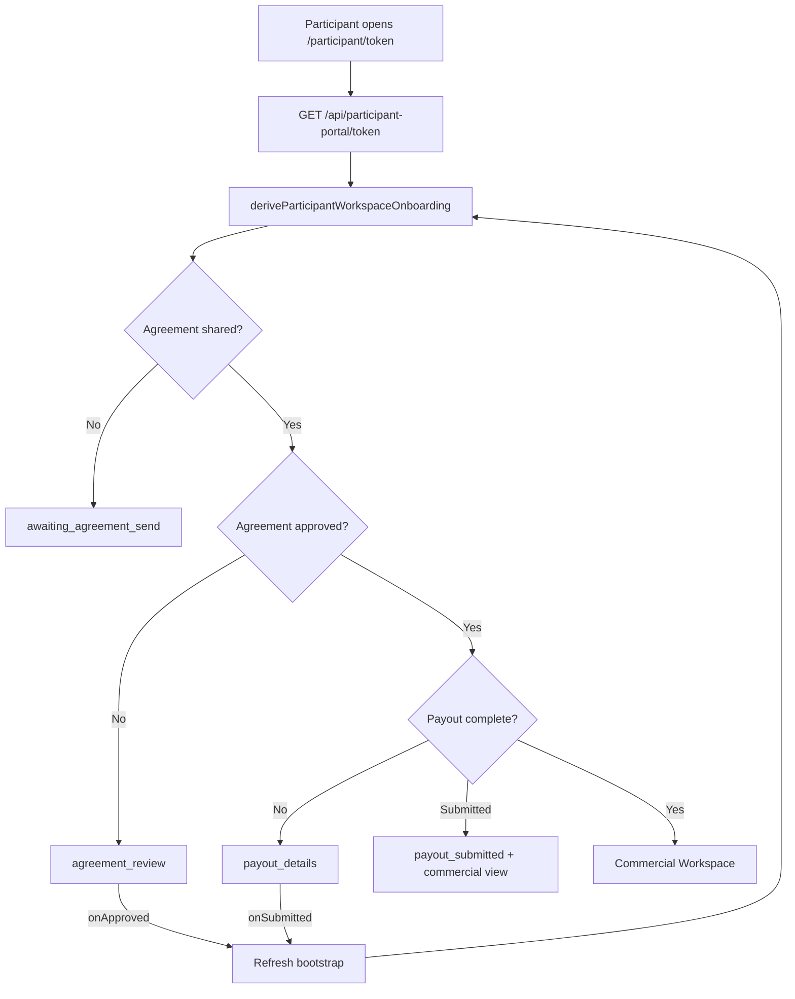
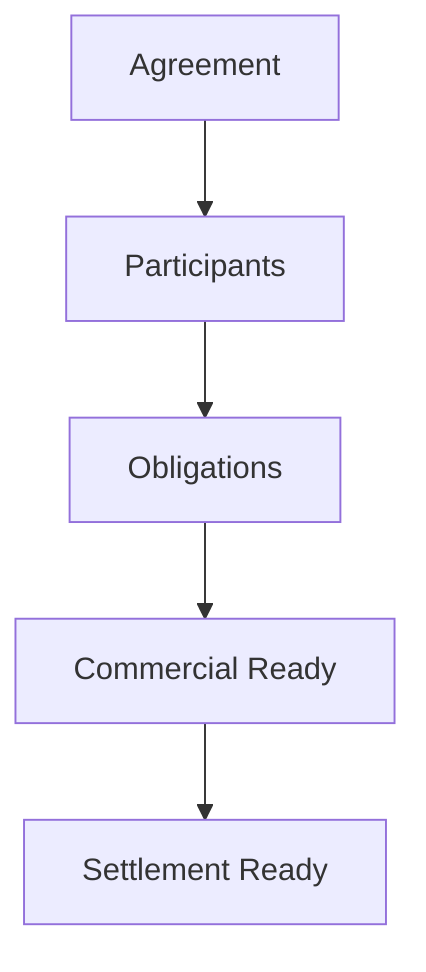
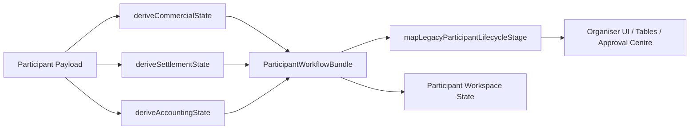
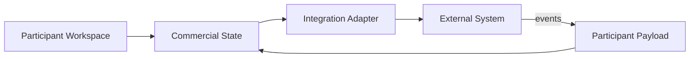

# ADR: Participant Workspace Architecture

## Status

Accepted — canonical reference for Participant Workspace design and extension.

## Context

Provvypay orchestrates commercial relationships between organisers and participants: agreements, obligations, earnings, settlement, and accounting. Participants need a single, persistent place to review terms, complete onboarding, and track commercial activity throughout the relationship.

Before the Participant Workspace, agreement approval, payout collection, and commercial visibility were split across separate URLs (`/deal-invites/[token]`, `/payment-setup/[token]`, ad-hoc portal links). That created dead ends, confused participants, and duplicated lifecycle logic.

This document records **why** the Participant Workspace exists, **how** it works, and **where** future changes belong.

---

## Product Philosophy

Provvypay is **not** modeling payments. It is modeling **commercial relationships**.

A project is a commercial container. Participants enter through agreements. Obligations define what must happen commercially. Settlement moves money when commercial conditions are met. Accounting records what happened for bookkeeping. AI extraction, payment rails, and participant workspaces are **different views of the same underlying commercial agreement**.

| Layer | What it represents | What it is *not* |
| --- | --- | --- |
| Commercial agreement | The relationship and its terms | A payment form |
| Participant Workspace | The participant's permanent commercial home | A one-off invite link |
| Commercial workflow | Whether the relationship is executable | Whether Xero has synced |
| Settlement workflow | Whether money can move | Whether an invoice exists in accounting |
| Accounting workflow | Whether events are recorded externally | The source of commercial truth |

When making product or engineering decisions, ask: *"Does this change the commercial relationship, or only how we observe/settle/record it?"* Integrations (Stripe, Wise, Xero, Hedera, etc.) **consume** commercial state. They must never **define** it.

---

## Participant Workspace

The **Participant Workspace** is the permanent commercial home for every participant involved in a commercial agreement.

- **One participant** → one relationship with the organiser
- **One workspace** → one UI surface for the full lifecycle
- **One permanent URL** → `/participant/[participantPortalToken]`
- **One commercial relationship** → all milestones happen inside the same experience

The participant never receives multiple product links. They always return to the same workspace. The workspace **adapts to lifecycle state** rather than redirecting users to separate applications.

Organisers share, copy, resend, and request actions against this single URL. Legacy routes redirect into it:

| Legacy route | Redirect target |
| --- | --- |
| `/deal-invites/[inviteToken]` | `/participant/[token]` |
| `/payment-setup/[paymentSetupToken]` | `/participant/[token]?step=payout` |

Implementation: `src/lib/participant-portal/participant-workspace-redirect.server.ts`

---

## Design Principles

1. **One participant, one workspace, one URL.** The `participantPortalToken` on the participant payload is the only participant-facing identifier for the workspace.

2. **Commercial workflows drive participant experience.** What the participant sees is derived from commercial and settlement state — not from accounting sync status or payment-provider internals.

3. **Agreement approval is a milestone, not a destination.** Approval unlocks payout onboarding and the long-term commercial workspace. It is not a separate product.

4. **Payout onboarding is part of onboarding, not a separate application.** Payout/tax collection is embedded in the workspace (`ParticipantWorkspacePayoutPanel`). Internal payment-setup tokens authenticate API calls; they are never shown as separate participant URLs.

5. **The workspace adapts; it does not redirect.** `ParticipantWorkspaceGate` renders the correct stage in-place. Successful actions refresh state and show the next required action — the participant stays on the same URL.

6. **Workflows are independent projections.** Commercial, settlement, and accounting each derive from the participant payload through separate pure functions. Legacy organiser UI stages are mapped from these projections for backwards compatibility.

7. **No duplicate participant models.** `DemoParticipant` (participant payload) is the source of truth. Workspace view models are derived; they are not persisted separately.

---

## High-Level Architecture

| Layer | Responsibility |
| --- | --- |
| **Commercial Agreement** | Terms, deliverables, obligations, conditional payments — the legal/commercial contract |
| **Project** | Container for participants, earnings configuration, and organiser workflow |
| **Participants** | Individuals bound to the agreement with roles, compensation, and lifecycle state |
| **Participant Workspace** | Participant-facing surface: onboarding + long-term commercial home |
| **Commercial Workflow** | Agreement acceptance, commercial readiness, obligation completion |
| **Settlement Workflow** | Readiness, initiation, processing, and completion of money movement |
| **Accounting Workflow** | Export and sync to external ledgers (Xero today; others later) |
| **Reporting** | Performance metrics, intelligence summaries, organiser dashboards |

Data flows **downstream**: commercial events enable settlement; settlement events may trigger accounting. Accounting never flows upstream into commercial state.

---

## Participant Lifecycle

Two lifecycle views exist for different audiences. Both derive from the same participant payload.

### Participant-facing commercial state

Used by the workspace UI (`deriveParticipantCommercialState` in `src/lib/participant-portal/participant-workspace-state.ts`):

| State | Meaning | Typical transition trigger |
| --- | --- | --- |
| `INVITED` | Participant exists; agreement not yet shared | Organiser adds participant, configures earnings |
| `AGREEMENT_PENDING` | Agreement shared; awaiting participant approval | Organiser sends workspace link / shares agreement |
| `AGREEMENT_ACCEPTED` | Agreement approved; payout onboarding may be outstanding | `POST /api/deal-network-pilot/invites/[token]/approve` |
| `ACTIVE` | Commercially active — obligations, earnings, activity visible | Payout verified or exempt; commercial workflow active |
| `SETTLEMENT_PENDING` | Settlement ready, initiated, or processing | Organiser releases / settlement rail processes |
| `PAID` | Settlement complete | `payoutSettlementStatus === 'Paid'` or settlement workflow `COMPLETE` |

### Workspace onboarding steps

Within the workspace gate, onboarding is finer-grained (`deriveParticipantWorkspaceOnboarding` in `src/lib/participant-portal/participant-workspace-onboarding.ts`):

| Step | Participant sees | Organiser tracks |
| --- | --- | --- |
| `awaiting_agreement_send` | "Workspace ready — agreement coming" | Agreement: Pending |
| `agreement_review` | Agreement panel + progress | Agreement: Pending |
| `payout_details` | Embedded payout/tax form | Payout: Pending |
| `payout_submitted` | Confirmation + commercial workspace | Payout: Submitted |
| `complete` | Full commercial workspace | Agreement: Approved; Payout: Verified / Not required |

Organiser Approval Centre shows **Agreement Status** and **Payout Details** independently (`deriveAgreementOrganiserStatus`, `derivePayoutDetailsOrganiserStatus`).

### Organiser-facing legacy lifecycle

The organiser UI still uses stable stage labels (`ParticipantCommercialLifecycleStage` in `src/lib/commercial/participant-commercial-lifecycle.ts`: `DRAFT` → `EARNINGS_CONFIGURED` → … → `PAID`). These are **mapped** from the three independent workflows via `mapLegacyParticipantLifecycleStage` — not stored as a separate source of truth.

---

## Workspace Entry Logic

The workspace gate (`ParticipantWorkspaceGate` in `src/components/participant-portal/participant-workspace-gate.tsx`) is the single routing layer for participant UI. It never navigates away from `/participant/[token]`.

**URL parameters:**

| Parameter | Effect |
| --- | --- |
| `?step=payout` | Forces payout onboarding when agreement is approved (used by organiser "Request Payout Details") |
| `?mode=preview` | Organiser preview of agreement review without persisting approval |

**Token model (internal — do not expose multiple URLs to participants):**

| Token | Purpose |
| --- | --- |
| `participantPortalToken` | Workspace URL authentication |
| `inviteToken` | Agreement approval API (`/api/deal-network-pilot/invites/[token]/approve`) |
| `paymentSetup.token` | Internal auth for payout form submit/upload APIs only |

---

## Agreement Approval

### Why it lives inside the workspace

Agreement approval is the **first milestone** of the commercial relationship, not a standalone product. Embedding it in the workspace:

- Eliminates the "approve here, then go somewhere else" dead end
- Keeps the participant on the permanent URL from day one
- Lets the organiser use one link for invitation, approval, and ongoing activity

### How it works

1. **Display:** `ProjectParticipantAgreementPanel` renders inside the gate when `onboarding.step === 'agreement_review'`. Agreement payload is loaded via `GET /api/deal-network-pilot/invites/[inviteToken]`.

2. **Approval:** Participant submits approval via `POST /api/deal-network-pilot/invites/[inviteToken]/approve`. This updates `approvalStatus`, `approvedAt`, and agreement lifecycle on the participant payload.

3. **Organiser state:** Approval Centre badges flip Agreement Status to **Approved**. Commercial workflow moves to `AGREEMENT_ACCEPTED`. Legacy lifecycle stage becomes `AGREEMENT_ACCEPTED`.

4. **Transition:** `onApproved` triggers workspace refresh. Gate re-derives onboarding → participant sees payout step (if required) or commercial workspace (if exempt/complete).

No redirect occurs. The same page re-renders the next stage.

---

## Payout Onboarding

### Why it is embedded

Payout and tax detail collection was previously a separate `/payment-setup/[token]` application. That violated the one-URL principle and created support burden ("which link do I use?").

Embedding payout onboarding:

- Reuses `PaymentTaxInformationForm` and existing `/api/payment-setup/[token]/*` endpoints
- Keeps submit/upload logic in one server module (`payment-setup.server.ts`)
- Presents payout as **Step 2** of commercial onboarding, not a new product

### How it works

1. **Gate routing:** When `onboarding.step === 'payout_details'`, the gate renders `ParticipantWorkspacePayoutPanel`.

2. **Token provisioning:** `ensurePaymentSetupTokenForPortalParticipant` creates or refreshes an internal payment-setup token without generating a separate participant URL (`src/lib/participant-portal/participant-portal-payout.server.ts`).

3. **Submission:** Form posts to `/api/payment-setup/[token]/submit`. Supplier onboarding lifecycle moves to `SUBMITTED` / `UNDER_REVIEW`.

4. **Organiser status:** Payout Details badge → **Submitted**. Operator reviews via Approval Centre / operator review paths.

5. **Return to workspace:** After submit, `onSubmitted` refreshes bootstrap. Participant sees confirmation and transitions to commercial workspace (`payout_submitted` or `complete`).

6. **Organiser request:** "Request Payout Details" generates a payment request (if needed) and shares `/participant/[token]?step=payout` — never a separate payment-setup URL.

Legacy `/payment-setup/[token]` requests redirect to `?step=payout` on the workspace.

---

## Commercial Workspace

After onboarding, the workspace becomes the participant's **permanent commercial home** for the duration of the relationship.

### Sections

Navigation is defined by `CommercialWorkspaceSection` (`src/lib/participant-portal/participant-portal-types.ts`):

| Section | Purpose | Key components |
| --- | --- | --- |
| **Overview** | Lifecycle progress, earnings, settlement status, intelligence | `CommercialLifecycleCard`, `CommercialMetricsGrid`, `SettlementExplanationCard`, `CommercialIntelligence` |
| **Commercial Terms** | Compensation structure, deliverables, obligations | `CommercialSummaryCard`, `AgreementOverview` |
| **Payments** | Payment timeline, settlement explanation | `PaymentTimeline`, `SettlementExplanationCard` |
| **Activity** | Attribution, orders, conversions (when applicable) | `CommercialPerformanceCard`, performance metrics |

The view model is built by `deriveParticipantCommercialWorkspace` in `src/lib/participant-portal/participant-portal-data.ts` and served by `GET /api/participant-portal/[token]`.

Onboarding completion banners (payout submitted, onboarding complete) appear in `ParticipantCommercialWorkspaceView` when `onboarding` prop indicates transitional states.

---

## Commercial Workflow

Commercial workflow answers: *"Is this commercial relationship properly formed and executable?"*

**Module:** `src/lib/commercial/workflows/derive-commercial-state.ts`

**States:** `INVITED` → `AGREEMENT_PENDING` → `AGREEMENT_ACCEPTED` → `COMMERCIALLY_ACTIVE` → `OBLIGATIONS_OUTSTANDING` → `COMMERCIAL_SETTLEMENT_READY` → `COMMERCIALLY_COMPLETE`

**Inputs:** Participant identity, earnings configuration, agreement approval, supplier/payout lifecycle, outstanding obligations, settlement status.

**Does not depend on:** Accounting export status, Xero sync, payment provider connection state.

**Drives:** Participant workspace experience, organiser CTAs (`deriveParticipantOperationalWorkflow`), commercial badges.

---

## Settlement Workflow

Settlement workflow answers: *"Can money move for this participant?"*

**Module:** `src/lib/commercial/workflows/derive-settlement-state.ts`

**States:** `NOT_STARTED` → `BLOCKED` → `PENDING` → `READY` → `INITIATED` → `PROCESSING` → `COMPLETE`

| State | Meaning |
| --- | --- |
| `NOT_STARTED` | Agreement not approved — settlement not applicable |
| `BLOCKED` | Critical blockers (e.g. missing payout verification, obligation dependencies) |
| `PENDING` | Commercial prerequisites incomplete |
| `READY` | `deriveSettlementReadiness` reports `readyToSettle` |
| `INITIATED` / `PROCESSING` | Release initiated via organiser or automation |
| `COMPLETE` | `payoutSettlementStatus === 'Paid'` |

Settlement uses the settlement readiness engine with **accounting decoupled from settlement gates** (`xeroStatus: 'not_required'` in settlement input builders).

Settlement does **not** require accounting export. A participant can be settlement-ready before Xero sync.

---

## Accounting Workflow

Accounting workflow answers: *"Has this commercial event been recorded in external bookkeeping?"*

**Module:** `src/lib/commercial/workflows/derive-accounting-state.ts`

**States:** `NOT_REQUIRED` → `NOT_EXPORTED` → `QUEUED` → `EXPORTED` → `SYNCED` → `FAILED`

Accounting is a **downstream projection**. It reflects commercial and payout events (draft invoice, supplier submission, operator approval, Xero export). It never influences:

- Whether the participant sees the commercial workspace
- Whether settlement is ready
- Whether the agreement is approved

Organiser UI may show accounting badges and Xero export actions, but `deriveParticipantCommercialState` and workspace onboarding ignore accounting state.

---

## Workflow Separation

Three pure derivation functions compose the workflow bundle (`deriveParticipantWorkflows` in `src/lib/commercial/workflows/derive-participant-workflows.ts`):

| Function | Module | Responsibility |
| --- | --- | --- |
| `deriveParticipantCommercialWorkflowState()` | `derive-commercial-state.ts` | Agreement & commercial execution |
| `deriveParticipantSettlementWorkflowState()` | `derive-settlement-state.ts` | Money movement readiness & execution |
| `deriveParticipantAccountingWorkflowState()` | `derive-accounting-state.ts` | Bookkeeping export & sync |

### Legacy lifecycle mapping

`mapLegacyParticipantLifecycleStage` (`src/lib/commercial/workflows/map-legacy-lifecycle-stage.ts`) translates the three-workflow bundle into `ParticipantCommercialLifecycleStage` for existing organiser UI, table next-actions, and tests.

**Why map instead of migrate UI immediately?**

- Preserves backwards compatibility for organiser workflows built on stage labels
- Allows workflow internals to evolve without breaking every consumer
- New code should prefer workflow badges (`deriveParticipantWorkflowBadges`) over inferring state from legacy stages alone

Tests enforcing independence: `src/__tests__/commercial/participant-workflow-independence.test.ts`

---

## Participant Workspace Components

Reusable components live under `src/components/participant-portal/` and shared commercial workspace components under `src/components/commercial/workspace/`.

| Component | Purpose |
| --- | --- |
| `ParticipantWorkspaceGate` | Routes onboarding vs commercial workspace; never redirects away |
| `ParticipantWorkspaceOnboardingProgress` | Three-step progress UI + next required action banner |
| `ParticipantWorkspacePayoutPanel` | Embedded payout/tax form (wraps `PaymentTaxInformationForm`) |
| `ParticipantCommercialWorkspaceView` | Long-term workspace shell with section navigation |
| `CommercialSummaryCard` | Compensation and commercial structure summary |
| `CommercialLifecycleCard` | Visual lifecycle stepper for participant |
| `SettlementExplanationCard` | Plain-language settlement status and blockers |
| `CommercialPerformanceCard` / `CommercialMetricsGrid` | Earnings and activity metrics |
| `CommercialIntelligence` | AI-generated commercial explanation (when available) |
| `AgreementOverview` | Deliverables, obligations, payment events |
| `PaymentTimeline` | Chronological payment/settlement events |
| `PortalStatusBadge` | Participant-facing status chips |
| `ParticipantWorkspaceActions` | Organiser actions: Open, Copy, Resend, Request Payout Details |

Organiser-side counterparts: `ApprovalCentreParticipantCard`, `ProjectParticipantTableRow` — these consume the same derivation functions, not separate lifecycle logic.

---

## Source of Truth

The participant payload (`DemoParticipant` on `deal_network_pilot_participants.participant_payload`) is the **single source of truth**. Everything else is derived.

| Domain | Key fields / modules | Drives |
| --- | --- | --- |
| **Project** | Deal payload, project ID | Context for earnings, obligations, naming |
| **Participant** | Identity, role, `participantPortalToken` | Workspace URL, display |
| **Agreement** | `approvalStatus`, `approvedAt`, agreement lifecycle | Onboarding step, commercial workflow |
| **Earnings configuration** | `compensationProfile`, commission fields | Commercial terms display, metrics |
| **Obligations** | `extractedObligations` | Commercial readiness, settlement blockers |
| **Supplier / payout onboarding** | `supplierOnboarding`, `paymentSetup`, `payoutVerificationConfirmed` | Payout onboarding step, settlement readiness |
| **Settlement** | `payoutSettlementStatus`, `payoutPaidAt` | Settlement workflow, PAID state |
| **Accounting** | `paymentSetup.xeroExportedAt`, `xeroSyncStatus` | Accounting workflow only |
| **Commercial terms** | Agreement notes, scoped services, participation model | Terms section content |

**Rules:**

- Do not introduce a parallel "portal participant" or "workspace participant" model
- Do not persist workspace view models to the database
- Do not store onboarding step as a separate column — derive it with `deriveParticipantWorkspaceOnboarding`
- Hydration for organiser UI uses `hydrateParticipant` / `participantEntity` — still the same underlying payload

---

## Extension Guidelines

When extending the Participant Workspace, place changes in the correct layer:

| Change | Belongs in | Do not put in |
| --- | --- | --- |
| New participant role | Role normalization, earnings selectors, display copy | Workspace gate routing |
| New earnings model | Compensation profile, `deriveParticipantCommercialPerformance`, metrics field registry | Accounting workflow |
| New payment provider | Settlement rail registry, payment execution services | Participant URL routing |
| New accounting integration | `derive-accounting-state.ts`, export connectors | Commercial or settlement derivation |
| New onboarding step | `participant-workspace-onboarding.ts`, gate, progress UI | Separate public route |
| New commercial workflow stage | `derive-commercial-state.ts`, legacy mapper, tests | Participant portal components directly |
| New workspace section | `participant-portal-types.ts`, `participant-portal-data.ts`, portal view | API route business logic |
| Organiser action | `participant-portal-actions.tsx`, payment-request server | Duplicate URL builders |

### Adding a new onboarding step

1. Extend `PARTICIPANT_WORKSPACE_ONBOARDING_STEPS` and derivation logic
2. Add gate branch in `ParticipantWorkspaceGate`
3. Update `ParticipantWorkspaceOnboardingProgress` labels
4. Update organiser badges if organiser-visible
5. Add tests in `__tests__/participant-portal/participant-workspace-onboarding.test.ts`
6. Preserve single URL — no new participant-facing routes

### Adding a new commercial workflow stage

1. Extend `COMMERCIAL_WORKFLOW_STATES` in `workflows/types.ts`
2. Update `deriveParticipantCommercialWorkflowState`
3. Update `mapLegacyParticipantLifecycleStage` if organiser UI needs a legacy label
4. Update workflow independence tests

---

## Future Integrations

The architecture separates **commercial truth** from **integration mechanics**. New rails and ledgers plug in downstream:

| Integration | Role | Touches |
| --- | --- | --- |
| **Stripe** | Payment execution / merchant settlement | Settlement workflow, release buttons |
| **Wise** | Cross-border payout rails | Settlement execution, payout method collection |
| **Hedera** | Tokenized settlement / revenue share demo | Settlement rail, public wallet components |
| **Canton** | Institutional ledger sync | Accounting or settlement connector layer |
| **QuickBooks / NetSuite** | Accounting export | `derive-accounting-state.ts`, export connectors |

**Participant experience unchanged:** Participants still use `/participant/[token]`. Integrations consume `deriveParticipantWorkflows()` outputs and emit events that update the participant payload. They never replace the workspace or define onboarding steps.

Pattern:

---

## Design Decisions

| Decision | Rationale |
| --- | --- |
| **Single workspace URL** | Participants should not manage multiple links; organisers should have one link to share for all stages |
| **Agreement approval embedded** | Approval is a milestone in the relationship, not a separate app; reduces drop-off |
| **Payout onboarding embedded** | Same URL, same shell, same progress model; payment-setup APIs reused internally |
| **Three independent workflows** | Commercial, settlement, and accounting change at different rates and for different reasons; coupling caused incorrect gates (e.g. settlement blocked on Xero) |
| **Participant state from commercial/settlement** | Participant-facing state reflects what matters to them — not bookkeeping sync |
| **Accounting downstream** | Xero/export failure must not block agreement approval or workspace access |
| **Legacy lifecycle mapper** | Avoid big-bang UI migration; workflow internals can evolve safely |
| **Internal payment-setup token** | Reuse battle-tested submit/upload APIs without exposing a second URL |
| **Refresh-in-place after actions** | Avoid redirects that feel like "leaving" the product; show next required action |

---

## Common Pitfalls

1. **Do not introduce multiple participant portals.** One `participantPortalToken`, one `/participant/[token]` route.

2. **Do not create separate agreement applications.** Agreement review stays in `ParticipantWorkspaceGate`.

3. **Do not duplicate participant lifecycle logic.** Use `deriveParticipantWorkspaceOnboarding`, `deriveParticipantCommercialState`, or `deriveParticipantWorkflows` — do not add ad-hoc `if (approved && !paid)` chains in components.

4. **Do not derive commercial state from accounting.** Never gate workspace access or settlement readiness on `xeroSyncStatus`.

5. **Do not expose payment-setup URLs to participants.** Use `buildParticipantWorkspacePayoutUrl` / `buildParticipantPaymentPortalUrl` (which resolves to workspace URLs when portal token exists).

6. **Do not persist derived view models.** Derive on read in `participant-portal-data.ts` and API routes.

7. **Reuse existing workflow services.** If adding organiser status, extend derivation functions — do not add parallel badge logic in one card only.

8. **Reuse commercial workspace components.** Prefer `src/components/commercial/workspace/*` for new participant sections.

9. **Do not break legacy redirects.** `/deal-invites/*` and `/payment-setup/*` must continue redirecting for emailed links already in the wild.

---

## Development Checklist

When adding or modifying Participant Workspace features, verify:

- [ ] **Single workspace URL** — participants receive only `/participant/[token]` (with optional `?step=payout`)
- [ ] **Lifecycle preserved** — onboarding steps derive from payload; no new persisted step enum in DB
- [ ] **Commercial workflow is source of truth** — participant experience driven by commercial/settlement, not accounting
- [ ] **Settlement independent** — settlement readiness does not require accounting sync
- [ ] **Accounting downstream** — accounting state changes do not affect gate routing or commercial state
- [ ] **Components reusable** — new UI extends existing portal/commercial workspace components
- [ ] **No duplicate participant models** — all data from `DemoParticipant` payload
- [ ] **Backwards compatibility** — legacy lifecycle stages still map correctly for organiser UI
- [ ] **Legacy redirects work** — old invite and payment-setup links redirect to workspace
- [ ] **Tests updated** — onboarding derivation, workflow independence, configure-earnings-flow, approval centre actions
- [ ] **Organiser actions use workspace URLs** — copy/share/resend/request payout all point to participant workspace

---

## Key Files Reference

| Area | Path |
| --- | --- |
| Public page | `src/app/(public)/participant/[token]/page.tsx` |
| Portal API | `src/app/api/participant-portal/[token]/route.ts` |
| Workspace gate | `src/components/participant-portal/participant-workspace-gate.tsx` |
| Onboarding derivation | `src/lib/participant-portal/participant-workspace-onboarding.ts` |
| Commercial state | `src/lib/participant-portal/participant-workspace-state.ts` |
| View model derivation | `src/lib/participant-portal/participant-portal-data.ts` |
| URL helpers | `src/lib/participant-portal/participant-portal-url.ts` |
| Legacy redirects | `src/lib/participant-portal/participant-workspace-redirect.server.ts` |
| Payout token provisioning | `src/lib/participant-portal/participant-portal-payout.server.ts` |
| Commercial workflow | `src/lib/commercial/workflows/derive-commercial-state.ts` |
| Settlement workflow | `src/lib/commercial/workflows/derive-settlement-state.ts` |
| Accounting workflow | `src/lib/commercial/workflows/derive-accounting-state.ts` |
| Legacy mapper | `src/lib/commercial/workflows/map-legacy-lifecycle-stage.ts` |
| Organiser lifecycle | `src/lib/commercial/participant-commercial-lifecycle.ts` |
| Payment request (organiser) | `src/lib/commercial/payment-request.server.ts` |
| Tests | `src/__tests__/participant-portal/`, `src/__tests__/commercial/participant-workflow-independence.test.ts` |

---

## Related Documents

- `docs/adr/0001-rabbit-hole-agreements-boundaries.md` — product boundary rules (Rabbit Hole vs Agreements UI)
- `docs/CANONICAL_DOMAIN_MODEL.md` — broader domain model
- `docs/canonical-payment-lifecycle.md` — payment lifecycle (downstream of commercial)
- `docs/qa/participant-golden-path.md` — QA golden path for participants
