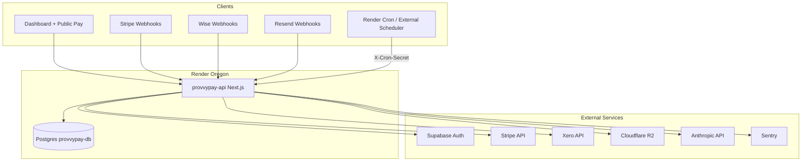

# System Architecture Map — Provvypay

**Audit date:** 2026-05-20  
**Scope:** Full platform map for public launch certification  
**Repo root:** `src/` (Next.js 15 App Router, Prisma, Render Postgres)

---

## Executive Summary

Provvypay is a **monolithic Next.js application** (`provvypay-api` on Render) with **~174 API route handlers**, **66 dashboard pages**, **Prisma/Postgres** as the system of record, and **HTTP-triggered background jobs** (`/api/jobs/*` + `CRON_SECRET`) because dedicated worker/cron services are **disabled in `render.yaml` Phase 1**.

External integrations: **Supabase Auth**, **Stripe**, **Xero**, **Cloudflare R2** (attachments/logos), **Resend**, **Wise**, **Hedera**, **Anthropic** (AI extraction), **Sentry** (optional).

---

## Platform Topology



---

## Cross-Cutting Layers

| Layer | Location | Notes |
|-------|----------|-------|
| Auth (session) | `@/lib/auth/middleware`, `@/lib/supabase/server`, `middleware.ts` | Cookie presence gating on Edge; **JWT not verified in middleware** |
| Org membership | `user_organizations`, `getOrganizationForAuthenticatedUser` | Most dashboard APIs resolve org from user |
| Permissions | `checkUserPermission`, `organization-access.ts` | Granular keys: `view_payment_links`, `manage_ledger`, etc. |
| Beta / launch gates | `BETA_LOCKDOWN_MODE`, `checkBetaLockdown`, `deriveOperationalCapabilities` | Settlement/release still beta-gated; attribution view decoupled (`canViewAttributionCommissions`) |
| Operational graph | `lib/operations/*`, `/api/operations/coordination-snapshot` | Coordination layer, release eligibility, initialization |
| Ledger | `lib/ledger/*`, `ledger_entries`, `ledger_accounts` | Double-entry; Stripe posting rules |
| Webhooks audit | `webhook_events`, `lib/webhooks/stripe-audit.ts` | Idempotent Stripe delivery |
| Jobs | `lib/jobs/job-lease.ts`, `/api/jobs/*` | Leases prevent concurrent duplicate runs |
| Logging | `lib/logger.ts` (Pino) | Structured logs; Sentry via `@sentry/nextjs` when `SENTRY_DSN` set |
| Storage | R2 primary, `legacy-supabase-storage.ts` fallback | Payment link attachments |

---

## 1. Authentication

| Surface | Routes / Pages | APIs | Services | DB |
|---------|----------------|------|----------|-----|
| Login / signup | `app/auth/*` | — | Supabase Auth | Supabase (external) |
| Session | — | — | `getCurrentUser`, `requireAuth` | — |
| Middleware gating | All `/dashboard/*` | — | `middleware.ts` | — |
| Password reset | `app/auth/reset-password/page.tsx` | — | Supabase | — |

**Dependencies:** Supabase URL + anon key (public), service role (server uploads legacy path).

---

## 2. Onboarding

| Surface | Pages | APIs | Services | DB |
|---------|-------|------|----------|-----|
| Workspace bootstrap | Settings, projects entry | `POST /api/onboarding/bootstrap-workspace` | `lib/onboarding/*` | `organizations`, `operational_onboarding_transitions` |
| Project bootstrap | `dashboard/projects` | `POST /api/onboarding/bootstrap-project` | `build-onboarding-project` | `deal_network_pilot_deals`, participants |
| Participants | — | `POST /api/onboarding/participants`, `GET /api/onboarding` | `onboarding-participant-persist` | `deal_network_pilot_participants` |
| Copilot status | — | `GET /api/copilot/onboarding-status` | — | — |
| Initialization resume | — | `POST /api/operations/initialization/resume` | `resolveOperationalInitializationSnapshot` | onboarding transitions |

---

## 3. Organizations & Merchant Management

| Surface | Pages | APIs | Services | DB |
|---------|-------|------|----------|-----|
| Org settings | `dashboard/settings/organization` | `GET/PATCH /api/organizations/[id]`, `GET/POST /api/organizations` | Membership + OWNER/ADMIN checks | `organizations`, `user_organizations` |
| Team | `dashboard/settings/team` | (org APIs) | — | `user_organizations` |
| Merchant settings | `dashboard/settings/merchant` | `GET/PATCH /api/merchant-settings`, `[id]`, `upload-logo` | Branding, Stripe connect fields | `merchant_settings` |
| Services catalog | `dashboard/settings/services` | `organization-services` CRUD | — | `organization_services` |
| Customer-facing config | — | `GET /api/customer-facing-config` | — | merchant + org |
| Integrations | `dashboard/settings/integrations` | Xero connect/callback/status | `lib/xero/*` | `xero_connections` |

---

## 4. Payment Links

| Surface | Pages | APIs | Services | DB |
|---------|-------|------|----------|-----|
| List / create | `dashboard/payment-links` | `GET/POST /api/payment-links`, `v2/payment-links` | State machine, validations | `payment_links` |
| Detail / edit | Settings sub-route | `[id]` CRUD, status, send, resend, delete | — | `payment_links`, attachments via R2 |
| Public checkout | `(public)/pay/[shortCode]/*` | `GET /api/public/pay/[shortCode]`, wise, crypto, attachment | FX, Stripe PI, Wise | `payment_links`, `fx_snapshots` |
| Stripe checkout | Public | `POST /api/stripe/create-checkout-session`, `create-payment-intent` | Stripe SDK | — |
| Manual bank / crypto review | Dashboard payments | `manual-bank-confirmations`, `crypto-confirmations` | Review workflows | confirmation tables |
| Attachments | Create dialog | `upload-attachment`, public attachment API | `payment-link-attachment` | R2 + metadata on link |
| Jobs | — | `GET /api/jobs/expired-links` | Cron secret | link expiry |

**Duplicate APIs:** v1 `/api/payment-links` and v2 `/api/v2/payment-links` coexist — consolidation deferred.

---

## 5. Invoice Generation

Invoices are primarily **payment links + multi-currency invoice records**, not a separate invoice SaaS module.

| Surface | APIs / Services | DB |
|---------|---------------|-----|
| Multi-currency | FX calculate/rates/snapshots | `multi_currency_invoices`, `fx_snapshots` |
| Deal attach | `POST .../deal-network-pilot/deals/[dealId]/attach-invoice` | links deal ↔ payment link |
| Xero invoices | `lib/xero/invoice-service.ts` | `xero_syncs` |

---

## 6. Referrals

| Surface | Pages | APIs | Services | DB |
|---------|-------|------|----------|-----|
| Referral links | `dashboard/referrals`, `partners/referral-links` | `referral-links`, `organization-referrals` | Split rules | `referral_links`, `referral_link_splits`, `referral_rules` |
| Public referral checkout | Public referral routes | `referral/[code]/*`, `track-attribution` | Checkout metadata | `referral_codes` |
| Advocate / reviews | Programs pages | `referrals/advocates`, `reviews`, `submit-lead` | Token crypto | — |
| My dashboard | `referrals/mine` | `GET /api/me/referral-dashboard` | — | conversions, ledger |

---

## 7. Reporting

| Surface | Pages | APIs | DB |
|---------|-------|------|-----|
| Reports hub | `dashboard/reports` | `reports/revenue-summary`, `time-series`, `ledger-balance`, `token-breakdown`, `reconciliation`, `operational-insights` | ledger, payment_events |
| Exports | `reports/exports` | `reports/export`, `export/download` | — |
| Ledger UI | `dashboard/ledger`, `reports/ledger` | `ledger/accounts` | `ledger_accounts`, `ledger_entries` |
| Transactions | `dashboard/transactions` | (aggregates from payments APIs) | `payment_events` |
| Metrics (admin) | `dashboard/monitoring` | `GET /api/metrics` (admin) | — |

---

## 8. AI Agreement Extraction

| Surface | APIs | Services | DB |
|---------|------|----------|-----|
| Extract | `POST /api/ai-extractor/extract` | Anthropic SDK, validation contracts | Pilot deals/participants (downstream persist via onboarding/coordination) |
| Copilot | Deal network panel | `copilot/session`, `copilot/tools` | — |

**Workflow tie-in:** Extraction feeds **deal network pilot** models and **operational coordination graph** (participants, obligations, funding).

---

## 9. Deal Network (Pilot)

| Surface | Pages | APIs | Services | DB |
|---------|-------|------|----------|-----|
| Deal network UI | `partners/deal-network`, obligations sub-page | `deal-network-pilot/snapshot`, `obligations`, `refresh` | `getPilotSnapshotForUser` | `deal_network_pilot_*` |
| Participants | Project participants pages | `participants/[id]`, `activate-attribution`, `referral-commerce` | — | `deal_network_pilot_participants` |
| Invites | — | `invites/[token]`, `approve` | — | — |
| Payment events | — | `payment-events/[eventId]`, deals `payment-events` | — | `payment_events` |
| Debug | — | `debug/participant-identity` | Auth required; pilot-scoped | — |

**Note:** Pilot data is **user-scoped** in snapshot APIs, not always `organization_id` filtered at DB layer — see tenant audit.

---

## 10. Coordination Layer

| Surface | APIs | Services | DB |
|---------|------|----------|-----|
| Graph snapshot | `GET /api/operations/coordination-snapshot` | `resolveOperationalCoordinationSnapshot` | Derived from pilot + onboarding |
| Release eligibility | `GET /api/operations/release-batch-eligibility` | `deriveReleaseBatchEligibility` | — |
| Mutations | Funding sources, payout batch create | `operational-mutation-orchestrator` | `project_funding_sources`, leases |
| Capabilities | UI providers | `derive-operational-capabilities`, `derive-release-interaction-state` | — |

---

## 11. Revenue Share & Commissions

| Surface | Pages | APIs | Services | DB |
|---------|-------|------|----------|-----|
| Commission posting | — | (internal from webhooks) | `commission-posting.ts`, `applyRevenueShareSplits` | `commission_obligations`, `items`, `lines` |
| Attribution earnings | `payouts/commissions` | `GET /api/commissions/attribution-earnings` | `attribution-earnings.server` | `commission_obligation_items` |
| Beta obligations API | `payouts/obligations`, partners commissions | `GET /api/commissions/obligations` | Beta lockdown | same + pilot projection |
| Ledger entries | — | `GET /api/commissions/ledger-entries` | Beta-gated query | `ledger_entries` |
| Admin trace | — | `GET /api/admin/commission-propagation-trace` | Admin only | chain diagnostic |

**Dual models:** `commission_obligations` (financial source of truth for attribution) vs `deal_network_pilot_obligations` (UI projection / participant earnings).

---

## 12. Funding Allocations

| Surface | Pages | APIs | DB |
|---------|-------|------|-----|
| Project funding | `projects/[projectId]/funding`, allocations | `projects/[projectId]/funding-sources` | `project_funding_sources` |
| Treasury | Project dashboard | `treasury-summary` | aggregates |
| Deal funding summary | Deal network | `deals/[dealId]/funding-summary` | pilot deals |

---

## 13. Payouts & Settlements

| Surface | Pages | APIs | DB |
|---------|-------|------|-----|
| Payout batches | `payouts/settlements`, partners payouts | `payout-batches/*`, `create`, `submit`, Hedera prepare/confirm | `payout_batches`, `payouts` |
| Mark paid/failed | — | `payouts/[id]/mark-*` | — |
| Payout methods | `partners/payout-methods` | `payout-methods` | `payout_methods` |
| Participant earnings | `payouts/commissions` | obligations + attribution | pilot + commission tables |

**Beta:** `checkBetaLockdown` on batch create and several settlement mutations when `BETA_LOCKDOWN_MODE=true` (default).

---

## 14. Stripe Payments

| Surface | APIs | Services | DB |
|---------|------|----------|-----|
| Webhook | `POST /api/stripe/webhook` | Signature verify, audit dedupe, `confirmPayment` | `webhook_events`, `payment_events` |
| Reconciliation job | `GET /api/jobs/stripe-reconciliation` | Cron secret | — |
| Internal replay | `POST /api/internal/webhooks/stripe/replay` | Admin/token | audit |

---

## 15. Accounting Integrations (Xero)

| Surface | APIs | Services | DB |
|---------|------|----------|-----|
| OAuth | `xero/connect`, `callback` | OAuth2 | `xero_connections` |
| Sync queue | `xero/queue/process`, `process-now`, `backfill`, `reset` | Queue processor | `xero_syncs` |
| Mappings | `settings/xero-mappings` | — | merchant settings |
| Replay / failed | `xero/sync/replay`, `failed`, `status`, `stats` | — | sync rows |
| **Risk:** `GET /api/xero/debug` | Returns cross-tenant sync samples (see tenant audit) | — |

---

## 16. Additional Subsystems (Launch Scope)

| System | Pages / Routes | Notes |
|--------|----------------|-------|
| Hedera | `hedera/*` APIs, payout batch Hedera | Optional flag `ENABLE_HEDERA_PAYMENTS` |
| Huntpay | `dashboard/huntpay`, `api/huntpay/*` | Separate pilot; admin conversions |
| Platform preview | `dashboard/platform-preview/*` | Beta-admin middleware restricted |
| Programs / Consultant | `dashboard/programs`, `consultant` | Middleware restricted prefixes |
| GDPR | — | `gdpr/export`, `gdpr/delete` |
| Legal | — | `legal/version-history` |
| Admin / Beta ops | `admin/beta-ops`, `dashboard/admin/*` | Errors, orphans, queue, audit-logs |
| FX | `fx/rates`, `calculate`, `health` | `fx_rate_history`, overrides |
| Notifications | settings + API | `notifications`, Resend webhooks |
| Recurring templates | `dashboard/recurring-templates` | `recurring-templates` + job |

---

## Background Jobs & Cron

| Job route | Purpose | Auth |
|-----------|---------|------|
| `/api/jobs/expired-links` | Expire stale links | `CRON_SECRET` |
| `/api/jobs/stripe-reconciliation` | Stripe vs DB | `CRON_SECRET` |
| `/api/jobs/ledger-integrity` | Ledger checks | `CRON_SECRET` |
| `/api/jobs/stuck-payments` | Stuck payment recovery | `CRON_SECRET` |
| `/api/jobs/recurring-templates` | Recurring billing | `CRON_SECRET` |
| `xero/queue/process` | Xero sync drain | Auth + org (route-specific) |

**Gap:** `package.json` references `workers/index.js` and `cron/*.js` but files are absent; Render worker/cron **commented out** in `render.yaml`. Production depends on **external scheduler** hitting job URLs.

---

## Integrations Matrix

| Integration | Config (`env.ts`) | Inbound | Outbound |
|-------------|-------------------|---------|----------|
| Supabase | URL, anon, service role | Auth session | Storage legacy |
| Stripe | Secret, publishable, webhook secret | Webhooks | PI, Checkout |
| Xero | Client ID/secret | Callback | Invoices, payments sync |
| R2 | Account, keys, bucket | — | Uploads |
| Resend | API key, webhook secret | Webhooks | Email |
| Wise | API token, profile, webhook | Webhooks | Pay rail |
| Hedera | Network, mirror, token IDs | — | Verify, payouts |
| Anthropic | SDK env | — | AI extract |
| Sentry | `SENTRY_DSN` | — | Errors |
| Upstash Redis | Optional | — | Rate limit |

---

## Orphaned / Duplicate / Dead Code Findings

| Finding | Severity | Detail |
|---------|----------|--------|
| Dual payment-link APIs | Medium | v1 + v2; clients may diverge |
| Dual obligation models | High | `commission_obligations` vs `deal_network_pilot_obligations`; sync drift risk |
| Duplicate dashboard paths | Low | `dashboard/payouts/*` vs `dashboard/partners/*` (commissions, payouts, ledger) |
| Missing worker/cron binaries | High | `npm run worker` / `cron:*` reference non-existent files |
| `lib/operational` vs `lib/operations` | Low | Naming confusion; operations is canonical |
| Huntpay subsystem | Low | Separate from core fintech launch; still exposed if routes reachable |
| `example-protected` API | Low | Demo route |
| `TEST_MODE` console log in `env.ts` | Low | Always logs at import — noise in production |
| Platform preview / programs | Medium | UI hidden by middleware but APIs may still exist |

---

## Database Model Index (Prisma)

Core financial: `payment_links`, `payment_events`, `ledger_entries`, `ledger_accounts`, `commission_obligations`, `commission_obligation_items`, `commission_obligation_lines`, `payout_batches`, `payouts`, `payout_methods`.

Org/merchant: `organizations`, `user_organizations`, `merchant_settings`, `organization_services`.

Referrals: `referral_links`, `referral_link_splits`, `referral_rules`, `referral_codes`.

Pilot/coordination: `deal_network_pilot_deals`, `deal_network_pilot_participants`, `deal_network_pilot_obligations`, `project_funding_sources`, `operational_onboarding_transitions`.

Integrations: `xero_connections`, `xero_syncs`, `webhook_events`, `operational_job_leases`.

Supporting: `fx_*`, `notifications`, `email_logs`, `audit_logs`, `crypto_payment_confirmations`, `manual_bank_payment_confirmations`, `recurring_templates`.

---

## Dependency Graph (Simplified)

```
Public Pay → Stripe Webhook → confirmPayment → payment_events
                              → applyRevenueShareSplits → ledger + commission_obligations
                              → Xero queue (async)
Dashboard → requireAuth → org → permission → Prisma
Coordination → pilot snapshot + graph → release batch → payout_batches
```

---

## Recommendations (Architecture — No Redesign)

1. Enable Render **worker** or documented **cron** for `xero/queue/process` and reconciliation — do not rely on ad-hoc HTTP triggers alone.
2. Document **single canonical** payment-links API (v2) and obligation read path for GA.
3. Add **org_id** column usage audit on all pilot tables before scaling multi-tenant merchants.
4. Remove or gate `xero/debug` before public launch.
