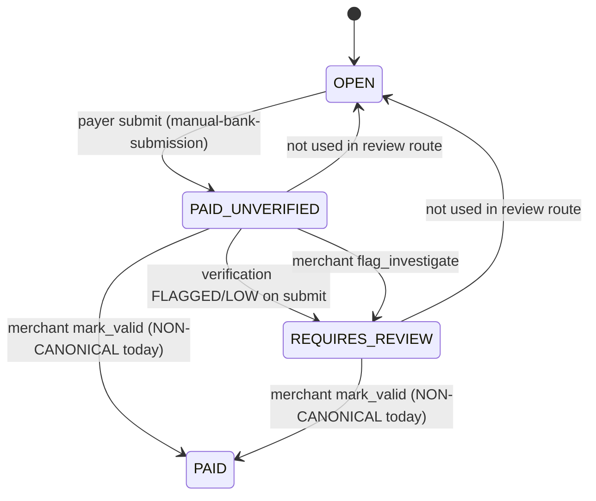

# R3 Remediation Analysis — Bank & Crypto Review Paths

**Date:** 2026-06-04  
**Related:** [r3-canonical-integration-design.md](./r3-canonical-integration-design.md), [payment-path-remediation-plan.md](./payment-path-remediation-plan.md) (R3), [canonical-payment-lifecycle.md](./canonical-payment-lifecycle.md)

---

## Executive summary

Assisted **manual bank** and **assisted crypto** payment links use a two-phase model: payer submission moves the invoice to **`PAID_UNVERIFIED`** or **`REQUIRES_REVIEW`**; merchant **`mark_valid`** moves to **`PAID` without canonical settlement**. This is the same class of divergence R1/R2 fixed for operator manual mark-paid and the status API.

**Recommended fix:** Option **C** — thin **`executeAssistedReviewSettlement()`** adapter calling **`confirmPayment({ provider: 'manual', providerRef: '…-review:{confirmationId}' })`**, with a minimal extension so `confirmPayment` accepts transitions from **`PAID_UNVERIFIED` / `REQUIRES_REVIEW`** (not only `OPEN`).

---

## Step 1 — Bank review path

### Entry points

| Layer | Path | Role |
|-------|------|------|
| **Public API** | `POST /api/public/pay/[shortCode]/manual-bank-confirmation` | Payer submits transfer details |
| **Merchant API** | `GET /api/payment-links/manual-bank-confirmations?organizationId=` | List pending submissions |
| **Merchant API** | `POST /api/payment-links/manual-bank-confirmations/[id]/review` | `mark_valid`, `flag_investigate`, `acknowledge` |
| **Page** | `src/app/(public)/pay/[shortCode]/page.tsx` | Renders `ManualBankPublicPaymentContent` when `payment_method === 'MANUAL_BANK'` |
| **Component** | `src/components/public/manual-bank-public-payment-content.tsx` | Payer form → public POST |
| **Dashboard** | `src/app/(dashboard)/dashboard/payment-links/page.tsx` | Embeds `PendingManualBankConfirmations` |
| **Component** | `src/components/payment-links/pending-manual-bank-confirmations.tsx` | Review UI → review POST |
| **Service** | `src/lib/payments/manual-bank-submission-service.ts` | `submitManualBankPaymentConfirmation` |
| **Verification** | `src/lib/payments/manual-confirmation-verification.ts` | Amount/currency/recipient checks |
| **Lifecycle** | `src/lib/payments/payment-confirmation-lifecycle.ts` | `statusAfterManualConfirmationVerification` |

No server actions; no separate “approve bank transfer” route outside the above.

### State transitions (bank)



| Action | Handler | Transition | Side effects |
|--------|---------|--------------|--------------|
| Payer submit | `submitManualBankPaymentConfirmation` | `OPEN` → `PAID_UNVERIFIED` (+ maybe → `REQUIRES_REVIEW`) | `manual_bank_payment_confirmations` SUBMITTED; `PAYMENT_INITIATED` event; notification |
| `flag_investigate` | review route | `PAID_UNVERIFIED` → `REQUIRES_REVIEW` (if was unverified) | `merchant_investigation_flag` |
| `acknowledge` | review route | None on link | `merchant_acknowledged_at` only |
| **`mark_valid`** | review route | **`PAID_UNVERIFIED` / `REQUIRES_REVIEW` → `PAID`** | **No** `confirmPayment`; confirmation → APPROVED; referral only if `PAYMENT_CONFIRMED` exists |

### Divergence at `mark_valid`

```105:142:src/app/api/payment-links/manual-bank-confirmations/[id]/review/route.ts
    await prisma.$transaction(async (tx) => {
      await transitionPaymentLinkState({
        tx,
        paymentLinkId: link.id,
        targetState: 'PAID',
        source: 'manual-bank-confirmation-review',
        reason: 'merchant_mark_valid',
        ...
      });
    });
    // ... confirmation APPROVED; optional referral if PAYMENT_CONFIRMED exists
```

Missing vs canonical: `PAYMENT_CONFIRMED`, ledger, commission, funding, Xero.

---

## Step 2 — Crypto review path

### Entry points

| Layer | Path | Role |
|-------|------|------|
| **Public API** | `POST /api/public/pay/[shortCode]/crypto-confirmation` | Payer submits wallet/amount/hash |
| **Merchant API** | `GET /api/payment-links/crypto-confirmations?organizationId=` | List pending |
| **Merchant API** | `POST /api/payment-links/crypto-confirmations/[id]/review` | Same actions as bank |
| **Page** | `src/app/(public)/pay/[shortCode]/page.tsx` | Crypto pay UI |
| **Component** | `src/components/public/crypto-public-payment-content.tsx` | Payer form |
| **Dashboard** | `payment-links/page.tsx` → `PendingCryptoConfirmations` | Review UI |
| **Component** | `src/components/payment-links/pending-crypto-confirmations.tsx` | Actions + explorer link |
| **Service** | `src/lib/payments/crypto-submission-service.ts` | `submitCryptoPaymentConfirmation` |
| **Verification** | `src/lib/payments/crypto-confirmation-verification.ts` | Network/amount/hash checks |

### State transitions (crypto)

Same diagram as bank with sources `crypto-submission` / `crypto-review` / `crypto-confirmation-review`.

| Action | Handler | Transition | Side effects |
|--------|---------|--------------|--------------|
| Payer submit | `submitCryptoPaymentConfirmation` | `OPEN` → `PAID_UNVERIFIED` (+ optional `REQUIRES_REVIEW`) | `crypto_payment_confirmations` SUBMITTED; `CRYPTO_PAYMENT_SUBMITTED` event |
| `mark_valid` | review route | → `PAID` only | Same divergence as bank |

### Services invoked on `mark_valid`

- `transitionPaymentLinkState`  
- `prisma.*_payment_confirmations.update`  
- `createReferralConversionFromPaymentConfirmed` (conditional, usually no-op)  
- **Not invoked:** `confirmPayment`, `applyRevenueShareSplits`, `orchestrateFundingAfterInvoiceSettlement`, `queueXeroSync`

---

## Step 3 — Comparison with manual settlement (R1)

See [r3-canonical-integration-design.md](./r3-canonical-integration-design.md).

**Critical implementation note:** `executeOperatorManualInvoiceSettlement` requires **`link.status === 'OPEN'`**. Bank/crypto review requires **`confirmPayment` to accept `PAID_UNVERIFIED` / `REQUIRES_REVIEW` → `PAID`**. R3 is **not** a call to the R1 helper as-is.

---

## Step 4 — Dependency checklist

### Bank `mark_valid`

| Data | Available? | Source |
|------|------------|--------|
| Payment link id | Yes | `confirmation.payment_link_id` |
| Amount | Yes | `link.amount` (invoice) |
| Currency | Yes | `link.currency` / `invoice_currency` |
| Provider reference | **Must define** | Proposed: `bank-review:{confirmationId}` |
| Confirmation timestamp | Yes | `reviewed_at` (set after); `created_at` on confirmation |
| Audit trail | Yes | Transition metadata + confirmation row + `PAYMENT_INITIATED` event |
| Payer-reported amount | Yes | `payer_amount_sent` (may differ — use invoice amount for ledger unless product rule changes) |

### Crypto `mark_valid`

| Data | Available? | Source |
|------|------------|--------|
| Payment link id | Yes | |
| Amount / currency | Yes | `link` |
| Tx hash / network | Yes | `payer_tx_hash`, `payer_network` (metadata only for R3 minimal) |
| Provider reference | **Must define** | `crypto-review:{confirmationId}` |

### Missing for safe `confirmPayment` (gaps)

| Gap | Severity | Mitigation in R3 |
|-----|----------|------------------|
| `confirmPayment` only transitions from `OPEN` | **Blocker** | Widen eligible statuses in orchestrator |
| Review sets `PAID` before settlement | **Blocker** | Call `confirmPayment` **instead of** pre-transition |
| Historical `PAID` without event | Medium | Backfill script / repair job |
| Amount mismatch (REQUIRES_REVIEW) | Low | Settle invoice amount; keep payer fields in metadata |

---

## Step 5 — Design recommendation

**Option C — Adapter → `confirmPayment`** (full detail in [r3-canonical-integration-design.md](./r3-canonical-integration-design.md)).

Reject **Option A** (manual `PAYMENT_CONFIRMED` insert) and **Option B** (duplicated settlement txn).

---

## Step 6 — Risk assessment

| Area | Bank review | Crypto review | Notes |
|------|-------------|---------------|-------|
| **Implementation complexity** | Medium | Medium | Shared adapter; two route edits; one `confirmPayment` guard |
| **Regression risk** | Medium | Medium | Merchants rely on “Mark valid = Paid” UX — behavior should improve (ledger appears) |
| **Testing requirements** | High | High | State matrix: UNVERIFIED→PAID, REVIEW→PAID, idempotent double-click, commission+Xero+funding |
| **Migration concerns** | High | High | Invoices already **PAID** via old `mark_valid` need `confirmPayment` backfill |

### Test matrix (recommended)

1. `OPEN` → submit → `mark_valid` → `PAYMENT_CONFIRMED` + ledger + commission items  
2. Submit with LOW confidence → `REQUIRES_REVIEW` → `mark_valid` → same  
3. Double `mark_valid` → idempotent, no duplicate ledger  
4. `flag_investigate` / `acknowledge` → still no settlement  
5. R1 unchanged: `OPEN` + operator manual settlement still works  
6. Link with old `PAID` + no event → repair path documented

### Migration

| Population | Action |
|------------|--------|
| `PAID` + `MANUAL_BANK`/`CRYPTO` + no `PAYMENT_CONFIRMED` | Admin/backfill: `confirmPayment` with synthetic `providerRef` or dedicated repair endpoint |
| In-flight `PAID_UNVERIFIED` | New code path on next `mark_valid` |

---

## Related: `/api/xero/queue/backfill` (Step 4 scope note)

**Not modified for R3.** Documented for tenant safety:

| Method | Cross-tenant? |
|--------|----------------|
| `POST /api/xero/queue/backfill` | **Yes** — all `PAID` links globally; UI `organizationId` ignored |
| `GET` preview | **Yes** — same |

Separate from R3 but should be fixed before Xero GA.

---

## Remaining launch impact (R3 only)

| Before R3 | After R3 (when implemented) |
|-----------|----------------------------|
| Bank/crypto GA claims “paid in books” | Aligned with Stripe/manual R1 |
| Attribution empty after mark_valid | Commission + reconcile run |
| Pilot funding stale | Funding orchestration runs |

**Until implemented:** R3 remains **P0** if `MANUAL_BANK` or `CRYPTO` assisted review is enabled in production.

---

## References

| File | Purpose |
|------|---------|
| `manual-bank-confirmations/[id]/review/route.ts` | Bank mark_valid |
| `crypto-confirmations/[id]/review/route.ts` | Crypto mark_valid |
| `manual-bank-submission-service.ts` | Payer submit |
| `crypto-submission-service.ts` | Payer submit |
| `manual-invoice-settlement.server.ts` | R1 pattern |
| `payment-confirmation.ts` | Canonical settlement |
| `state-machine.ts` | Allowed transitions |
