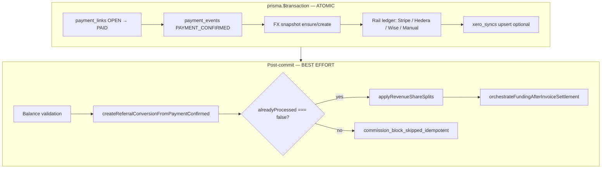
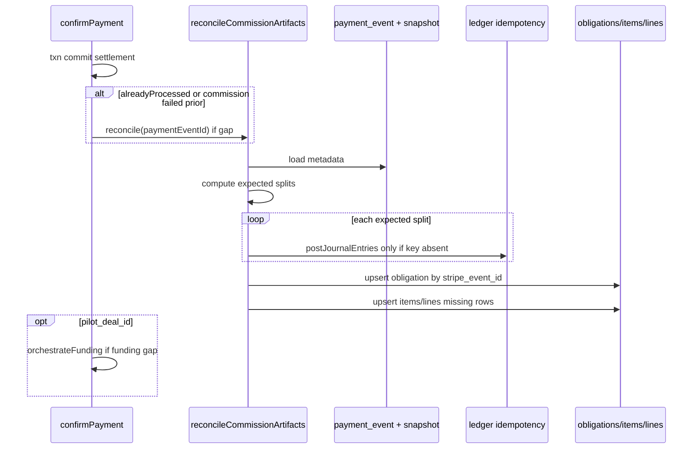

# R5 — Commission Replay and Repair Design

**Status:** Design only (no implementation).  
**Scope:** Settlement exists, ledger exists, commission artifacts missing or partial.  
**Related:** [payment-path-remediation-plan.md](./payment-path-remediation-plan.md) (R5, R13), [canonical-payment-lifecycle.md](./canonical-payment-lifecycle.md), [failure-scenario-review.md](./production-readiness/failure-scenario-review.md) §9.

---

## Executive summary

When `confirmPayment()` succeeds, **settlement truth** is committed atomically: `payment_links` → `PAID`, `payment_events` → `PAYMENT_CONFIRMED`, rail settlement **ledger** entries, and optional `xero_syncs` upsert. **Commission propagation** runs **after commit**, is **best-effort**, and is **skipped entirely** when `alreadyProcessed === true` or when provider-level idempotency returns early.

That split creates durable gaps: **ledger commission expense/payable exists without matching `commission_obligations` / items / lines**, or **obligation exists without items** (P2002 + `createdObligation === false` guard). Webhook replay and `repair-stripe-payment.ts` **do not heal** these gaps today.

**Recommended approach (hybrid):**

| Approach | Role |
|----------|------|
| **1. Retry logic** | Extend `confirmPayment` idempotent paths to invoke commission **reconcile** when gaps detected — safe for webhook retries. |
| **2. Reconciliation logic** | Nightly / on-demand job: `PAYMENT_CONFIRMED` + referral metadata → compare expected vs actual artifacts. |
| **3. Rebuild-from-ledger** | **Verification only** — detect drift; not primary repair input. |
| **4. Rebuild-from-payment-event** | **Primary repair input** — recompute amounts from `commission_attribution_snapshot` + event metadata (same functions as posting). |

Implementation should add a dedicated **`reconcileCommissionArtifactsForPaymentEvent()`** (name TBD) that **never duplicates settlement ledger** (rail keys unchanged) and **conditionally posts commission ledger** only when idempotency keys are absent. **R13** (item upsert when obligation already exists) is a prerequisite inside that function.

---

## Step 1 — Post-settlement flow (canonical)

There is **no separate `settlements` table**. Settlement is the **`PAYMENT_CONFIRMED` payment event** plus **`payment_links.status = PAID`** plus **rail settlement ledger** in one transaction.



### Layer reference

| Layer | What it is | File | Function | Transaction |
|-------|------------|------|----------|---------------|
| **Payment event** | `payment_events` row `event_type = PAYMENT_CONFIRMED` | `src/lib/services/payment-confirmation.ts` | `confirmPayment()` | **Inside** `prisma.$transaction` |
| **Settlement (logical)** | Link `PAID` + event + provider refs | Same | `transitionPaymentLinkState`, `payment_events.create` | **Inside** txn |
| **Ledger (rail)** | Clearing / cash / fee accounts per provider | `payment-confirmation.ts` → `postStripeSettlement` / `postHederaSettlement` / `postWiseSettlement` | Called with `tx` | **Inside** txn |
| **Ledger (commission)** | `COMMISSION_EXPENSE` ↔ payables | `src/lib/referrals/commission-posting.ts` | `applyRevenueShareSplits` → `LedgerEntryService.postJournalEntries` | **Outside** txn (per-split posts) |
| **Commission obligation** | `commission_obligations` | `commission-posting.ts` | `prisma.commission_obligations.create` | **Outside** txn |
| **Commission obligation items** | `commission_obligation_items` (split path) | `commission-posting.ts` | `create` in loop; **only if `createdObligation`** | **Outside** txn |
| **Commission obligation lines** | `commission_obligation_lines` (payout + legacy) | `commission-posting.ts` | `createMany` | **Outside** txn |
| **Funding allocation** | Operational graph refresh (pilot) | `src/lib/operations/funding/bridge-invoice-settlement.server.ts` | `orchestrateFundingAfterInvoiceSettlement` → `orchestrateOperationalMutation({ mutation: 'funding_update' })` | **Outside** txn; **skipped** when `alreadyProcessed` |
| **Pilot obligations** | `deal_network_pilot_obligations` | Derived via operational orchestration / deal refresh | Not in `confirmPayment` directly | Separate stack |
| **Payout eligibility** | Unpaid `commission_obligation_lines` or pilot obligations | `src/app/api/payout-batches/create/route.ts` | `deriveReleaseBatchEligibility` + line query | Read-only at batch time |

### Entry points to `confirmPayment()`

- Stripe webhook → `confirmPayment({ provider: 'stripe', ... })`
- Wise webhook, Hedera checker, manual settlement (R1), `repair-stripe-payment.ts`, reconciliation scripts

### Commission trigger (current)

```702:769:src/lib/services/payment-confirmation.ts
    // Revenue share (commission) — only when this invocation created a new PAYMENT_CONFIRMED row.
    if (result.success && result.paymentEventId && result.alreadyProcessed === false) {
      // ... resolveReferralCommissionMetadata → applyRevenueShareSplits
    } else if (result.success && result.paymentEventId && result.alreadyProcessed === true) {
      commissionPropagationTrace('commission_block_skipped_idempotent', { ... });
    }
```

**Early exit before transaction** (provider idempotency): lines ~214–253 return `alreadyProcessed: true` with **no** commission block at all — only optional referral conversion retry.

### Commission internal order (split path)

1. `provisionCommissionLedgerAccounts`
2. For each split: post journal (`idempotencyKey: commission-${rootId}-split-${split_id}`)
3. `commission_obligations.create` (`stripe_event_id` = **`payment_events.id`** via `commissionSourceId`)
4. **Only if `createdObligation`:** items + lines
5. Return `{ posted: true }` even when obligation existed but items were skipped (P2002 path)

`rootId` = `commissionSourceId ?? stripeEventId` (production passes `paymentEventId` for both).

---

## Step 2 — Failure points

### A. Settlement transaction (`confirmPayment` txn)

| Failure | Exists after failure | Missing | Self-heal | Operator repair |
|---------|---------------------|---------|-----------|-----------------|
| Invalid transition / link not found | Nothing new | Event, ledger, commission | Provider retry | Fix link state; call `confirmPayment` |
| Ledger post throws inside txn | **Rolled back** — no PAID, no event | All downstream | Webhook retry | Same |
| Xero upsert throws | PAID + event + ledger **committed** (Xero errors swallowed) | Reliable Xero row | Xero replay API | `POST /api/xero/sync/replay` |
| Duplicate `PAYMENT_CONFIRMED` in txn | Prior event | New event | Returns `alreadyProcessed: true` | See commission gaps |

### B. Post-commit — commission (`applyRevenueShareSplits`)

| Failure | Exists | Missing | Self-heal | Operator repair |
|---------|--------|---------|-----------|-----------------|
| No referral metadata | Event, rail ledger | Commission ledger + obligations | None | Fix snapshot / referral_link_id; **R5 reconcile** |
| Below minimum amounts | Event, rail ledger | Commission (intentional skip) | None | None needed |
| Account provision fails | Event, rail ledger | All commission | None | Fix chart of accounts; reconcile |
| **Split N ledger fails** after N−1 posted | Partial commission **ledger** | Obligation, items, lines | None | Reconcile posts missing splits only (idempotent keys) |
| Obligation create fails (non-P2002) | Commission ledger may exist | Obligation, items, lines | None | Reconcile obligation + items |
| Obligation P2002, `createdObligation === false` | Commission ledger + obligation row | **Items and lines** | **None today** | **R5 + R13** — upsert items/lines |
| Item create fails (no unique → no P2002) | Ledger + obligation | Some items | None | Manual dedupe + reconcile |
| Lines `createMany` fails | Ledger + obligation + maybe items | Lines | None | Reconcile lines |
| Outer catch in `applyRevenueShareSplits` | Same as partial step | Same | SYSTEM_ALERT only | Admin trace + reconcile |
| `confirmPayment` commission catch | Event, rail ledger, partial commission | Complete commission | **Webhook retry skips** | **Must not rely on replay alone** |

### C. Post-commit — funding

| Failure | Exists | Missing | Self-heal | Operator repair |
|---------|--------|---------|-----------|-----------------|
| No `pilot_deal_id` | Commission (if ran) | Pilot funding refresh | None | Link deal; manual `funding_update` mutation |
| Orchestration throws | Same | `deal_network_pilot_obligations` refresh | None | Operational mutation replay |
| Skipped (`alreadyProcessed`) | Event, commission maybe | Funding refresh | None | Same as above |

### D. Idempotent replay paths (critical for R5)

| Path | Commission runs? | Risk |
|------|------------------|------|
| First success, commission failed | Once (failed) | Permanent gap |
| Second `confirmPayment`, txn sees existing event | **No** (`commission_block_skipped_idempotent`) | Gap permanent |
| Provider idempotency early return | **No** | Gap permanent |
| `repair-stripe-payment.ts` on PAID link | **No** commission | Stuck commission |

---

## Step 3 — Repair matrix

| Record type | Source of truth | Recreate from source? | Repairable? | Idempotent today? |
|-------------|-----------------|----------------------|-------------|-------------------|
| **payment_events** (`PAYMENT_CONFIRMED`) | Provider + `confirmPayment` txn | No — must not duplicate | Only if missing settlement (call `confirmPayment`) | Yes — unique per link in txn |
| **settlements** (logical) | Same as event + `PAID` | Same | Same | Same |
| **ledger_entries** (rail) | `confirmPayment` txn | Re-post via `confirmPayment` only if event missing | Yes with rail idempotency keys | Yes inside txn |
| **ledger_entries** (commission) | **Intended:** same math as `applyRevenueShareSplits` from event + snapshot | From payment event metadata, **not** from obligation rows | Yes — keys `commission-${paymentEventId}-split-${split_id}` etc. | **Per-key yes**; partial runs possible |
| **commission_obligations** | `payment_events.id` → `stripe_event_id` unique | From event + snapshot + link `referral_link_id` | Yes — upsert on `stripe_event_id` | **Create:** P2002; **no update** path |
| **commission_obligation_items** | Split snapshot at settlement time | From event + snapshot (same `computeSplitAmounts`) | Yes — **needs R13 upsert** | **Weak** — no DB unique on `(obligation_id, split_id)`; P2002 rarely fires |
| **commission_obligation_lines** | Legacy path / mirror of splits | From expected payees | Yes — insert missing lines | **Weak** — no composite unique |
| **payout_batches** / **payouts** | Operator action on POSTED lines | N/A — downstream of obligations | Do not auto-create in R5 | Batch creation has own guards |
| **funding allocations** (operational) | `deal_network_pilot_obligations` + graph | `orchestrateFundingAfterInvoiceSettlement` | Yes, separate from commission | Mutation orchestrator |
| **deal_network_pilot_obligations** | Pilot deal refresh | Funding orchestration | Separate track from attribution items | Project-scoped |

**Attribution UI** reads **`commission_obligation_items`** (`attribution-earnings.server.ts`). **Payout batch (non-pilot)** reads **`commission_obligation_lines`**. **Pilot release** reads **`deal_network_pilot_obligations`**.

---

## Step 4 — Existing repair utilities

| Utility | Location | Reconstructs commission? |
|---------|----------|-------------------------|
| **Commission propagation trace** | `GET /api/admin/commission-propagation-trace` → `lookupCommissionPropagationChain` | **Diagnose only** — `propagation_stops[]` |
| **trace-latest-payment.ts** | `src/scripts/trace-latest-payment.ts` | Read-only chain |
| **repair-stripe-payment.ts** | `src/scripts/repair-stripe-payment.ts` | Calls `confirmPayment` — **heals missing settlement**, **not** commission when already PAID |
| **Stripe webhook replay** | `replay-stripe-webhook.ts`, internal replay route | Re-enters handler → `confirmPayment` — same commission skip |
| **repair-utilities / orphans** | `src/lib/data/repair-utilities.ts` | Ledger/Xero for PAID orphans — **no commission checks** |
| **integrity-checks** | `src/lib/payments/integrity-checks.ts` | Settlement/ledger/Xero — **no commission** |
| **referral-attribution-replay.test.ts** | Documents invariants only | No runtime repair |
| **Xero sync replay** | `/api/xero/sync/replay` | Accounting sync only |
| **referrals replay-ledger** (docs) | Separate conversion path | Not wired to `commission_obligations` |

**Conclusion:** Operators can **find** gaps (admin trace) but cannot **safely close** them with existing tools without new R5 machinery.

---

## Step 5 — Canonical repair strategy

### Design goals

1. **Idempotent** — safe on webhook retries and repeated admin runs.
2. **Replayable** — deterministic inputs from frozen `commission_attribution_snapshot` + `PAYMENT_CONFIRMED.metadata`.
3. **No duplicate commission ledger** — always check `idempotencyKey` / existing entries before `postJournalEntries`.
4. **No duplicate rail ledger** — never re-run settlement txn for repair-only cases.
5. **Webhook-safe** — reconcile returns success when already complete; partial heal is explicit.

### Approach comparison

#### (1) Retry logic only — extend `confirmPayment`

**Pros:** Automatic on every replay; minimal operator burden.  
**Cons:** Insufficient without **R13** — calling `applyRevenueShareSplits` as-is still skips items on P2002; blind re-call may duplicate **items** (no unique constraint).  
**Verdict:** **Required adjunct**, not sufficient alone.

#### (2) Reconciliation logic — gap detector + heal

**Pros:** Catches failures that never retry (commission threw after commit); supports nightly audit; clear operator report.  
**Cons:** Needs scheduler or admin trigger.  
**Verdict:** **Primary operational mechanism.**

#### (3) Rebuild-from-ledger

**Pros:** Proves money was accrued; useful for **drift detection** (sum payables vs obligation totals).  
**Cons:** Ledger descriptions do not carry `split_id`; GROSS/NET basis not stored on entries; cannot rebuild items for attribution UI reliably.  
**Verdict:** **Secondary verification**, not primary repair.

#### (4) Rebuild-from-payment-event

**Pros:** Same code path as production (`resolveReferralCommissionMetadata`, `parseReferralSplitsFromMetadata`, `computeBasisAmount`, `computeSplitAmounts`); snapshot immutability aligns with Sprint 1.  
**Cons:** If snapshot incomplete, repair must fail closed (same as first-run skip).  
**Verdict:** **Primary repair input.**

### Recommended architecture



### Proposed API surface (implementation phase)

```typescript
// Pseudocode — not implemented
type ReconcileCommissionResult = {
  paymentEventId: string;
  status: 'complete' | 'repaired' | 'skipped' | 'failed';
  gapsBefore: string[];
  actions: Array<'ledger_posted' | 'obligation_upserted' | 'items_upserted' | 'lines_upserted'>;
};

async function reconcileCommissionArtifactsForPaymentEvent(
  paymentEventId: string,
  options?: { dryRun?: boolean; postMissingLedger?: boolean }
): Promise<ReconcileCommissionResult>
```

**Gap detection rules** (align with `lookupCommissionPropagationChain`):

- `PAYMENT_CONFIRMED` exists
- `referral_link_id` or complete snapshot / legacy metadata
- Expected split count > 0
- Missing: obligation OR items count < expected OR lines count < expected (legacy)
- Optional: commission ledger keys missing while obligation missing

**Heal rules:**

1. Resolve metadata exactly as `confirmPayment` post-commit block (~702–748).
2. Recompute amounts — **do not** read amounts from existing ledger as primary.
3. **Ledger:** for each expected idempotency key, if `entriesPosted === 0` pattern or DB lookup empty, call `postJournalEntries`; else skip.
4. **Obligation:** `upsert` on `stripe_event_id` = `paymentEventId` (fix R13: update totals if row exists).
5. **Items:** for each split, `findFirst` + `create` if missing (add migration `@@unique([commission_obligation_id, split_id])` in implementation).
6. **Lines:** same for legacy payees.
7. **Funding:** if `pilot_deal_id` and graph stale, call `orchestrateFundingAfterInvoiceSettlement` (idempotent mutation).

### Wiring plan (R5 + R13)

| Hook | Behavior |
|------|----------|
| `confirmPayment` after success | If `alreadyProcessed` OR commission block skipped, call `reconcileCommissionArtifactsForPaymentEvent` when detector reports gaps |
| Nightly job | Scan recent `PAYMENT_CONFIRMED` with referral_link_id; reconcile failures alert |
| Admin | `POST /api/admin/commission-reconcile?paymentEventId=` |
| `repair-stripe-payment` | After `confirmPayment`, call reconcile (document in runbook) |

### Explicit non-goals for R5

- Changing rail settlement posting rules inside the txn.
- Auto-creating payout batches.
- Backfilling `deal_network_pilot_obligations` without funding orchestration rules.
- Deleting duplicate commission ledger rows (manual accounting review if duplicates exist).

### Failure modes after R5 (residual)

| Case | Handling |
|------|----------|
| Incomplete snapshot at settlement | Reconcile **fails closed**; operator fixes attribution at source (pre-PAID only) |
| Historical duplicate items | Pre-R5 manual dedupe; then add unique constraint |
| Commission ledger duplicates from old bugs | Detector flags sum mismatch; no auto-delete |
| Paid obligation items | Reconcile must not mutate `status = PAID` or `payout_id` set rows |

### Acceptance criteria (pre-implementation review)

- [ ] Documented flow matches `payment-confirmation.ts` and `commission-posting.ts`.
- [ ] Design names **payment-event-driven reconcile** as primary, ledger as verifier.
- [ ] Design requires **item upsert on idempotent obligation** (R13).
- [ ] Design does not depend on changing `confirmPayment` txn boundaries for settlement.
- [ ] Webhook retry story: second delivery → reconcile no-ops when complete.

---

## Implementation checklist (for engineering, post-approval)

1. Extract `reconcileCommissionArtifactsForPaymentEvent` from shared helpers used by `applyRevenueShareSplits` (single source of amount math).
2. Fix `createdObligation` guard → always ensure items/lines (R13).
3. Add DB unique `(commission_obligation_id, split_id)` + reconcile-friendly upserts.
4. Wire reconcile into `confirmPayment` idempotent branches and admin/nightly.
5. Tests: obligation-without-items replay; partial ledger; `alreadyProcessed` + gap; idempotent second reconcile.
6. Runbook: admin trace → reconcile endpoint → verify attribution dashboard.

---

## References

| Artifact | Path |
|----------|------|
| Settlement orchestrator | `src/lib/services/payment-confirmation.ts` |
| Commission posting | `src/lib/referrals/commission-posting.ts` |
| Propagation diagnostics | `src/lib/referrals/commission-propagation-lookup.server.ts` |
| Funding bridge | `src/lib/operations/funding/bridge-invoice-settlement.server.ts` |
| Payout eligibility | `src/app/api/payout-batches/create/route.ts` |
| Remediation ranking | `docs/payment-path-remediation-plan.md` |
